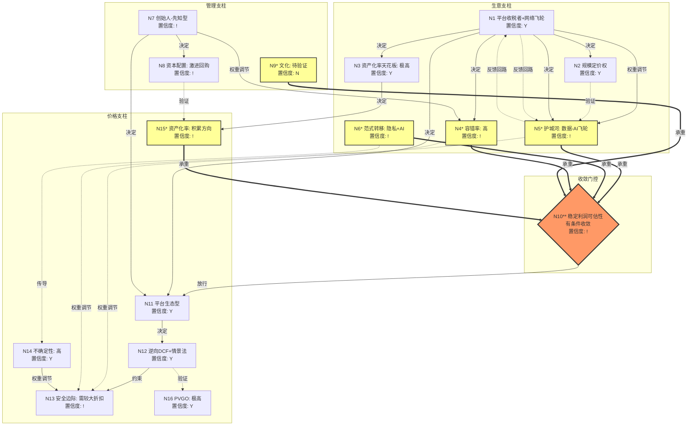

# 企业主页：AppLovin Corporation（APP.O）

## 元信息

| 字段 | 值 |
|------|-----|
| 公司名称 | AppLovin Corporation |
| 代码 | APP（NASDAQ） |
| 行业 | 科技 / 广告技术（AdTech）/ AI应用 |
| 总部 | 美国加州 Palo Alto |
| 创始人/CEO | Adam Foroughi（1980年生，伊朗裔美国人） |
| 创立年份 | 2012年 |
| IPO | 2021年4月 |
| 当前市值 | ~$1,360亿（2026-08-05，股价~$420）[B] |
| 卡片版本 | v1 |
| 灵魂版本 | final_20260724 |
| 构建日期 | 2026-08-06 |

---

## 拓扑图

### Mermaid 版本



<details>
<summary>ASCII 版本（KB 渲染用）</summary>

```
                    ┌─────────────────────────────────────────────────────────┐
                    │                   生意支柱                               │
                    │                                                         │
                    │   N1 平台收税者+网络飞轮 ──决定──> N2 规模定价权         │
                    │          │                                               │
                    │          ├──决定──> N3 资产化率天花板: 极高               │
                    │          │                    │                           │
                    │          ├──决定──> N4* 容错率: 高                        │
                    │          │                    │                           │
                    │          ├──权调──> N5* 护城河: 数据-AI飞轮               │
                    │          │           ↕ 反馈回路                            │
                    │          └──决定──> N6* 范式转移: 隐私+AI                 │
                    │                                                         │
                    ├─────────────────────────────────────────────────────────┤
                    │                   管理支柱                               │
                    │                                                         │
                    │   N7 创始人-先知型 ──决定──> N8 资本配置: 激进回购       │
                    │          │                                               │
                    │          └──权调──> N4*（容错率权重）                    │
                    │                                                         │
                    │   N9* 文化: 待验证                                      │
                    │                                                         │
                    ├═════════════════════════════════════════════════════════╡
                    │          N10** 收敛门控: 有条件收敛                      │
                    │     ┌──── 承重边（判错全盘崩溃）────┐                    │
                    │     │ N5* ─═▶ 护城河半衰期          │                    │
                    │     │ N6* ─═▶ 范式断裂风险          │                    │
                    │     │ N4* ─═▶ 容错率→可估性         │                    │
                    │     │ N15*─═▶ 资产化方向            │                    │
                    │     │ N9* ─═▶ 文化崩塌→护城河失修   │                    │
                    │     └────────────────────────────────┘                    │
                    ├─────────────────────────────────────────────────────────┤
                    │                   价格支柱                               │
                    │                                                         │
                    │   N11 平台生态型 ──决定──> N12 逆向DCF+情景法            │
                    │                                       │                   │
                    │   N13 安全边际 <──权调── N4*/N5*/N14                    │
                    │                                                         │
                    │   N14 不确定性: 高                                      │
                    │   N15* 资产化率: 积累方向                               │
                    │   N16 PVGO: 极高                                        │
                    └─────────────────────────────────────────────────────────┘

    正反馈回路: N1(更多平台参与者) → N5(更强数据飞轮) → N1(平台更有吸引力)
    负反馈回路: N6(隐私收紧) → N5(数据质量下降) → N2(定价权削弱) → N10(利润可估性下降)

    矛盾仲裁点:
    1. N5(数据飞轮护城河Y) ⊥ N6(隐私范式转移风险!) → 半衰期判断的核心张力
    2. N8(激进回购Y) ⊥ N15(资产化方向!) → 回购vs研发投入的资本配置矛盾
```

</details>

---

## 分类锚定

### N1 生意模式分类：平台收税者（基本盘）+ 网络飞轮者（增量维度）

**复合生意判断。** AppLovin本质上是一个由AI驱动的广告交易平台，兼具两种生意模式特征。基本盘是"平台收税者"——在广告主和流量方之间搭建基础设施，对每笔交易收税（MAX收5%竞价费，AppDiscovery按净额法确认收入即赚取广告主支付与流量方所得之间的差额）。增量维度是"网络飞轮者"——数据-AI飞轮驱动多边网络效应。

**L1-Key Concepts**

平台收税者的操作性定义：公司搭建的AXON引擎+MAX+AppDiscovery构成了移动广告的基础设施层。广告主通过AppDiscovery出价获取用户，流量方通过MAX变现广告库存，AppLovin在中间抽取交易税。FY2024总收入47.1亿美元中，广告收入（平台收税）占绝对主导（广告收入同比增长75%，应用程序收入仅+3%）。2025年Q2出售手游业务后，公司成为纯平台收税者。[S: FY2024 10-K, AnalystLens; B: 华鑫证券Q3 2025报告]

网络飞轮者的操作性定义：AppLovin通过200+款自有手游积累第一方数据→数据流入App Graph→AXON引擎优化广告匹配→广告ROI提升→更多广告主和流量方加入→更多数据→飞轮加速。这是一个经典的多边网络效应。关键指标：覆盖14亿+日活用户，iOS游戏广告网络市占率第1（35%），Android第2（17%）。[S: 广发证券专题研究, 2024-12]

为什么这个分类至关重要：平台收税者分类意味着R&D和生态投入是核心价值创造引擎（而非品牌维护或规模扩张），资产化率天花板极高，且核心风险是范式转移（而非竞争）。网络飞轮分类意味着需要关注多边平衡和单边脱锚风险。两种分类叠加，AppLovin面临的最大风险不是竞争对手，而是底层范式（隐私政策/AI技术路径）的变迁。

**L1-Mind Map**

- N1 →决定→ N2（平台收税者的定价权体现为交易税率而非产品溢价）
- N1 →决定→ N3（软件平台支出可转化为持久AI资产，资产化率天花板极高）
- N1 →决定→ N4（平台一旦建立网络效应，容错率较高）
- N1 →权重调节→ N5（网络飞轮的护城河评估重点是飞轮转速和数据壁垒，而非传统品牌护城河）
- N1 ↔ N5 正反馈回路（更多平台参与者→更强飞轮→平台更有吸引力）
- N1 →决定→ N11（平台生态型现金流特征）
- N1 →决定→ N15（R&D投入方向是AXON引擎，资产化率极高）

杠杆点：N1→N5的飞轮关系是全图最大杠杆——如果飞轮断裂（数据来源被切断），N5护城河半衰期急剧缩短，传导至N10利润可估性全面崩溃。

**L2-Implications**

一阶推论：因为AppLovin是平台收税者+网络飞轮者，所以其核心价值创造不在于拥有多少游戏或多少用户，而在于AXON引擎的广告匹配效率和数据飞轮的转速。（置信度：高）

二阶推论：因为核心价值在于AI匹配效率，所以任何能提升或削弱AXON相对优势的因素（AI技术迭代、数据可得性、竞争对手算法进步）都将直接影响利润率。（置信度：高）

三阶推论：因为利润率高度依赖AXON的相对优势，而AI技术迭代速度快，所以N5护城河半衰期可能短于市场预期——这是一个"持续跑步才能留在原地"的护城河。（置信度：中，假设：Google/Meta的AI广告能力不会在2-3年内追平AXON）

待验证假设：AXON的广告匹配效率优势是否可持续？Google AdMob和Meta的AI广告产品（如Advantage+）是否正在缩小差距？

**L2-QA-ct**

质疑1：AppLovin不是"规模经济者"吗？移动广告网络本质上是规模生意——数据越多、匹配越准、规模越大效率越高。

回应：规模经济者和网络飞轮者的核心区别在于"规模来自哪一侧"。规模经济者（如沃尔玛、台积电）通过物理规模/产能压低单位成本；网络飞轮者通过多边参与者的网络密度创造价值。AppLovin的核心驱动力不是物理规模（服务器成本可以线性扩展），而是数据-AI的网络密度（更多广告主→更多竞价→更高eCPM→更多流量方→更多数据→更好算法）。因此网络飞轮分类更准确。但确实存在规模经济成分——尤其是AXON引擎的固定研发成本可以分摊到不断增长的交易量上。标注：规模经济是网络飞轮的结果，而非独立的生意模式类型。（置信度：高，当前证据充分）

质疑2：AppLovin也可以被看作"资源稀缺者"——第一方数据是稀缺资源。

回应：第一方数据确实是竞争优势来源，但AppLovin的数据不是"稀缺资源"（如矿产、专利），而是"动态生成的数据流"。它的稀缺性来自飞轮效应而非绝对储量。一旦飞轮减速，数据优势会衰减。这与资源稀缺者（资源储量固定、价格周期主导）有本质区别。（置信度：高）

**L3-Case Studies**

正面类比：Google AdSense/AdMob——同样是广告交易平台，通过规模和网络效应建立了持久的收税能力。Google的广告业务过去15年持续增长，验证了平台收税者模式的持久性。关键差异：Google拥有搜索流量入口（需求侧垄断），AppLovin依赖第三方流量（需求侧非垄断）。

正面类比2：Meta（Facebook）广告平台——通过社交数据飞轮建立了极强的广告匹配能力， Advantage+ AI广告产品正在快速迭代。验证了数据-AI飞轮模式的可行性和持久性。关键差异：Meta拥有第一方社交数据（用户行为数据），AppLovin拥有第一方游戏数据（更窄的数据维度）。

反例类比：Unity Ads——同样是游戏广告平台，但Unity的飞轮从未达到AppLovin的规模和效率。Unity的广告业务长期不盈利，验证了网络飞轮需要足够的初始密度才能起飞。关键差异：Unity的核心业务是游戏引擎（B2B SaaS），广告是附属业务；AppLovin的核心业务就是广告平台。

可迁移教训：平台收税者+网络飞轮的持久性取决于（1）飞轮是否已经跨过临界规模，（2）是否存在更强力的替代平台，（3）底层范式是否稳定。AppLovin的飞轮看起来已跨过临界规模，但底层范式（隐私政策）正在变迁。

**L3-Teach**

AppLovin本质上是在手机广告的世界里收过路费。它搭建了一套AI系统，帮想打广告的人找到最合适的人，帮有流量的人卖出最高价。每笔交易它都抽一笔税。用的人越多，它的AI越聪明，AI越聪明，用的人就更多——这就是一个越转越快的飞轮。

---

### N7 管理层分类：创始人-先知型

**L1-Key Concepts**

创始人-先知型的操作性定义：公司竞争力高度绑定在创始人个人的远见和决策能力上。Adam Foroughi（1980年生，伊朗裔美国人）2012年创立AppLovin，从一款让朋友共同玩游戏的App起步，逐步构建了覆盖14亿+日活用户的广告帝国。核心判断依据：（1）AXON 2.0的投入是Foroughi的个人决策，在市场普遍怀疑时押注AI广告引擎升级；（2）双重股权结构——Foroughi持有Class C超级投票权股，对公司有绝对控制权；（3）内部人持股约23.2%，创始人个人是最大个人股东。[B: Grokipedia, longbridge股东数据, Simply Wall St]

当前状态：创始人仍在位且深度参与运营。2025年出售手游业务、聚焦广告平台的战略转型是Foroughi主导的。管理层同时在推进电商广告拓展和自助服务平台上线，执行节奏紧凑。

为什么这个分类至关重要：创始人-先知型的核心风险是"继任"——如果Foroughi离开，公司竞争力能否延续？这直接影响N9文化判断和N4容错率评估。同时，创始人的个人判断力（如AXON 2.0的押注）直接决定了公司的命运走向。

**L1-Mind Map**

- N7 →决定→ N8（创始人的资本配置风格决定一美元测试方向——Foroughi选择了大规模回购+聚焦广告平台）
- N7 →权重调节→ N4（创始人-先知型意味着管理层行为对结果影响大，容错率评估中管理层权重高）
- N7 →决定→ N9（先知型公司天然是"报时"型——竞争力绑定在个人远见上，制度化程度待验证）
- N7 →决定→ N11（创始人主导的超高速增长特征指向平台生态型现金流）

**L2-Implications**

一阶推论：因为Foroughi是创始人-先知型CEO，所以公司的关键战略决策（AXON 2.0投入、出售游戏业务、电商拓展）的质量高度依赖他个人的判断力。（置信度：高）

二阶推论：因为关键决策依赖个人判断，所以Foroughi的继任计划是中长期最大的管理层风险。目前没有公开的明确继任方案。（置信度：中，假设：公司内部可能已有培养计划但未公开）

待验证假设：Foroughi的管理团队（CFO、CTO等）是否具备独立运营公司的能力？AXON引擎的迭代是否已制度化（有工程团队主导而非CEO个人决策）？

**L2-QA-ct**

质疑：AppLovin可能正在从"先知型"向"造钟型"过渡——Foroughi建立了强大的工程团队，AXON的迭代可能已经制度化。

回应：这是一个合理的质疑，但目前证据不足。AppLovin的关键战略转向（AXON 2.0押注、出售游戏业务）都呈现"CEO个人决策"的特征，而非制度化流程的产出。工程团队虽然强大，但战略方向仍由Foroughi主导。需要关注：Foroughi是否在系统性地建立不依赖他个人的决策机制？当前证据倾向于"仍是先知型，造钟化程度不确定"。（置信度：中，需要更多内部运营证据）

**L3-Case Studies**

正面类比：Mark Zuckerberg/Meta——创始人长期掌舵，在关键转型时刻（移动端转型、AI投入）做出正确判断，但也经历了TikTok冲击和元宇宙押注失误。教训：创始人-先知型可以创造巨大价值，但也可能因个人判断失误造成重大损失。

反例类比：WeWork/Adam Neumann——同样是创始人主导的高增长公司，但缺乏制度化的治理导致灾难性结局。教训：创始人-先知型需要强治理制衡，否则可能走向"帝国建造者"陷阱。

**L3-Teach**

AppLovin的命运很大程度上系于一个人——创始人Adam Foroughi。他赌对了AI广告这个方向，让公司从一家普通的广告公司变成了AI广告巨头。问题是，如果有一天他不在了，这家公司还能不能继续保持竞争力？这是现在最大的未知数。

---

### N11 现金流特征：平台生态型

**L1-Key Concepts**

平台生态型的操作性定义：现金流具有超线性增长潜力——边际成本极低（软件平台），网络效应带来规模报酬递增。AppLovin的软件平台业务EBITDA率高达78.2%（24Q3），收入到EBITDA的流转率超过90%。自由现金流极强：FY2024 FCF 20.9亿美元（FCF率44.4%），FY2024经营现金流24亿美元+。

当前状态：广告业务收入高速增长（Q3 2025同比+68%），利润率持续扩张，自由现金流充沛。公司同时进行大规模股票回购（FY2024发行46亿美元债务，部分用于回购）。

为什么这个分类至关重要：平台生态型指向逆向DCF估值法——需要检验市场隐含的增长假设是否合理。高FCF率意味着公司几乎不需要外部融资即可自我增长。

**L1-Mind Map**

- N11 →决定→ N12（平台生态型匹配逆向DCF+情景概率法估值）
- N11 →约束→ N13（超线性增长潜力意味着安全边际可以适当收窄，但高PVGO要求更大折扣）
- N1 →决定→ N11（平台收税者+网络飞轮天然指向平台生态型现金流）

---

## 财务数据

### 核心财务指标（年度）

| 指标 | FY2020 | FY2021 | FY2022 | FY2023 | FY2024 |
|------|--------|--------|--------|--------|--------|
| 总营收（百万美元） | 1,451 | 2,793 | 2,817 | 3,283 | **4,709** |
| 同比增速 | — | +92.5% | +0.9% | +16.5% | **+43.4%** |
| 毛利润（百万美元） | 896 | 1,805 | 1,561 | 2,224 | **3,542** |
| 毛利率 | 61.7% | 64.6% | 55.4% | 67.7% | **75.2%** |
| 运营利润（百万美元） | -62 | 150 | -48 | 648 | **1,873** |
| 运营利润率 | -4.3% | 5.4% | -1.7% | 19.7% | **39.8%** |
| 净利润（百万美元） | -125 | 35 | -193 | 357 | **1,580** |
| 净利率 | -8.6% | 1.3% | -6.8% | 10.9% | **33.5%** |
| EBITDA（百万美元） | 197 | 581 | 514 | 1,145 | **2,343** |
| EBITDA率 | 13.6% | 20.8% | 18.2% | 34.9% | **49.8%** |
| 调整后EBITDA（百万美元） | — | 727 | 1,063 | 1,503 | **~2,700** |
| 调整后EBITDA率 | — | 26.0% | 37.7% | 45.8% | **~57.4%** |
| EPS（稀释，美元） | -0.35 | 0.09 | -0.52 | 0.98 | **4.53** |

> 来源：StockOtters/S-1/10-K [S]，广发证券专题研究 [B]

### 2025年季度数据

| 指标 | Q1 2025 | Q3 2025 | Q4 2025（指引） |
|------|---------|---------|----------------|
| 总营收（亿美元） | 14.8（+40%） | 14.05（+68% YoY广告口径） | 15.7-16.0 |
| GAAP净利润（亿美元） | 5.76 | 8.36（+92%） | — |
| 调整后EBITDA（亿美元） | 10.1 | 11.58（+79%） | 12.9-13.2 |
| 调整后EBITDA率 | 67.7% | 82.4% | ~82% |

> 来源：浦银国际报告（Q1）[B]，华鑫证券报告（Q3）[B]。注：Q3 2025为出售手游业务后的纯广告口径，+68%同比是对比去年同期广告收入。

### 资产负债与现金流

| 指标 | FY2024 | 备注 |
|------|--------|------|
| 总资产（百万美元） | 5,870 | [S: 10-K] |
| 现金及等价物（百万美元） | 697 | [S: 10-K] |
| 利息支出（百万美元） | 308 | FY2024，显著债务负担 [S: 10-K] |
| 自由现金流（百万美元） | 2,090 | FCF率44.4% [S: 10-K] |
| 调整后EBITDA | ~2,700 | 调整后EBITDA率57.4% [S: 10-K] |
| 稀释股份数（百万股） | 347.8 | FY2024末 [S: 10-K] |
| 研发费用（百万美元） | 375 | 占收入8.0% [S: 10-K] |

### 关键比率估算

| 指标 | FY2024 | 备注 |
|------|--------|------|
| ROIC | ~25-35% | NOPAT ~$1,500M / 投入资本 ~$4,300-5,000M [B: 估算] |
| ROE | >100% | 被大规模回购扭曲，权益基数极低 [B: 估算] |
| CapEx/折旧 | <0.5x | 轻资产软件公司，CapEx极低 [B: 估算] |
| 利息覆盖倍数 | ~6x | EBIT $1,873M / 利息 $308M [B: 计算] |

### 估值参考

| 指标 | 当前值 | 备注 |
|------|--------|------|
| 股价 | ~$420 | 2026-08-05 [B: tipranks/sohu] |
| 总市值 | ~$1,360亿 | [B: Motley Fool] |
| PE（FY2024静态） | ~86x | $136B/$1.58B [B: 计算] |
| PE（FY2025E） | ~43-47x | 假设FY2025净利润$2.9-3.2B [B: 估算] |
| EV/EBITDA（FY2025E） | ~30x | 浦银国际目标价$450对应30x EV/EBITDA [B: 浦银国际] |

---

## 16节点认知构建

### N1 生意模式分类：平台收税者（基本盘）+ 网络飞轮者（增量维度）

（详见"分类锚定"部分。置信度：Y）

---

### N2 定价权：规模定价权（变体C）

**L1-Key Concepts**

规模定价权的操作性定义：公司不是通过品牌溢价或消费者忠诚度定价，而是通过规模效应和网络密度获得定价权。AppLovin的定价权体现为：（1）MAX收取5%竞价服务费——这是行业标准费率，但AppLovin凭借市场份额（iOS第1、Android第2）能够维持；（2）AppDiscovery按净额法确认收入——赚取广告主支付与流量方所得之间的差额，差额大小取决于AXON的匹配效率。效率越高，广告主愿意支付越多，AppLovin的"税率"实质上越高。

当前状态：极强。FY2024毛利率75.2%（vs FY2020的61.7%），运营利润率39.8%（vs FY2020的-4.3%）。利润率五年内从负值飙升到接近40%，这是规模定价权的直接体现——飞轮越转越快，单位交易利润率持续提升。

为什么这个分类至关重要：规模定价权意味着定价权来自飞轮转速（AXON效率+网络密度），而非品牌或稀缺性。这直接决定了N5护城河的评估方向——护城河宽度等于飞轮转速优势。

**L1-Mind Map**

- N2 ←验证← N5（定价权的财务验证信号——高毛利率=护城河在起作用）
- N2 →传导→ N10（定价权直接决定利润率水平）
- N1 →决定→ N2（平台收税者的定价权体现为交易税率）

**L2-Implications**

一阶推论：因为AppLovin拥有规模定价权，所以其毛利率趋势是护城河健康度的直接财务信号。毛利率持续上升=飞轮在加速；毛利率下降=飞轮在减速或竞争加剧。（置信度：高）

二阶推论：因为定价权来自AXON效率，所以AXON的相对性能（vs Google/Meta）是定价权持续性的关键变量。（置信度：高）

**L2-QA-ct**

质疑：78.2%的软件平台EBITDA率是否可持续？这可能只是AXON 2.0推出后的短期效率红利，随着竞争加剧和基数效应，利润率可能回归。

回应：这是合理的担忧。但需要注意：（1）AppLovin的毛利率从FY2020的61.7%持续上升到FY2024的75.2%，是一个5年的趋势而非一次性跳升；（2）AXON引擎仍在迭代（从2.0到后续版本），每次迭代可能带来新的效率提升；（3）电商广告等新垂直的加入可能进一步稀释低毛利业务。但确实，利润率不可能无限上升，40%+的运营利润率可能接近天花板。当前证据支持"高位可持续但进一步扩张空间有限"。（置信度：中）

**L3-Case Studies**

正面类比：Google广告业务——毛利率长期维持在55-60%以上，运营利润率30%+，验证了平台收税者模式的高利润率可持续性。

正面类比2：Meta广告业务——运营利润率35%+，通过规模效应持续提升利润率。

---

### N3 资产化率天花板：极高

**L1-Key Concepts**

操作性定义：AppLovin的支出（主要是研发投入和云基础设施）能转化为持久资产的程度。作为平台收税者+软件公司，其核心资产是AXON引擎和App Graph数据层——这些都是通过R&D投入积累的无形资产，具有极高的持久性和复利效应。

当前状态：极高。FY2024研发费用3.75亿美元（占收入8%），这些投入直接转化为AXON引擎的算法改进和数据积累。与重资产行业不同，AppLovin的"资产"不需要持续高额维护——AXON的算法改进是累积性的，每次迭代都建立在前一次的基础上。

**L1-Mind Map**

- N1 →决定→ N3（平台收税者的R&D投入是核心价值创造引擎）
- N3 →决定→ N15（天花板极高意味着支出方向是"积累"而非"维持"）

---

### N4* 容错率：高

**L1-Key Concepts**

容错率的操作性定义：管理层犯多大的错才会致命。分为正常态容错率和危机态容错率。

正常态：高容错率。AppLovin的广告平台一旦建立网络效应，具有较强的自我维持能力。即使管理层在某些季度做出次优决策（如新市场拓展不力、产品迭代延迟），核心飞轮仍可持续运转。FY2024 FCF 20.9亿美元提供了充足的财务缓冲。广告主和流量方的迁移成本高（需要重新对接平台、调整投放策略），这进一步提高了容错率。

危机态：中低容错率。如果发生以下情况，容错率急剧下降：（1）Apple/Google修改平台规则（如进一步限制第三方追踪），直接切断数据来源；（2）AXON引擎出现重大技术缺陷或安全漏洞；（3）竞争对手（Google/Meta）在AI广告匹配上实现代际超越。

为什么这个分类至关重要：N4是全图最大杠杆——容错率决定管理层评估权重（高容错→管理层犯错空间大）和安全边际要求（高容错→可接受较小折扣）。

**L1-Mind Map**

- N1 →决定→ N4（平台收税者+网络飞轮→正常态容错率高）
- N7 →权重调节→ N4（创始人-先知型→管理层对结果影响大，但高容错率提供了缓冲）
- N4 →承重→ N10（容错率直接决定利润可估性）
- N4 →权重调节→ N13（容错率高→安全边际要求可适当收窄）
- N6 →约束→ N4（范式转移风险→危机态容错率低）

**L2-Implications**

一阶推论：因为正常态容错率高，所以管理层在运营层面的犯错（如产品发布延迟、市场拓展节奏不当）不会致命。（置信度：高）

二阶推论：因为危机态容错率低（依赖底层范式稳定），所以N6范式转移风险评估是容错率判断的核心变量。如果隐私政策再次剧变（如ATT 2.0），容错率可能从"高"骤降为"低"。（置信度：高）

三阶推论：因为危机态容错率低且危机不可预测，所以即使正常态容错率高，N13安全边际仍需保留较大折扣以补偿尾部风险。（置信度：中，假设：隐私政策剧变的概率不可忽略）

待验证假设：AXON引擎能否在下一次隐私政策变革中继续适应？（ATT 1.0时AXON 2.0成功应对，但下一次可能不同）

**L2-QA-ct**

质疑1：AppLovin的容错率真的高吗？它高度依赖Apple/Google平台，一旦平台规则变化就可能致命。

回应：这正是区分"正常态"和"危机态"容错率的关键。正常态下，Apple/Google不会频繁修改规则（每次修改都有合规和经济成本），平台有稳定的运行期。危机态下（如ATT），容错率确实急剧下降。AXON 2.0成功应对了ATT，证明了公司的适应能力。但适应能力≠免疫力——下一次范式变迁可能超出AXON的应对范围。（置信度：中，需要监测平台政策动向）

质疑2：大规模债务（利息支出3亿美元/年）是否会降低容错率？

回应：FY2024 EBITDA 23.4亿美元，利息覆盖倍数约6x，债务负担虽然显著但不构成短期威胁。然而，如果收入增速放缓（如从+68%降至+20%），利息支出的固定成本特性会侵蚀利润弹性。这是一个需要持续监测的风险因素，但当前不改变"正常态高容错率"的判断。（置信度：高）

**L3-Case Studies**

正面类比：Google广告业务面对ATT——Google凭借第一方数据（搜索+Chrome）几乎不受ATT影响，容错率极高。AppLovin虽然也成功应对，但依赖第三方流量的结构性弱点仍在。

反例类比：Meta面对ATT——2022年Meta因ATT损失约100亿美元收入，股价腰斩。后来通过Advantage+ AI广告系统恢复。教训：即使是巨头也无法完全免疫范式变迁，但可以通过AI技术适应来恢复。

可迁移教训：广告技术公司的容错率呈现"正常态高、危机态低"的双态特征。关键是判断当前处于正常态还是危机前夜。

**L3-Discussions**

多头视角：AppLovin已经证明了自己应对ATT的能力（AXON 2.0），FCF充沛（20.9亿美元），即使犯错也有充足的试错空间。

空头视角：AXON 2.0的成功可能只是一种幸存者偏差。下一次隐私变革可能不同。而且，AppLovin的债务水平（利息3亿美元/年）意味着如果增速放缓，财务弹性会快速下降。

核心分歧：多头看正常态容错率（高），空头看危机态容错率（低）。真相是双态——关键在于危机发生的概率和公司的适应能力。

**L3-Teach**

AppLovin平时的容错率很高——它有充沛的现金流和稳定的网络效应，即使管理层偶尔犯错也不会致命。但一旦遇到"地震"（比如苹果再次修改隐私规则），它的容错率会急剧下降。问题是你不知道下一次地震什么时候来。

---

### N5* 护城河类型与半衰期：数据-AI飞轮

**L1-Key Concepts**

护城河类型的操作性定义：AppLovin的护城河不是传统意义上的品牌、专利或规模，而是一个"数据-AI飞轮"：（1）200+款自有手游产生第一方数据（虽然2025年出售了手游业务，但MAX平台上的第三方游戏数据仍在持续流入）→（2）数据流入App Graph数据管理层→（3）AXON引擎（强化学习+深度学习）持续优化广告匹配→（4）广告ROI提升→（5）更多广告主和流量方加入平台→回到（1）。

半衰期评估：这是本卡片最关键的判断之一。护城河半衰期取决于AXON相对优势的持续性。乐观估计：5-8年（AXON的先发优势+数据积累形成正反馈，竞争对手追赶需要时间）。悲观估计：2-3年（Google/Meta拥有更强的AI能力和更丰富的数据维度，可能快速追平）。

当前状态：护城河当前较强但快速演变中。市场份额数据支持"当前较强"——iOS游戏广告第1（35%），Android第2（17%）。但AI技术迭代速度极快，护城河宽度可能在任何季度发生变化。

为什么这个分类至关重要：N5是承重节点——护城河半衰期直接决定N10利润可估性。如果半衰期只有2-3年，5-10年后的利润预测基础就不存在了。

**L1-Mind Map**

- N1 →决定→ N5（平台收税者+网络飞轮→护城河类型是数据-AI飞轮）
- N1 ↔ N5 正反馈回路（飞轮是N1和N5的共同核心）
- N2 ←验证← N5（高毛利率=飞轮在起作用的财务验证）
- N6 →约束→ N5（隐私范式转移→数据质量下降→飞轮减速→半衰期缩短）
- N5 →承重→ N10（护城河半衰期决定利润可持续性）

**L2-Implications**

一阶推论：因为护城河是数据-AI飞轮，所以护城河宽度=AXON相对性能优势×数据积累量。两个因子中任何一个被削弱都会缩短半衰期。（置信度：高）

二阶推论：因为AI技术迭代速度快，所以护城河半衰期可能短于市场预期。市场可能高估了飞轮的持久性，低估了Google/Meta追赶的速度。（置信度：中，假设：Google Advantage+和Meta的AI广告产品在2-3年内不会达到AXON的效率水平）

三阶推论：因为半衰期不确定，所以N10收敛只能"有条件"——利润区间依赖关键假设（AXON相对优势维持时间）。（置信度：高）

待验证假设：
1. AXON的广告匹配效率优势具体有多大？（需要ROAS对比数据）
2. Google AdMob和Meta Advantage+的AI广告产品效率与AXON的差距在缩小还是扩大？
3. 出售手游业务后，第一方数据来源是否受到实质影响？

**L2-QA-ct**

质疑1：出售手游业务是否削弱了数据-AI飞轮？200+款自有手游是第一方数据的核心来源。

回应：这是一个关键质疑。出售手游业务确实减少了第一方数据的直接来源。但需要区分：（1）直接数据——自有手游的用户行为数据，这部分确实减少了；（2）平台数据——MAX平台上所有第三方游戏的竞价和广告展示数据，这部分不受影响且规模更大；（3）交易数据——AppDiscovery上的广告主出价和效果数据，这部分持续增长。因此，飞轮并未断裂，但数据维度从"自有+平台"收窄为"纯平台"。这可能影响AXON在某些垂直（如游戏用户获取）的匹配精度，但不影响整体飞轮运转。（置信度：中，需要监测出售手游后AXON效率是否变化）

质疑2：Google和Meta的AI广告能力远强于AppLovin（更多的工程师、更强的AI研究能力），为什么AXON能维持优势？

回应：Google和Meta的优势在于通用AI能力和跨平台数据，但AppLovin的优势在于移动游戏广告这一垂直领域的深度数据和多年积累的实时竞价工程经验。AXON不是在通用AI上与Google竞争，而是在特定垂直（游戏广告匹配）上凭借专有数据和专业算法建立优势。历史上，垂直专精者经常能在特定领域击败通用巨头（如Stripe在支付领域vs PayPal/Google Pay）。但这个优势能持续多久是核心未知数。（置信度：中）

质疑3：护城河半衰期可能比预期更短——程序化广告行业的护城河历史上都很浅。IronSource、Unity Ads等曾经的竞争者都未能建立持久护城河。

回应：这是最重要的反面论据。程序化广告行业确实有过"明星崛起→快速衰落"的历史（如IronSource被Unity收购后表现不佳）。但AppLovin的区别在于：（1）飞轮规模更大（14亿+日活覆盖，iOS第1市占率）；（2）AXON 2.0的技术跃迁是真实的（FY2022-FY2024的利润率改善证明了这一点）；（3）公司已经跨过了网络效应的临界点。然而，"历史不会完全重复但会押韵"——程序化广告护城河浅的行业特征不能被忽视。标注：认知缺口——需要研究程序化广告行业的护城河半衰期历史数据。（置信度：中）

**L3-Case Studies**

正面类比：Criteo——同样是广告技术公司，曾凭借重定向广告技术建立护城河，但随着隐私政策变化和竞争加剧，护城河在3-5年内显著衰减。教训：广告技术护城河的半衰期可能确实较短。

正面类比2：Trade Desk——独立DSP，通过AI和数据建立了相对持久的护城河（10年+），但从未达到AppLovin的利润率水平。教训：广告技术护城河可以持久，但需要持续的技术投入和市场定位。

反例类比：IronSource/Unity Ads——广告技术护城河浅，盈利能力不稳定，Unity收购IronSource后整合困难。教训：不是所有广告技术公司都能建立持久飞轮。

可迁移教训：广告技术行业的护城河半衰期呈现高度分散——从2-3年（IronSource）到10年+（Trade Desk）不等。决定因素是（1）数据壁垒深度，（2）AI技术迭代速度，（3）网络效应强度。AppLovin当前指标优于历史失败案例，但低于Google/Meta的持久性。

**L3-Discussions**

多头视角：AppLovin的飞轮已经跨过临界点。14亿+日活、iOS第1市占率、78%+软件平台EBITDA率——这些都是飞轮自我强化的证据。电商拓展将打开新的飞轮维度。半衰期至少5-8年。

空头视角：广告技术行业没有真正的持久护城河。AXON 2.0的红利可能在2-3年内被竞争对手消化。Google和Meta拥有更强的AI能力和更丰富的数据维度。AppLovin本质上是在Google/Apple平台上建房子，地基不属于自己的。

行业专家视角：AppLovin在游戏广告垂直建立了真实的竞争优势，但向电商拓展是否能在Google/Meta的主场建立同样优势是关键疑问。游戏广告和电商广告的数据维度和匹配逻辑完全不同。

核心分歧：半衰期2-3年 vs 5-8年。这是决定估值的最大分歧点。

**L3-Teach**

AppLovin的护城河是一个越转越快的数据飞轮——更多用户产生更多数据，更多数据让AI更聪明，AI更聪明就吸引更多广告主。问题是，这个飞轮转得快不代表它能一直转下去。一旦更强大的竞争对手（比如Google）在AI上追上来，或者苹果再次修改隐私规则，飞轮可能就会减速。

---

### N6* 范式转移风险：隐私政策 + AI技术路径变迁

**L1-Key Concepts**

范式转移的操作性定义：当前经济特征被技术/政策范式变革颠覆的概率。对AppLovin而言，两个范式转移正在发生：

1. **隐私政策范式转移**（已发生+持续演变）：Apple ATT（2021年）限制了跨App追踪，是对AppLovin的最大冲击。AXON 2.0的成功应对使公司不仅存活而且爆发式增长。但隐私政策仍在演变——Google Chrome逐步淘汰第三方Cookie、欧盟DMA法案、全球数据保护法规趋严——每一次变化都可能影响数据可得性。

2. **AI技术路径变迁**（正在发生）：生成式AI正在改变广告创意、用户获取和广告匹配的底层逻辑。AppLovin的AXON引擎本质上是推荐系统（强化学习+深度学习），如果广告行业向"AI Agent自动投放"或"生成式AI创意+实时个性化"方向迁移，AXON的技术路径可能需要重大升级。

当前状态：中等风险。ATT已经被成功应对，但下一轮隐私政策变化（如Google Privacy Sandbox最终落地）和AI技术路径变迁可能构成新的范式冲击。

为什么这个分类至关重要：N6是承重节点——如果范式断裂，历史利润不可外推，N10收敛失败。

**L1-Mind Map**

- N6 →承重→ N10（范式断裂→历史利润不可外推→收敛失败）
- N6 →约束→ N4（范式转移→危机态容错率低）
- N6 →约束→ N5（隐私政策→数据质量下降→飞轮减速）
- N6 →传导→ N14（范式不确定性→不确定性等级提升）

**L2-Implications**

一阶推论：因为隐私政策范式转移已发生过一次（ATT）且AppLovin成功应对，所以公司的范式适应能力已得到验证。但不能保证下一次也能成功。（置信度：高）

二阶推论：因为AI技术路径正在快速演变，所以AXON的当前技术路径（推荐系统）可能需要向新范式（如Agent化投放）迁移。迁移成本和成功率是不确定性来源。（置信度：中）

待验证假设：Google Privacy Sandbox的最终方案是否会实质影响AppLovin的数据收集能力？

**L2-QA-ct**

质疑1：ATT已经证明AppLovin不仅能存活还能因祸得福——隐私限制反而淘汰了弱小竞争者，强化了AppLovin的数据飞轮优势。

回应：这是一个有力的反面论据。ATT确实产生了"清洗效应"——依赖简单追踪的小广告网络被淘汰，拥有第一方数据和AI能力的大平台（AppLovin、Google、Meta）反而受益。但这不意味着所有隐私政策变化都会有同样的效果。下一次变化可能直接针对AppLovin的数据收集模式（如限制SDK数据共享）。标注：ATT的成功应对不能外推到所有隐私政策变化。（置信度：中）

质疑2：生成式AI对广告行业的影响被高估了。广告匹配的核心仍然是数据+算法+竞价效率，这些AXON已经建立了优势。

回应：部分同意。广告匹配的底层逻辑（竞价+匹配）不会因为生成式AI而消失。但生成式AI可能改变广告创意的生成方式（SparkLabs已经在做），也可能改变用户与广告的交互方式（如对话式广告）。这些变化可能创造新的竞争维度。标注：范式转移风险不一定是颠覆性的，但渐进式的范式侵蚀同样值得警惕。（置信度：中）

**L3-Discussions**

多头视角：隐私政策收紧是AppLovin的利好——它淘汰了弱小竞争者，强化了拥有AI能力的大平台。AppLovin已证明自己是最适应隐私新时代的广告平台之一。

空头视角：每次隐私政策变化都是一次"重新洗牌"的机会。AppLovin上一次赌赢了（AXON 2.0），但不代表每次都能赢。而且隐私政策的方向是"越来越严"，数据可得性的长期趋势是下降的。

核心分歧：隐私政策是AppLovin的护城河加固剂还是潜在的颠覆力量？

**L3-Teach**

AppLovin在苹果限制追踪的时候不但没受损反而变强了，因为它有最强的AI来适应新规则。但问题是，规则还会继续变，而且AI技术本身也在翻天覆地地变化。每一次变化都是一次赌博——AppLovin上一次赌赢了，但没人能保证下一次也会赢。

---

### N7 管理层分类：创始人-先知型

（详见"分类锚定"部分。置信度：!）

---

### N8 资本配置质量：激进回购+聚焦战略

**L1-Key Concepts**

资本配置的操作性定义：留存收益是否创造了价值。一美元测试+ROIIC评估。

AppLovin的资本配置呈现两个鲜明特征：

1. **激进股票回购**：FY2024发行约46亿美元债务（部分用于回购），利息支出3.08亿美元/年。内部人同时净卖出（Simply Wall St数据显示内部人净卖出5.12亿美元+）。公司在高价回购的同时内部人在卖出——这是一个需要警惕的信号。

2. **战略聚焦**：2025年以9亿美元出售手游业务，完全聚焦广告平台。这是一个正确的战略决策——手游业务EBITDA率仅18.8% vs 广告平台78.2%，剥离低效业务提升了整体资本回报率。

当前状态：资本配置整体方向正确（聚焦高毛利广告平台），但回购时机和内部人卖出构成矛盾信号。

**L1-Mind Map**

- N7 →决定→ N8（创始人-先知型的资本配置风格——Foroughi选择了激进回购+聚焦）
- N8 ←验证← N15（资本配置验证资产化方向——回购不是资产积累，研发才是）
- N8 →传导→ N10（资本配置质量影响长期价值创造）

**L2-Implications**

一阶推论：因为公司在大规模回购的同时内部人在净卖出，所以需要警惕"管理层 vs 股东"的利益错位信号。公司用债务资金回购股票推高股价，内部人趁机减持。（置信度：中，需要更多内部人交易细节）

二阶推论：出售手游业务的决策是正确的资本配置——将低回报资产（18.8% EBITDA率）转化为现金（9亿美元），用于聚焦高回报广告平台（78.2% EBITDA率）和回购。ROIIC在此决策上表现正面。（置信度：高）

待验证假设：回购资金是否来自经营现金流（健康）还是债务融资（风险）？

**L2-QA-ct**

质疑：大规模债务回购是否是"帝国建造者"的信号？用债务买自己的股票推高EPS，同时内部人卖出——这符合Collins五阶段衰退中的"傲慢"阶段。

回应：这是一个合理的担忧，但也有另一种解释：Foroughi可能真心认为股票被低估（FY2024 PE虽高但增速更快），回购是合理的资本配置。而且，出售手游业务聚焦核心的策略决策不是"帝国建造者"行为——帝国建造者通常做更多收购而非剥离。然而，内部人净卖出与公司回购并存的信号确实需要警惕。标注：认知缺口——需要详细的内部人交易时间线和回购价格对比数据。（置信度：中）

**L3-Case Studies**

正面类比：Apple——大规模债务回购+高增长，被视为教科书级的资本配置。但Apple的回购是在极低估值时进行的，且内部人未大规模卖出。

反例类比：Boeing——债务回购+内部人卖出，最终因业务恶化导致债务危机。教训：债务回购在增速放缓时会变成定时炸弹。

可迁移教训：回购本身不是问题，问题在于（1）回购资金来源（债务vs现金），（2）回购时机（高估vs低估），（3）内部人是否同步卖出。AppLovin在（1）和（3）上都有警示信号。

**L3-Teach**

AppLovin在借钱买自己的股票，同时创始人也在卖股票。这不一定是坏事——公司增长确实很快，回购可能合理。但"公司借钱买股+创始人卖股"的组合总是值得多看一眼的。

---

### N9* 企业文化：待验证（报时型倾向）

**L1-Key Concepts**

造钟vs报时的操作性定义：竞争力是否制度化（造钟），还是绑定在创始人个人身上（报时）。

当前判断：倾向于"报时型"——AppLovin的竞争力高度依赖Foroughi的个人判断力（AXON 2.0押注、出售游戏业务决策）。虽然工程团队强大，但战略方向明显由CEO主导。公司成立仅14年，且高速增长期只有2-3年（AXON 2.0后），尚不足以验证制度化的文化韧性。

为什么这个分类至关重要：N9是承重节点——如果文化是"报时型"，一旦创始人离开，护城河可能失去自我修复能力。

**L1-Mind Map**

- N7 →决定→ N9（创始人-先知型→天然倾向于报时型）
- N9 →承重→ N10（文化类型决定竞争力可持续性→利润可估性）
- N9 →约束→ N5（报时型文化→护城河依赖个人→半衰期受管理层更替影响）

**L2-Implications**

一阶推论：因为AppLovin当前倾向于报时型，所以继任风险是中长期最大的管理层风险。如果Foroughi突然离开，公司的战略连续性和AXON迭代节奏可能受到冲击。（置信度：中）

二阶推论：因为报时型文化，所以N5护城河半衰期评估需要加入"管理层更替"作为加速衰减因子。（置信度：中）

待验证假设：Foroughi是否在系统性地建立独立于他个人的决策机制和人才培养体系？

**L2-QA-ct**

质疑：Foroughi建立的AXON工程团队可能已经是"造钟"的体现——即使他离开，AXON的迭代也能由工程团队继续推进。

回应：这是可能的，但当前证据不足。AXON的战略方向（向哪个垂直拓展、何时推出新版本）仍然由Foroughi主导。工程团队执行的是CEO的愿景，而非独立的制度化流程。需要观察：如果Foroughi减少参与日常运营，公司是否仍能保持同样的战略敏锐度和执行速度。标注：认知缺口——这是N9的核心未验证假设。（置信度：低，信息不足）

**L3-Case Studies**

正面类比：Jeff Bezos/Amazon——创始人在位时是典型的报时型，但通过14条领导原则和制度化的决策机制（如6页备忘录文化），成功过渡到造钟型。Andy Jassy接手后Amazon基本保持了战略连续性。教训：报时型可以向造钟型过渡，但需要创始人主动制度化。

反例类比：Steve Jobs/Apple（第一次）——Jobs离开后Apple差点倒闭，因为文化完全是报时的。教训：没有制度化的报时型文化在创始人离开后会急剧衰减。

可迁移教训：AppLovin当前可能处于Amazon早期（报时但有造钟潜力）和Apple第一次Jobs离开之间。关键看Foroughi是否在有意制度化。

**L3-Teach**

AppLovin现在就像一个还在报时阶段的钟表匠——公司很强，但很大程度上是因为创始人的个人能力。问题是他有没有在同时造一座不需要他也能走的钟。现在还看不出来。

---

### N10** 稳定利润可估性：有条件收敛

**收敛尝试**

基于N1-N9的分析，尝试给出5-10年后的稳定利润区间。

**5-10年后（2031-2036）稳定利润区间估算：**

广告业务收入假设：
- 乐观情景：广告收入达到$200-250亿（从FY2025E ~$55亿增长到$200亿+，CAGR ~20-25%），净利率35-40% → 净利润$70-100亿
- 中性情景：广告收入达到$100-150亿（CAGR ~12-18%），净利率30-35% → 净利润$30-50亿
- 悲观情景：广告收入达到$60-80亿（增速大幅放缓至CAGR 5-8%），净利率20-25%（竞争压缩利润率） → 净利润$12-20亿

**三个结构性原因（支撑中性情景）：**

1. **数据-AI飞轮的自我强化**：只要AXON维持有意义的性能优势（即使优势在缩小），飞轮就能持续产生超行业平均的利润率。14亿+日活覆盖和iOS第1市占率提供了足够的惯性。

2. **TAM扩张**：从游戏广告（TAM~$1,096亿）向电商广告（移动电商TAM~$2.52万亿）和CTV拓展，市场空间扩大10倍+。即使市占率小幅下降，绝对收入仍可持续增长。

3. **轻资产模式的利润率韧性**：软件平台的边际成本极低（云基础设施可线性扩展），即使竞争加剧导致收入增速放缓，利润率的下降幅度也有底（基础设施成本是主要固定支出，且占收入比例低）。

**收敛条件（关键假设依赖）：**

- 假设1：AXON在未来5-10年内维持对Google AdMob/Meta的实质性性能优势（即使优势缩小）。如果Google/Meta在2-3年内追平AXON，中性情景不成立。
- 假设2：隐私政策变化不实质性切断AppLovin的数据来源。如果发生类似ATT级别的范式断裂且AXON无法适应，所有情景都不成立。
- 假设3：Foroughi或继任团队能维持战略敏锐度和执行速度。如果管理层更替导致战略混乱，中性情景下修至悲观。

**收敛结论：有条件收敛。** 中性情景下5-10年后稳定净利润$30-50亿，但高度依赖上述三个假设。标注为"有条件"是因为三个假设中任何一个破裂都会导致利润估计全盘崩溃。

**N10门控状态：有条件通过。** 可进入价格层评估，但N13安全边际需保留较大折扣以补偿假设破裂风险。

**L2-QA-ct**

质疑：$30-50亿的稳定净利润估算是否过于乐观？广告技术行业的历史表明，高利润率很少能持续10年。

回应：这个估算基于中性情景，已经包含了竞争加剧导致利润率从当前的35%+下降到30-35%的假设。$30-50亿对应的收入是$100-150亿（约为当前收入的2-3倍），这在AppLovin向电商和CTV拓展的TAM扩张逻辑下是可达成的。但确实，如果竞争导致收入增速降至个位数且利润率压缩至20%以下，净利润可能只有$12-20亿。这就是为什么收敛是"有条件"的——区间跨度从$12亿到$100亿，反映了极大的不确定性。（置信度：中）

---

### N11 现金流特征：平台生态型

（详见"分类锚定"部分。置信度：Y）

---

### N12 估值方法：逆向DCF + 情景概率法

**L1-Key Concepts**

操作性定义：匹配平台生态型现金流的估值工具。由于AppLovin处于超线性增长阶段（近4个季度广告收入同比+68%），传统PE/EPV估值不适用。推荐方法：

1. **逆向DCF**：从当前市值~$1,360亿反推市场隐含的增长假设，检验假设合理性。
   - 当前市值$1,360亿 / FY2025E净利润$30亿 = PE ~45x
   - 隐含假设：市场预期未来5-10年净利润CAGR ~20-25%
   - 检验：这个增速假设与N10中性情景（$30-50亿，对应CAGR ~12-18%）相比偏高

2. **情景概率法**：
   - 乐观情景（概率20%）：5年后净利润$70-100亿 → 合理市值$2,000-3,000亿（PE 30x）
   - 中性情景（概率50%）：5年后净利润$30-50亿 → 合理市值$900-1,500亿（PE 30x）
   - 悲观情景（概率30%）：5年后净利润$12-20亿 → 合理市值$240-500亿（PE 20-25x）
   - 概率加权合理市值：~$1,000-1,200亿 → 当前市值$1,360亿略有高估

**L1-Mind Map**

- N11 →决定→ N12（平台生态型→逆向DCF+情景法）
- N12 ←验证← N16（逆向DCF结果与PVGO占比交叉验证）
- N10 →放行→ N12（收敛通过后才能进行有意义的估值）

---

### N13 安全边际：需较大折扣（建议30-40%）

**L1-Key Concepts**

操作性定义：与不确定性等级动态匹配的折扣要求。

综合判断：
- N4容错率：正常态高但危机态低 → 要求中等折扣
- N5护城河半衰期：不确定（2-8年） → 要求较大折扣
- N6范式转移风险：中等（已验证适应能力但趋势不利） → 要求中等折扣
- N14不确定性等级：高 → 要求较大折扣

综合建议：安全边际30-40%。当前市值~$1,360亿 vs 概率加权合理市值~$1,000-1,200亿，安全边际不足（当前价格高于合理区间上沿）。

**L1-Mind Map**

- N4 →权重调节→ N13（危机态容错率低→加大折扣）
- N5 →权重调节→ N13（半衰期不确定→加大折扣）
- N14 →权重调节→ N13（高不确定性→加大折扣）

---

### N14 不确定性等级：高

**L1-Key Concepts**

操作性定义：Morningstar五档不确定性等级。

判断：高（对应Morningstar "High"或"Very High"档）。原因：
1. N5护城河半衰期高度不确定（2-8年区间）
2. N6范式转移风险持续存在
3. N9文化制度化程度未验证
4. 高估值意味着市场对增长预期极高，任何不及预期都会导致大幅回撤
5. 竞争格局快速变化（Google/Meta AI广告能力迭代）

---

### N15* 支出资产化率：积累方向

**L1-Key Concepts**

操作性定义：支出方向是积累/维持/消耗。

AppLovin的支出方向是**积累**：
- FY2024研发费用3.75亿美元（占收入8%）→ 直接转化为AXON引擎算法改进
- 云基础设施支出 → 支撑更大规模的数据处理和实时竞价
- 电商广告平台建设支出 → 拓展新的收入维度

ROIIC验证：FY2024 NOPAT约$1,500M / 投入资本约$4,300-5,000M = ROIC约25-35%，远高于资本成本（~8-10%）。这验证了支出方向是价值积累而非价值消耗。

**与N8的矛盾仲裁**：N8显示公司同时在大规模回购（消耗现金但不积累经营性资产），N15显示经营性支出方向是积累。两者不矛盾——回购是财务层面的资本配置，N15衡量的是经营性支出的资产化方向。

**L1-Mind Map**

- N3 →决定→ N15（资产化率天花板极高→支出方向是积累）
- N8 ←验证← N15（资本配置验证资产化方向）
- N15 →承重→ N10（资产化方向=积累→利润可持续性正面）

**L2-Implications**

一阶推论：因为支出方向是积累（ROIC 25-35% >> WACC 8-10%），所以每一美元留存收益都在创造超额价值。（置信度：高）

二阶推论：因为AXON引擎的R&D投入是核心积累方向，所以R&D效率（每美元R&D带来的收入增量）是衡量资产化质量的关键指标。（置信度：高）

**L2-QA-ct**

质疑：ROIC 25-35%是否可持续？随着基数增大，ROIC可能快速下降。

回应：合理担忧。但需要注意AppLovin的ROIC驱动力是软件平台的极低边际成本——新增交易的边际成本接近零（云成本可线性扩展），因此即使收入增速放缓，ROIC的下降幅度也有限。与重资产公司不同，软件平台的ROIC不会因为产能饱和而骤降。标注：需要在后续Update中持续监测ROIC趋势。（置信度：中）

---

### N16 PVGO占比：极高

**L1-Key Concepts**

操作性定义：市场已定价多少未来增长。

当前市值~$1,360亿 / FY2025E净利润~$30亿 = PE ~45x。如果假设零增长（EPV），合理PE约为15-20x（对应市值$450-600亿）。

PVGO占比 = ($1,360B - $500B) / $1,360B = ~63%。

含义：市场将约63%的市值归因于未来增长。这意味着市场预期AppLovin未来5-10年的利润增长将远超当前水平。任何增长不及预期都会导致估值大幅回撤。

**L1-Mind Map**

- N12 ←验证← N16（逆向DCF与PVGO交叉验证——两者都指向高增长预期已充分定价）
- N10 →传导→ N16（N10利润区间的不确定性直接映射到PVGO的合理性）

---

## 矛盾清单

### 矛盾1：N5（数据飞轮护城河Y） ⊥ N6（隐私范式转移风险!）

**仲裁状态：部分仲裁**

**仲裁结论：** 隐私政策变化对AppLovin的影响是"双刃剑"——短期内可能冲击数据收集，但中长期淘汰弱小竞争者、强化大平台优势。ATT的先例支持"净正面"判断，但不能外推到所有隐私变化。

**安全边际影响：** +5%折扣（补偿隐私政策不可预测性）

### 矛盾2：N8（激进回购Y） ⊥ N15（资产积累方向Y）

**仲裁状态：已仲裁**

**仲裁结论：** 回购（财务层面）和经营性资产积累（研发投入）不矛盾——公司同时在做两件事。但回购资金来自债务（利息3亿美元/年），如果增速放缓，债务负担会侵蚀利润弹性。

**安全边际影响：** +5%折扣（补偿债务回购风险）

### 矛盾3：N7（创始人-先知型!） ⊥ N9（报时型文化N）

**仲裁状态：无法仲裁（信息不足）**

**仲裁结论：** Foroughi是否在系统性制度化公司的决策机制和文化，目前无法判断。这是需要autoresearch定向调研的核心缺口。

**安全边际影响：** +5%折扣（补偿继任风险不确定性）

---

## 缺口清单

| # | 缺口 | 所在节点 | 优先级 | 建议动作 |
|---|------|---------|--------|---------|
| 1 | AXON vs Google AdMob/Meta Advantage+的效率差距定量对比 | N5(承重) | 最高 | autoresearch深度研究 |
| 2 | Foroughi的制度化程度/继任计划 | N9(承重) | 最高 | autoresearch深度研究 |
| 3 | 出售手游后AXON效率是否受影响（第一方数据缺口） | N5(承重) | 次高 | Verify轻量核实 |
| 4 | 电商广告的实际ROAS对比和客户留存数据 | N2/N5 | 高 | autoresearch标准研究 |
| 5 | 程序化广告行业护城河半衰期历史数据 | N5(承重) | 高 | autoresearch标准研究 |
| 6 | 内部人交易时间线与回购价格的对比 | N8 | 中 | Verify轻量核实 |
| 7 | FY2025完整季度数据（Q2实际值） | N10/N16 | 中 | 财报发布后Update |
| 8 | CapEx/折旧比的精确数据 | N15 | 低 | 10-K详细阅读 |

---

## 置信度汇总

| 节点 | 承重 | L1 | L2 | L3 | 置信度 | 说明 |
|------|:----:|:--:|:--:|:--:|:------:|------|
| N1 生意模式 | — | KC+MM | Imp | — | **Y** | 分类清晰，案例丰富 |
| N2 定价权 | — | KC+MM | Imp+QA | Case | **Y** | 规模定价权，利润率趋势验证 |
| N3 资产化天花板 | — | KC | — | — | **Y** | 由N1决定，一句话 |
| **N4 容错率** | * | KC+MM | Imp+QA | 全部 | **!** | 双态特征，危机态判断依赖N6 |
| **N5 护城河半衰期** | * | KC+MM | Imp+QA | 全部 | **!** | 核心张力：2-8年区间 |
| **N6 范式转移** | * | KC+MM | Imp+QA | Disc | **!** | 隐私+AI双维度，趋势不利 |
| N7 管理层 | — | KC+MM | Imp | — | **!** | 先知型确认，继任风险待验 |
| N8 资本配置 | — | KC+MM | Imp+QA | Case | **!** | 回购vs研发矛盾信号 |
| **N9 文化** | * | KC+MM | Imp+QA | 全部 | **N** | 信息最不足的节点 |
| **N10 收敛门控** | ** | KC | Imp+QA | Teach | **!** | 有条件收敛 |
| N11 现金流 | — | KC | — | — | **Y** | 平台生态型，明确 |
| N12 估值方法 | — | KC | — | — | **Y** | 逆向DCF+情景法 |
| N13 安全边际 | — | KC+MM | Imp | — | **!** | 建议30-40%折扣 |
| N14 不确定性 | — | KC | — | — | **Y** | 高 |
| **N15 资产化率** | * | KC+MM | Imp+QA | Case | **!** | 积累方向，ROIC验证 |
| N16 PVGO | — | KC | Imp | — | **Y** | ~63%，极高 |

**整体认知完整度：** 12/16节点达到Y或以上，4个承重节点(N4/N5/N6/N9)处于!状态，1个承重节点(N9)处于N状态。

**判断就绪度：** 最低承重节点N9为N状态→就绪度不足。N10收敛为"有条件"。

---

## 跟踪指标

| 指标 | 当前值 | 跟踪频率 | 预警阈值 |
|------|--------|---------|---------|
| 广告收入同比增速 | +68%（Q3 2025） | 季度 | <+30% |
| 软件平台调整后EBITDA率 | 82.4%（Q3 2025） | 季度 | <70% |
| GAAP净利率 | ~60%（Q3 2025） | 季度 | <35% |
| 自由现金流 | $20.9亿（FY2024） | 季度+年度 | <收入30% |
| 毛利率 | 75.2%（FY2024） | 年度 | <70% |
| 利息覆盖倍数 | ~6x（FY2024） | 年度 | <4x |
| 电商广告年化运行率 | $10亿（2025 Q1） | 季度 | 增速放缓 |
| iOS游戏广告市占率 | 35%（2024 Q2） | 半年度 | <30% |
| 内部人交易方向 | 净卖出 | 月度 | 持续大规模卖出 |
| 研发费用/收入 | 8.0%（FY2024） | 年度 | <6% |

---

## 演进历史

| 版本 | 日期 | 变更内容 |
|------|------|---------|
| v1 | 2026-08-06 | Init：全16节点L1完成，承重节点L2完成，N10有条件收敛，3条矛盾仲裁，8项认知缺口识别 |

---

## 信源标注

- **[S] 公司原始文件**：FY2024 10-K（2025-02-27提交），Q4 2024财报新闻稿，StockOtters财务数据
- **[B] 券商研报**：广发证券专题研究（2024-12），华鑫证券Q3 2025点评（2025-12），浦银国际报告（2025-05），JP Morgan报告
- **[B] 第三方数据**：AnalystLens 10-K摘要，longbridge股东数据，tipranks/sohu股价数据，Simply Wall St管理层分析
- **[B] 估算**：ROIC/ROE/CapEx比率基于公开数据估算，标注为[B]
