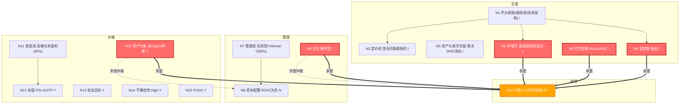

# 企业主页：Cerebras Systems Inc.（CBRS）

灵魂版本：final_20260724 | 构建日期：2026-07-31 Init | 更新：2026-07-31 Update（种子A回写：OpenAI合同研究）

## 元信息

|||
|---|---|
|公司全称|Cerebras Systems Inc.|
|代码|CBRS（NASDAQ）|
|行业|AI 硬件 / 半导体|
|技术路线|晶圆级引擎|
|成立|2016 年|
|IPO|2026年5月14日|
|CEO|Andrew Feldman（联合创始人）|
|数据截止|Q1 FY2026（2026/3/31）|
|股价参考|~$200（2026年7月），市值 ~$450-650 亿|
|标签|_company_card, Cerebras, 科技/半导体|

## 拓扑图概览



<details>
<summary>ASCII 版本（ima KB 渲染）</summary>

```
生意区: N1平台收税弱形态/技术架构(!) --> N2定价权受合同制约(!)/N4容错率极低(!)/N5晶圆级护城河真实(Y)/N6范式Rubin/ASIC(!)
管理区: N7先知型Feldman(Y)  N8 ROIIC为负(N)  N9报时型(!)
收敛区: N10门控(5-10年利润张力,!)  <=承重==>  N5 / N6 / N4 / N9 / N15
价格区: N11高增长未盈利(90%)  N12 P/S+SOTP(Y)  N13安全边际(Y)  N14不确定性High(Y)  N15高CapEx积累(Y)  N16 PVGO(Y)
矛盾仲裁: N15(高CapEx积累) ⊥ N8(ROIIC为负)→ROIIC信号优先; N9(报时型) ⊥ N10(利润估计)
正反馈: 晶圆级技术领先→低延迟推理溢价→大客户合同→营收增长→R&D投入→技术领先
负反馈(死亡螺旋): Rubin追平推理优势→客户流失→营收↓→R&D削减→技术差距扩大→更多客户流失
```

</details>

## 分类锚定

### N1 生意模式分类：平台收税者（弱形态——技术架构收税者）

置信度：80%（候选替代：规模经济者早期阶段）

L1-Key Concepts：
Cerebras 的核心生意是"用极端的晶圆级芯片架构在 AI 推理利基市场建立差异化阵地"。操作性定义：公司通过自研 WSE 芯片（单片晶圆不切割，4 万亿晶体管，44-128GB 片上 SRAM）在低 batch 高交互推理场景获得 7-16 倍的性能优势，以单套系统 >$300 万的溢价定价销售给超大规模客户，同时向云推理服务转型。

当前状态：正处于从"卖硬件"（一次性确认收入，FY2025 硬件收入 $3.58 亿，毛利率 ~43%）向"卖算力"（经常性收入，FY2025 云收入 $1.52 亿，毛利率 ~30%，增速 +93.6%）的战略转型期。FY2026 Q1 云占比已从 30% 升至 43%。

为什么关键：生意模式分类决定后续所有评估标准。Cerebras 不是纯粹的硬件公司（那样应按周期+规模经济者评估），也不是纯云平台（那样应按平台收税者评估）。它的分类本质是"技术架构收税者"——靠别人无法复制的芯片架构获得溢价。但这种收税能力极窄（仅限低 batch 推理场景，占总推理市场 <10%），且受到合同锁定而非生态锁定的脆弱保护。

L1-Mind Map：
- N1 →（决定）→ N3：平台收税者的资产化率天花板取决于 WSE 架构是否能持续领先（R&D 投入转化率）
- N1 →（决定）→ N4：技术架构收税者的容错率极低——一旦架构优势被追平，公司几乎没有缓冲
- N1 →（约束）→ N2：定价权受限于客户集中度（86% 来自 2 家关联方），非市场竞争定价
- N1 →（传导）→ N15：从硬件向云转型改变支出资产化率方向（从卖产品→建基础设施）

L2-Implications：
- 一阶推论：因为 Cerebras 是技术架构收税者（弱形态），所以它的护城河宽度直接取决于"多久没有竞争对手能复制晶圆级芯片"（置信度：高）。10 年来无竞争者成功复制 = 当前护城河真实存在。
- 二阶推论：因为护城河取决于"无竞争者复制"的持续时间，所以一旦 Rubin（2027 量产）或云厂商 ASIC 在低延迟推理上追平，Cerebras 的定价权将快速崩塌（置信度：中，假设：Rubin 推理延迟能缩小至 Cerebras 的 2-3 倍以内）。
- 待验证假设：晶圆级架构的性能优势是否随制程升级持续放大（WSE-4 仍是 5nm，未升级节点）。

L2-QA-ct：
- 质疑 1："Cerebras 难道不是规模经济者？年产越多芯片成本越低？"
  - 回应：否。Cerebras 年产芯片量极低（远不及 Nvidia 的数百万颗），无固定成本分摊优势。实际上，单片晶圆级芯片的单位成本高于 GPU。规模经济者的核心是"成本曲线位置"，Cerebras 的核心是"性能差异化"，两者方向相反。
- 质疑 2："平台收税者不应该有开发者生态吗？Cerebras 有 CWPyTorch，这不是平台吗？"
  - 回应：CWPyTorch 开发者数量远不及 CUDA（数百万级）。Cerebras 的"平台"不是软件生态，而是硬件架构。这是弱形态的平台收税者——靠硬件不可替代性而非软件锁定收税。正因如此，护城河半衰期短于典型平台收税者（如 Nvidia 的 CUDA 生态）。

L3-Case Studies：
- 正面类比：ASML（早期）——同样是用极端工程能力建立无人可复制的设备架构，通过技术垄断获得溢价定价。关键差异：ASML 的 EUV 垄断是全行业唯一的（无替代路线），而 Cerebras 的晶圆级路线只是 AI 推理的众多路线之一（GPU/ASIC/LPU 均可竞争）。
- 反例对比：Intel——曾靠制程领先+架构优势获得溢价，但被 AMD/ARM 从多个方向蚕食。教训：技术领先如果限定在单一场景而非全场景，护城河宽度有限。Cerebras 的低 batch 推理优势正是这种"单一场景领先"。

L3-Teacher-style：
Cerebras 做了一件别人做不到的事——把整块晶圆做成一颗芯片。这让它在需要快速响应的 AI 推理场景里比普通 GPU 快十几倍。但这个优势只在特定场景成立，而且一旦英伟达的新一代产品追上来，这个优势可能就不在了。它现在的商业模式是卖高价芯片和提供推理云服务，但收入极度依赖少数几个大客户。

### N7 管理层分类：创始人-先知型

置信度：85%

L1-Key Concepts：
Andrew Feldman，联合创始人兼 CEO，2016 年创立 Cerebras 至今约 10 年。此前创办 SeaMicro（2012 年被 AMD 以 $3.34 亿收购）。持股约 4.6%（IPO 时价值约 $32 亿），设计了三层股权结构（B 类 20 票/股），以 % 经济权益控制公司投票权。

当前状态：Feldman 是技术愿景驱动型管理者——敢于在 GPU 统治一切的市场中选择晶圆级架构的极端路线，历经多次流片失败仍坚持方向。商业上倾向"超级客户绑定"策略（G42 → OpenAI），善于利用大合同撬动资本市场。

为什么关键：创始人-先知型的核心风险是继任和战略集中。Cerebras 的技术路线、客户策略、资本结构都高度绑定 Feldman 个人判断。如果 Feldman 离开或判断失误，公司缺乏制度化的纠错机制。三层股权结构进一步放大了这一风险——没有任何力量能制衡创始人的决策。

L1-Mind Map：
- N7 →（决定）→ N4：创始人-先知型降低容错率——战略集中=单点失败风险
- N7 →（权重调节）→ N9：个人依赖型管理层的 N9 评估重点是"换 CEO 能否延续"，答案大概率是否
- N7 →（传导）→ N8：先知型管理层倾向于大额集中投注（OpenAI 750MW 数据中心），资本配置纪律弱
- N4 →（权重调节）→ N7：低容错率环境下，管理层评估权重大幅提升——管理层犯错=致命

L2-Implications：
- 一阶推论：因为 Feldman 是连续创业者且有成功退出记录（SeaMobile），所以他对技术路线和市场窗口的判断有较高可信度（置信度：中高）。
- 二阶推论：因为管理层竞争力绑定在个人身上，所以公司治理质量完全取决于 Feldman 的个人诚信和判断力，而非制度保障（置信度：高）。
- 待验证假设：OpenAI 三重绑定（客户+股东+债权人）是否反映了 Feldman 为追求增长而牺牲股东利益的倾向。

L3-Teacher-style：
Cerebras 的老板以前也创过业，成功把公司卖给 AMD。他有技术远见，坚持做别人不看好的晶圆级芯片，最终证明他是对的。但他也是那种"押大注"的人——整个公司现在押在 OpenAI 一个客户身上，而且他通过特殊的股权设计让自己拥有绝对控制权。这种风格的好处是决策快、执行力强，坏处是一旦他判断错了，没有人能纠正。

### N11 现金流特征：高增长未盈利型

置信度：90%

L1-Key Concepts：
Cerebras 当前处于高速增长但深度亏损的阶段。FY2025 营收 $5.10 亿（+76% YoY），Q1 FY2026 $1.93 亿（+94% YoY）。但 Non-GAAP 经营亏损 $7,570 万（FY2025），FCF -$3.93 亿。经营现金流 Q1 FY2026 首次转正（+$1,230 万），但主要因合同负债回款周期。CapEx 暴增至 $3.83 亿（FY2025），用于建设 OpenAI 合同所需的 750MW 数据中心。

估值含义：利润为负，无法用 PE/EPV。适用收入倍数（P/S）或 SOTP（分部估值）。但 P/S 极高（TTM ~64x，FY2025 ~91x），远超 Nvidia（24x）和 AI 芯片同业。

L1-Mind Map：
- N11 →（约束）→ N12：高增长未盈利型约束估值方法为 P/S + SOTP + 远期收入倍数
- N11 →（传导）→ N14：未盈利增加不确定性等级
- N1 →（决定）→ N11：平台收税者（弱形态）的现金流特征取决于转型进度——硬件销售是间歇性大单，云服务是经常性收入

## 财务数据摘要（FY2022 - Q1 FY2026）

|||||||
|---|---|---|---|---|---|
|营收（百万美元）|24.6|78.7|290.3|510.0|193.4|
|营收增速|—|+220%|+269%|+76%|+94% YoY|
|毛利率（GAAP）|11.7%|33.5%|39.4%|34.8%|44.6%|
|Core 毛利率|—|—|—|—|46.5%|
|经营利润|-178.8|-133.9|-101.4|-145.9|-15.0|
|经营利润率|-726%|-170%|-35%|-29%|-7.8%|
|经营现金流|-164.4|-79.0|+452.0|-10.1|+12.3|
|CapEx|10.5|6.6|23.4|382.7|236.6|
|FCF|-174.9|-85.6|+428.5|-392.8|-224.3|
|现金储备|—|—|698.9|1,336.9|~3,300|
|研发费用率|—|—|—|~47.7%|~60%|

分业务（FY2025）： 硬件 $3.58 亿（70%，毛利率 ~43%） | 云 $1.52 亿（30%，毛利率 ~30%）
Q1 FY2026 Core 分业务： 硬件 $1.12 亿（58%） | 云 $7,980 万（42%，+167% YoY）
客户集中度： FY2025 前两大客户 86%（MBZUAI 62% + G42 24%） | Q1 FY2026 OpenAI 开始贡献
合同积压（RPO）： $246 亿（主要 OpenAI $200 亿+）
Q2 FY2026 指引： Core 毛利率 36%-38%（骤降 -9pp），全年 38%-41%

信源：[S] 官方财报/SEC 文件 + cerebras_baseline.md（FY2026 Q1 tracker 数据）

## 16 节点认知构建

### N1 生意模式分类

见分类锚定。分类：平台收税者（弱形态——技术架构收税者） | 置信度：!

补充维度信息：
- 收入来源结构正在转变：硬件 70%→58%（下降），云 30%→42%（上升）。最终形态可能接近"SaaS 基础设施型"——卖算力使用权而非卖芯片。
- R&D 费用率 ~48%（FY2025），远高于成熟半导体公司（Nvidia ~15%，AMD ~25%）。这反映了平台收税者仍在前期的特征——需要持续高研发投入维持架构领先。

### N2 定价权

置信度：Y（Update 升级：种子A回写，合同条款透明度大幅提升）

L1-Key Concepts：
Cerebras 的定价权来源于晶圆级芯片在低 batch 推理场景的性能优势（7-16 倍于 GPU）。单套 CS-3 系统售价 >$300 万，溢价显著。但定价权的"四种变体"中，Cerebras 属于哪种？

- 消费者定价权：否（非 C 端产品）
- 供应链定价权：部分——对台积电 5nm 产能无议价权（依赖单一供应商），但对客户有一定议价权（产品不可替代）
- 规模定价权：否（无规模成本优势）
- 信任定价权：弱——品牌仅在 AI 行业圈内认知，无消费者品牌溢价

Cerebras 的定价权本质是技术稀缺定价权——因为别人做不出来，所以可以收高价。但这种定价权受两个因素严重制约：(1) 客户集中度 86%（议价权实际在少数大客户手中）；(2) 合同条款可能包含折扣（FY2025 毛利率从 42.3% 降至 39.0%，大客户折扣是原因之一）。

当前状态：FY2025 综合毛利率 34.8%（GAAP），Q1 FY2026 Core 毛利率 46.5%。Q2 指引骤降至 36-38%（租回硬件成本）。毛利率波动大，定价权的稳定性未经验证。

[种子A回写] OpenAI 合同定价机制深层揭示：
研究发现合同定价包含三层隐性折扣，结构性压低报表毛利率：

- Take-or-Pay 收入确认：750MW 承诺容量采用 over-time 确认（按 3-4 年服务期分摊），收入对"使用量"免疫但对"MW 部署交付"敏感。风险从需求端转移到供给端——Cerebras 只需交付就算收入，但如果无法按时交付则一切归零。[S]
- 权证摊销：OpenAI 获授 3,344 万 Class N 权证（行权价 $0.00001/股），入账客户权证资产 $5.16 亿（2026-03-31），按收入比例摊销至 2031-10，冲减收入。稳态拖累 GAAP 毛利率约 3-6pp。对比：G42 行权价 $0.01，AWS 行权价 $100——OpenAI 让渡条件远远优厚于同期伙伴。[S/C]

[generated, not original text]
