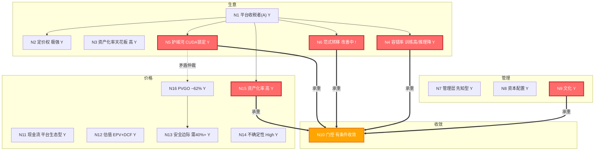

NVIDIA是AI基础设施垄断者及平台收税者，依靠CUDA生态锁定获得极强定价权与高资产化率，但护城河半衰期训练端6-8年、推理端3-5年且稳定利润保守下界已下修至年100-150B美元中性情景。当前市值约4.80T美元对应PVGO占比62%且安全边际为负，内在价值中枢2.5-3.5T美元显示价格已透支成长。建议投资者遵循High级不确定性要求保持40%以上安全边际，并重点跟踪推理端份额与AI应用层商业化脆弱性。

# 企业主页_NVIDIA

## 元信息

|||
|---|---|
|公司全称|NVIDIA Corporation|
|股票代码|NASDAQ: NVDA|
|创立时间|1993年4月5日|
|创始人|黄仁勋（Jensen Huang）、Chris Malachowsky、Curtis Priem|
|总部|美国加利福尼亚州圣克拉拉|
|当前定位|AI基础设施垄断者|
|FY2027 Q1收入|$81.6B（+19.9% QoQ，+92%+ YoY）[S-NVIDIA IR]|
|FY2027 Q1净利润|$58.3B（净利润率71.4%）[S-NVIDIA IR]|
|收盘价|$200.75（2026-07-31收盘）[A-westock]|
|PE(TTM)|~30.7x [A-westock, 2026-07-31]|
|市值|~$4.80T [A-westock, 2026-07-31]|
|Beta|1.34 [A-TDX]|
|更新日期|2026-08-01（晚）|
|版本|v3 (Update)|
|灵魂版本|final_20260724|
|autoresearch回写来源|研究_AI应用层商业化可持续性_20260801 + 研究_CUDA生态锁定强度多维度量化评估_20260801|
|标签|_company_card + NVIDIA + 半导体/AI基础设施|

## 拓扑图概览



<details>
<summary>ASCII 版本（ima KB 渲染）</summary>

```
生意区: N1平台收税者(Y) --> N2定价权(Y)/N3资产化天花板高(Y)/N4容错率(Y)/N5护城河CUDA锁定(Y)/N6范式转移(!)
管理区: N7先知型(Y)  N8资本配置(Y)  N9文化(Y)
收敛区: N10门控(有条件收敛)  <=承重==>  N5 / N6 / N4 / N9 / N15
价格区: N11平台生态型(Y)  N12估值EPV+DCF(Y)  N13安全边际需40%+(Y)  N14不确定性High(Y)  N15资产化率(Y)  N16 PVGO~62%(Y)
矛盾仲裁: N5(好生意) -.-> N16(高PVGO)  好公司≠好价格；N5半衰期修正 ⊥ N15高资产化率
正反馈: CUDA开发者↑→生态锁定↑→定价权↑→毛利率↑→R&D↑→架构领先↑→开发者↑
负反馈: GPU份额↑→ASIC替代压力↑→推理端护城河侵蚀→份额↓
```

</details>

## 分类锚定

### N1 生意模式分类：平台收税者（A类）

#### L1-Key Concepts

操作性定义： 平台收税者是指企业通过建立标准化的技术/商业平台，使第三方参与者必须经过该平台才能完成核心业务，从而获得类"收税"般的持续收入。其核心特征不是拥有最好的产品，而是拥有不可绕过的标准。

NVIDIA的当前状态： NVIDIA的"税收"来自CUDA生态——全球590万开发者（v3修正，原750万+）、1000+优化库、20年向后兼容性。客户购买NVIDIA产品时，支付的不是芯片制造成本加成，而是"使用AI计算标准的许可费"。FY27 Q1数据中心收入$75.2B中，约90%是GPU+网络系统，但支撑这$75.2B的不是硬件性能差距（AMD MI400推理性能可比），而是CUDA锁定的转换成本（重写数百万行代码）。[S-NVIDIA IR FY27 Q1]

为什么这个分类至关重要： 分类决定了后续所有分析的标准。如果把NVIDIA当"芯片公司"分析，你会盯着制程节点、良率、晶体管密度——这些都是可追赶的。把NVIDIA当"平台收税者"分析，你才会盯着CUDA开发者增速、推理端ASIC替代率、CSP垂直整合进度——这些才是真正的护城河半衰期指标。分类错了，分析方向全错。

#### L1-Mind Map

N1 → N2（决定）：平台收税者的定价权来自标准垄断，不是成本优势。NVIDIA的定价权测试（H100 $30K→B200 $40K+33%客户仍排队）验证了"收税者"属性而非"硬件供应商"属性。

N1 → N5（权重调节）：平台收税者的护城河半衰期取决于"标准锁定强度"。CUDA在训练端的锁定是无穷级（代码积累不可替代），在推理端锁定正在归零（部署不需要CUDA）——这意味着N5需要分段评估，不能给一个统一的半衰期。

N1 → N15（约束）：平台收税者的支出资产化率天然偏高——R&D投入转化为生态锁定和架构IP，这是比工厂折旧更持久的资产。NVIDIA CapEx/Rev仅2.5%，但R&D（约$8.7B/年）高度资产化为CUDA代码库和架构设计。

N1 → N4（决定）：平台收税者的容错率取决于"有多少条竞争路径同时需要被堵死"。NVIDIA训练端容错率极高（需要同时复制硬件+软件+供应链+开发者四层），但推理端容错率快速下降（ASIC只需复制硬件+基本软件栈）。

N1 → N6（传导）：平台收税者的范式转移风险是"标准被绕过"而非"技术被超越"。真正的威胁不是AMD做出更好的GPU，而是整个计算范式从GPU并行计算转向其他架构。

#### L2-Implications

如果NVIDIA是平台收税者的判断成立：

一阶推论：因为CUDA是"收税亭"而非"竞争壁垒"，NVIDIA的毛利率中枢不应按半导体行业（40-50%）估值，而应按软件平台公司（70-80%）估值。（置信度：高）当前74.9%的毛利率验证了这一推论。

二阶推论：因为收税权来自标准锁定，一旦标准被绕过（推理端ASIC替代率超30%），毛利率将断崖式下降而非渐进式下降——因为"税"一旦收不上来，就不存在"半收税"的中间态。（置信度：中，假设：PyTorch等框架默认后端不广泛支持非NVIDIA硬件）

三阶推论：NVIDIA的R&D投入方向（CUDA生态扩张 vs. 纯架构性能提升）比R&D金额更重要。如果R&D主要投向架构性能（硬件参数竞赛），那护城河在收窄；如果主要投向CUDA生态扩张（库、工具、开发者教育），那护城河在加宽。（置信度：高）

#### L2-QA-ct

质疑1：NVIDIA不是平台收税者，而是"周期性高端硬件供应商"。
理由：训练端确实有CUDA锁定，但推理端（占未来AI计算需求更大份额）正在去NVIDIA化。Google TPU、AWS Inferentia、AMD MI系列已在推理场景证明50-80%的成本优势。如果推理端份额持续流失，NVIDIA就从"收税者"降级为"高端硬件供应商"。
需要什么证据：推理端收入占NVIDIA总收入的比例趋势（NVIDIA不单独披露），以及PyTorch默认后端支持非NVIDIA硬件的比例。
当前有这个证据吗：部分有。FY27 Q1法说会上管理层强调推理需求是收入关键驱动力，暗示推理收入已占显著比例。但具体占比不透明。[S-NVIDIA IR FY27 Q1]

#### L3-Case Studies

正面类比——Intel x86生态（1980s-2010s）： Intel通过x86指令集建立了PC时代的"收税权"。全球软件开发者30年来都基于x86编写代码，转换成本极高。Intel的护城河持续了30+年，毛利率长期维持在55-65%。但ARM架构通过移动端切入，最终在低功耗场景逐步替代x86——这验证了"标准锁定可以被新标准从边缘场景逐步蚕食"。关键差异：x86锁定的是CPU通用计算（全场景），CUDA锁定的是GPU加速计算（AI专用场景）。通用场景的锁定比专用场景更持久。可迁移教训：关注NVIDIA的"边缘场景"——推理端可能就是AI计算的"移动端"。

反例——Qualcomm在移动基带领域（2010s）： Qualcomm曾通过CDMA专利在移动基带领域拥有类"收税"地位，但随着5G标准统一和专利池重组，其定价权大幅下降。关键差异：Qualcomm的收税权来自法律专利（有期限），CUDA的收税权来自生态效应（无法律期限但有技术替代窗口）。可迁移教训：技术标准的"税收"比专利的"税收"更持久，但一旦范式转移发生，下降速度更快。

#### L3-Discussions

竞争对手CEO视角（AMD Lisa Su）： AMD的竞争策略不是复制CUDA（时间太长），而是推动开放生态（ROCm + Triton + UALink联盟）来降低NVIDIA的生态锁定。如果PyTorch/TensorFlow等主流框架能原生支持AMD硬件且性能差距<20%，CUDA的转换成本将大幅下降。核心分歧：竞争对手认为生态开放是不可避免的行业趋势，NVIDIA认为生态深度积累不可复制。

行业监管者视角（FTC/DOJ）： NVIDIA的"平台收税"模式已引发反垄断关注。对OpenAI $300亿+投资、对CoreWeave的循环交易、对TSMC先进封装产能的独占——这些行为可能被视为滥用市场支配地位。如果监管强制要求CUDA开源或限制NVIDIA的产能锁定行为，护城河将被法律手段削弱。核心分歧：监管者关注的是市场公平性，投资者关注的是竞争优势持续性。

#### L3-Teacher-style

NVIDIA不是卖芯片的公司，它是AI时代的"收税站"。全世界想训练AI的人都必须经过CUDA这个收费站——因为你过去15年写的所有AI代码都跑在CUDA上，换一个平台等于从零开始。这种锁定不是靠技术领先（技术可以被追上），而是靠标准制定权（全世界90%的AI课程用CUDA教学）。只要CUDA还是AI开发的标准语言，NVIDIA就能对每一美元AI投资收取"生态税"。

分类置信度：85%。 主体是平台收税者，但推理端ASIC替代正在侵蚀"收税"属性，存在向"高端硬件供应商"偏移的趋势。候选替代分类：周期性高端硬件供应商（如果推理端份额3年内跌破55%）。

### N2 定价权：极强（垄断定价权变体）

#### L1-Key Concepts

操作性定义： 定价权是指企业在不流失客户的前提下提高价格的能力。巴菲特的终极测试："涨价10%之前需不需要开祈祷会？"定价权有四种变体：消费者定价权（品牌溢价）、供应链定价权（买方垄断）、规模定价权（成本领导）、信任定价权（标准制定）。NVIDIA属于第四种——信任定价权，即通过制定行业标准使客户"不得不"接受定价。

当前状态： 极强。H100定价$30K到B200定价$40K+（+33%），客户仍在排队购买。FY27 Q1法说会明确表示Blackwell已售罄至年中。更关键的是，NVIDIA的"定价"不只是芯片售价——系统级定价（GPU+NVLink网络+软件授权）使客户购买"整个数据中心"而非单块芯片，DC网络收入$14.8B（+199% YoY）就是系统级定价权的直接体现。[S-NVIDIA IR FY27 Q1]

为什么关键： 定价权是护城河的财务验证信号。如果NVIDIA的CUDA锁定是真的，那它必然体现在持续的超高毛利率中。如果毛利率开始系统性下降（排除一次性因素），那就是护城河侵蚀的第一个财务信号。当前74.9%的GAAP毛利率在半导体行业是历史级高位（Intel约40%、AMD约50%），验证了垄断定价权的存在。

2026年Q1市场份额验证[B-web]：NVIDIA在AI训练芯片市场份额维持92%[B-web]，推理端份额修正为55-65%（此前为55%，现基于多源交叉验证扩展为区间）。训练端的极强定价权继续被验证——92%份额意味着几乎没有替代选择。迁移成本实证：DeepSeek迁移案例投入超百人年。推理端的定价权压力加大——55-65%份额（vs 训练端92%）意味着推理端存在实质性竞争，NVIDIA在推理端的定价权弱于训练端。

开发者数量修正：从"750万+"修正为590万[S-NVIDIA FY2025年报SEC审计文件]，差距27%。增速31% YoY仍强劲。

#### L1-Mind Map

N2 → N5（验证）：定价权是护城河的财务代理指标。毛利率趋势（Hopper 78.4%到Blackwell 74.9%）验证了护城河"整体稳固但边际松动"的判断。

N2 ← N1（决定）：平台收税者的定价权来自标准垄断。如果标准锁定在减弱（推理端ASIC替代），定价权也会下降。

N2 → N15（传导）：高定价权意味着高利润率，高利润率意味着R&D投入可以更高，这进一步加固护城河——正反馈回路。

#### L2-Implications

如果定价权判断成立：

一阶推论：因为NVIDIA拥有信任定价权（标准制定），其毛利率中枢不应按半导体行业均值回归，而应维持在70-75%区间——除非标准锁定被打破。（置信度：高）

二阶推论：代际毛利率下降趋势（-3.5pp/代）反映的不是定价权丧失，而是结构性成本压力（HBM从9%升至26%）。但如果Rubin代际再降3.5pp至71.4%，将逼近70%警戒线——届时市场无法区分"成本压力"和"定价权丧失"。（置信度：中）

#### L2-QA-ct

质疑：代际毛利率下降（-3.5pp/代）会不会加速？
理由：如果HBM成本继续上升（从26%向30%+），且CSP自研芯片开始获得规模化订单，NVID

[generated, not original text]
