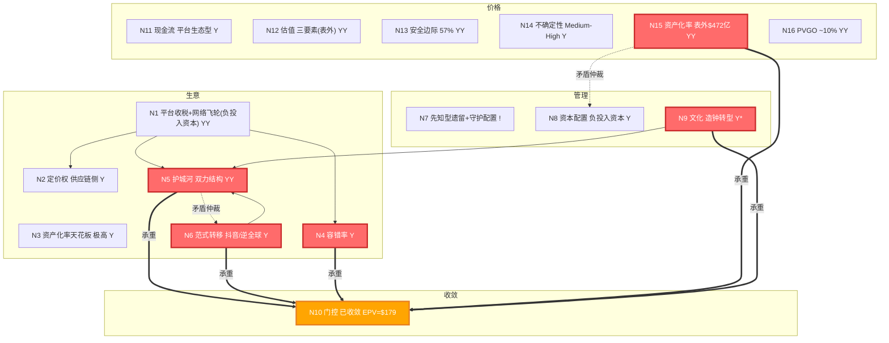

# PDD是负投入资本型平台收税与网络飞轮复合体
国内靠品类隔离与网络效应维持高容错率护城河，但Temu受de minimis取消确定性打击、新拼姆千亿投入经测算所有情景NPV为负构成资本毁灭风险。估值显示EPV达179美元/ADS而现价仅84.85美元，含表外资产的安全边际约57%，市场过度定价竞争担忧但VIE现金可及性存疑。建议优先验证VIE结构下4961亿现金跨境可及性并关注股东回报政策与Temu转型盈利拐点以兑现折价修复。

## 拓扑图概览



<details>
<summary>ASCII 版本（ima KB 渲染）</summary>

```
生意区: N1平台收税+网络飞轮(负投入资本)(YY) --> N2供应链定价权(Y)/N3天花板极高(Y)/N4容错率(Y)/N5护城河双力(YY)/N6范式转移(Y)
管理区: N7先知型遗留+守护配置(!)  N8负投入资本型(Y)  N9造钟转型(Y*)
收敛区: N10门控(已收敛, EPV=$179)  <=承重==>  N5 / N6 / N4 / N9 / N15
价格区: N11平台生态型(Y)  N12三要素表外(YY)  N13安全边际57%(YY)  N14 Medium-High(Y)  N15表外$472亿(YY)  N16 PVGO~10%(YY)
矛盾仲裁: N15(高表外资产) ⊥ N8(Temu亏损170-240亿); N5(网络效应) ⊥ N6(抖音)→共存非替代
正反馈: S&M投入→用户增长→商家增长→GMV增长→利润→更多S&M
负反馈: 广告变现率↓→利润率↓→S&M效率↓→增长放缓
```

</details>

## §1 生意区

### N1 生意模式分类
**信心：YY**

**[L1-KC] 核心认知**
PDD 的生意模式是 **平台收税者**（基本盘）+ **网络飞轮者**（结构性优势） 的复合体，且属于极为特殊的 **负投入资本型平台**。

*   **平台收税者的操作性定义**：对在平台上发生的交易收取"税"——两种变现方式并行。(1) 在线营销服务（广告），商家竞价购买流量和曝光，FY2025收入2178亿CNY占总营收50.4%；(2) 交易服务（佣金/Take Rate），对GMV抽取佣金，FY2025收入2141亿CNY占49.6%。Q1 2026交易服务收入639亿首次超越广告收入，标志着变现模式正从"流量税"向"交易税"深化。收入模型的本质公式为：收入 = GMV × Take Rate，核心健康度指标不是收入增速，而是经营利润率——它反映take rate与成本结构的平衡状态。
*   **网络飞轮者的操作性定义**：平台价值随双边用户增长非线性放大——约9亿+活跃买家和1580万活跃商家形成正反馈飞轮。买家的"最低价"心智吸引更多商家，更多商家带来更丰富的SKU和更低价格，进一步吸引买家。社交裂变（拼团）是飞轮的启动机制，C2M反向定制（聚合需求→反向压缩供应链成本）是飞轮的加速器。
*   **负投入资本型的关键特征**：投入资本 = 有息负债(56亿) + 股东权益(4149亿) - 超额现金(4746亿) = -541亿（负值）。应付商家款1443亿形成负营运资本——PDD不是用资本做生意，而是用商家的钱做生意。这意味着传统ROIC/ROIIC公式对PDD完全失效（分母为负），需要用ROE（27.3%）、FCF Yield（11.9%）和Ex-cash PE（3.8x）作为替代指标。
*   **当前状态**：FY2025营收4318亿CNY（+9.6%），增速从FY2024的+56%显著放缓。毛利率从FY2019的79%持续降至FY2025的56.3%（因Temu履约成本占比上升），净利率从28.6%降至23.0%。PDD的10年财务轨迹经历了"战略性亏损（2018-2020）→ 规模效应暴利（2022-2024）→ 战略再投入换挡（2025）"三个阶段。

**[L1-MM] 机制图谱**
*   N1 ──-> N2 定价权：平台收税者模式决定了PDD的定价权在供给侧（对商家）而非需求侧（对消费者）。决定了N2用"渠道摩擦比"而非"消费者溢价"来衡量定价权。
*   N1 ──-> N3 资产化率天花板：平台生意的支出转化率天然极高（算法/数据/网络效应是持久资产，无需折旧）。PDD 10年累计CapEx仅46亿，固定资产$9亿——但真正的价值资产在表外。
*   N1 ──-> N4 容错率：平台+网络效应的复合模式通常容错率较高（双边网络越过临界点后难以被颠覆），但PDD面临特殊的低容错率风险（Temu地缘政治）。
*   N1 ──-> N5 护城河：网络飞轮者的护城河是双边网络效应，平台收税者的护城河是规模经济+转换成本。7 Powers框架验证为"1主导(网络效应)+1辅助(规模经济)"双力结构。
*   N1 ──◇-> N15 资产化率评估方向：负投入资本型平台需用表外资产重置成本（S&M+R&D积累）作为替代指标。Greenwald估值确认表外资产$472亿。

**[L2-Imp] 推论**
*   **一阶推论**：传统资本回报率指标（ROIC/ROIIC）对PDD的估值约束力为零——PDD的增长不依赖资本投入，而依赖S&M费用。分析PDD时，利润率的边际变化比"资本回报率"更能反映平台健康度。（置信度：高）
*   **二阶推论**：FY2025经营利润率从27.5%降至21.9%不仅是"战略投入"的结果，更是平台效率正在被竞争和纳税规范化侵蚀的信号。如果这个趋势持续（连续2-3年利润率下降），说明PDD的"收税权"正在减弱——可能需要下调N10保守下界。待验证假设："千亿扶持"结束后利润率能否回升至25%+。（置信度：中，假设：竞争格局不进一步恶化）
*   **三阶推论**：负投入资本型特征意味着PDD的增长本质上是"已投入资金的延迟变现"——2022-2024年的巨额S&M（用户补贴+Temu扩张）形成了用户基数和商家生态，2025年及以后逐渐释放利润。当前利润率下滑可能是"延迟变现"被竞争和纳税规范化侵蚀的信号。（置信度：中）

### N2 定价权
**信心：Y**

**[L1-KC] 核心认知**
PDD 的定价权属于 **供应链定价权（供给侧）** 变体，消费者端定价权为负值（以最低价竞争）。这是平台收税者模式的结构性特征——平台对商家的议价能力越强，take rate越高，但对消费者的价格必须越低（否则流量流失）。

*   **四层体现**：(1) C2M反向定制，聚合海量需求反向压缩供应链成本，出厂价仅占传统零售价的25%；(2) 应付账款周转天数持续拉长（18天→25天），占用商家资金1443亿形成负营运资本；(3) "仅退款"政策将售后成本转嫁给商家；(4) 全托管模式下对定价权的完全控制——平台决定零售价，商家只负责供货。
*   **定价权的直接量化**：FY2024营业利润率32.6%，远超阿里8%、京东3%。但FY2025经营利润率降至21.9%（"千亿扶持"主动压制+竞争加剧）。
*   **广告变现率下滑归因（种子G拆解）**：Q1 2026广告收入增速仅2.5%。
    | 归因维度 | 缺口贡献占比 | 影响百分点 | 属性与可逆性 |
    | :--- | :--- | :--- | :--- |
    | 会计口径调整 | ~67% | -5.0pp | 技术性（完全可逆）：智能优惠券被要求冲减广告收入(ASC 606)，叠加推广净成交计费模式调整，造成表观"假摔" |
    | 纳税规范化冲击 | ~20% | -1.5pp | 结构性（部分可逆）：受金税四期与涉税信息报送规定影响，中小商家广告预算收缩(>30%)，短期补缴冲击1-2年可消化，但合规成本永久上升 |
    | 流量价值衰减等竞争因素 | ~9% | -0.7pp | 结构性（不可逆）：自然流量枯竭（付费占比达80-90%），ROI持续下降，平台全公域商业化逼近物理极限 |
    | 平台主动让利/战略转型 | ~4% | -0.3pp | 主动（可逆）：千亿扶持计划中降低基础技术服务费等主动生态升级带来的短期代价 |
*   **定价权本质判断——"高效率框架内的极致榨取"（种子G核心结论，双重性统一）**：
    *   *支持"效率提升"的证据*：平台Take rate仅4.6%，远低于抖音电商的10%；投流ROI（1:3.2）仍优于抖音（1:2.5）；C2M模式与黑标体系为白牌工厂提供确定性产能。
    *   *支持"极致压榨"的证据*：全链路渠道成本率高达23.8%，几乎等同于商家加权毛利率（24.9%）；零私域机制（无购物车、无关注店铺、单品逻辑）；高频罚款机制。
    *   *核心结论*：平台确实提供了更高效率的交易基础设施，但通过"全公域商业化"的流量垄断，将效率提升的收益几乎完全捕获，把商家的利润空间压缩至物理极限。

**[L1-MM] 机制图谱**
*   N2 ──v-> N5 护城河（验证关系：定价权下降→护城河在收窄的信号。）
*   N2 ──=>> N10 利润可估性（传导关系：广告变现率的结构性下滑意味着利润可估性的保守下界需要考虑更低take rate的情景。）
*   N2 ──=>> N15 资产化率（传导关系：定价权越强，S&M投入转化为利润的效率越高。）

**[L2-Imp] 推论**
*   **一阶推论（精确化）**：PDD国内广告变现率并非表观下滑5pp+那样严重——表观增速下滑67%可逆，真实结构性下滑约1.5-2pp。（置信度：高）
*   **二阶推论**：C2M+低价心智的底层壁垒未破（活跃商家仍净增+100万/年、投流ROI仍优于抖音），但ROI下降（1:5.2→1:3.2）、流量见顶、单商家广告收入增速骤降等表层压力确实存在。这是当前定价权状态最准确的描述。（置信度：中）

[generated, not original text]
