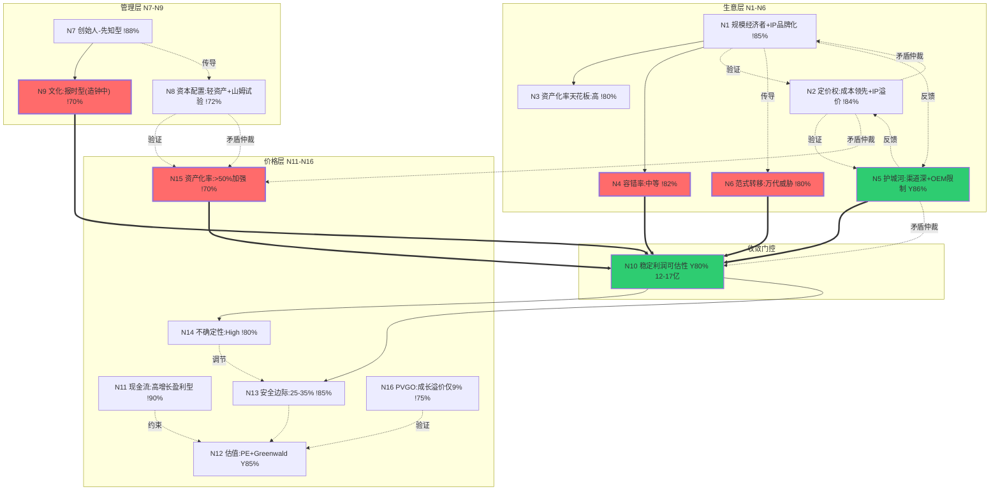

# 企业主页：布鲁可（00325.HK）

---

## 元信息

| 项目 | 内容 |
|------|------|
| 公司全称 | 布鲁可集团有限公司（Bloks Group Limited） |
| 股票代码 | 00325.HK（港交所主板，2025年1月上市） |
| 行业 | 拼搭角色类玩具 / IP消费品 |
| 创始人/CEO | 朱伟松（Weisong Zhu），持股48.48% |
| 灵魂版本 | 三支柱 final_20260724 |
| 卡片版本 | v7（Update: 去IP化证伪+新Excel时间维度） |
| 创建日期 | 2026-07-31 |
| 最新财报 | FY2025（2025.12.31）+ 26H1（2026.06.30），26H1营收14.67亿港元，经调整净利润3.20亿人民币 |
| 前置依赖 | financial-analysis：25年报点评+26H1中报点评 ✓；value-investing-analysis：深度分析+Greenwald三要素估值（AV/EPV/成长） ✓ |
| 估值锚 | Greenwald: AV=26港元, EPV中枢=47港元, 当前股价~48港元（接近EPV，无安全边际） |

---

## 拓扑图

### Mermaid 版本（GitHub 渲染）



<details><summary>ASCII 版本（ima KB 渲染）</summary>

```
                    ┌──────────────────────────────────────────────────┐
                    │                生意层（N1-N6）                     │
    N1 规模经济者（基本盘）+ IP品牌化（增量层）  !85%                  │
    ├──决定--> N3 资产化率天花板：高 !80%                               │
    ├──决定--> N4 容错率：中等 *  !82%                                  │
    ├──验证--> N2 定价权：成本领先+IP溢价 !84%                          │
    │          └--验证--> N5 护城河：渠道深+OEM限制 * Y88%              │
    └──传导--> N6 范式转移：万代威胁 *  !80%                            │
                    ┌──────────────────────────────────────────────────┐
                    │               管理层（N7-N9）                     │
    N7 创始人-先知型  !90%                                              │
    ├──决定--> N9 企业文化：报时型（造钟中）*  !70%                     │
    └──传导--> N8 资本配置：轻资产+山姆试验 !72%                        │
                    ╔══════════════════════════════════════════════╗    │
                    ║        N10 稳定利润可估性 **  Y83%            ║    │
                    ║   承重边：N4==>N10 N5==>N10 N6==>N10          ║    │
                    ║          N15==>N10 N9==>N10                   ║    │
                    ║   状态：Y级收敛（12-17亿人民币，中值15-16亿）  ║    │
                    ╚══════════════════════════════════════════════╝    │
                    ┌──────────────────────────────────────────────────┐
                    │               价格层（N11-N16）                   │
    N11 高增长盈利型（A/C过渡）  !90%                                   │
    ├──约束--> N12 估值：PE+Greenwald  Y85%                            │
    ├──调节--> N13 安全边际：25-35%  !85%                               │
    ├──传导--> N14 不确定性等级：High  !80%                             │
    ├──决定--> N15 支出资产化率：>50%加强 *  !70%                       │
    └──验证--> N16 PVGO：成长溢价仅9%  !75%                             │

    关键反馈回路（正）：
    IP变现效率 -> 规模经济 -> 成本优势 -> 更低定价 -> 更多消费者
    -> 更强渠道议价力 -> 更多IP方愿意授权 -> 更强IP矩阵 -> 更高变现效率

    关键反馈回路（负）：
    版税率上升 -> 毛利率承压 -> 利润率下降 -> 成长溢价收缩 -> 估值下修

    矛盾仲裁点：
    N15（高资产化率） -X- N8（ROIIC待验证） -> 待验证，FY2026-2027仲裁
    N5（IP到期2027/2028） -X- N10 -> 已仲裁（v3），安全边际下调至25-35%
    N2（版税率上升） -X- N15（毛利率改善） -> 慢性病，跟踪续约条款
    N5（OEM依赖） -X- N8（资本配置） -> 已仲裁（v6），轻资产主动选择
    N2（山姆高端化） -X- N1（下沉基本盘） -> 部分仲裁（v6），增量不冲击

    Greenwald估值锚：
    AV=26港元（资产底） -> EPV=47港元（盈利锚） -> 市场价~48港元（无安全边际）
```

</details>

---

## 分类锚定

### N1 生意模式：规模经济者（基本盘）+ IP品牌化（增量层）

**L1-KC**：布鲁可的核心生意是"拼搭角色类玩具"——获取IP授权，通过标准化供应链生产拼搭积木人，以9.9-59元主力价格带通过15万+经销商网点触达消费者。FY2025营收32.26亿港元，其中拼搭角色类玩具占97.58%，拼搭载具类及积木玩具占2.4%。[S: westock zhsy FY2025]

基本盘是**规模经济者**：零件高度标准化、模具复用率高、上新周期6-7个月（行业10-12个月）、1,447个SKU在售（年新增913个）、经销商网络15万+网点。通过产量规模摊薄固定成本，形成"低成本→低价→大规模→更大规模→更低成本"的飞轮。

增量层是**IP品牌化**：29个商业化IP（含奥特曼、变形金刚、假面骑士、宝可梦、三丽鸥、初音未来等），驱动消费者购买意愿。但IP绝大部分是授权的（非自有），因此不是纯品牌溢价者。

**L1-MM**：N1（规模经济）决定N3天花板（拼搭玩具全球TAM）和N4容错率（规模经济者容错率中等——犯错不致命但侵蚀飞轮）。N1（IP品牌化）验证N2定价权（IP热度→消费者支付意愿）并传导至N5护城河半衰期（IP生命周期）。复合生意分段处理：N1/N2/N4/N5/N6从两个视角分别分析；N7/N8/N9整体分析；N10分段→整体收敛。

**L2-Imp**：如果规模经济分类成立→评估重点为成本曲线位置和飞轮自律性（置信度：高），核心跟踪指标为毛利率趋势和SKU上新效率。如果IP品牌化增量逻辑成立→N5护城河半衰期>10年（置信度：低，假设：IP授权续约顺利+自有IP成长）。

**L2-QA**：质疑1——"布鲁可明明靠IP赚钱，为什么不是品牌溢价者？"回应：品牌溢价者的IP是自有且沉淀在消费者心智中的（如茅台、爱马仕），布鲁可的IP是"租来的"，需要持续支付授权费。它不拥有IP的长期资产——核心竞争力是把IP变成高质价比产品的工业能力。质疑2——"去掉IP公司会垮，IP才是核心驱动力？"回应：IP可以更换（奥特曼占比已从63.5%降至约40%），供应链效率崩塌则所有IP都无法变现。基本盘是"把任何IP变成高质价比产品的能力"。

**L3-Case**：正面类比——万代南梦宫（同样依赖IP授权、核心是工业化产品能力，高达IP运营40+年）。反例——乐高（自有品牌+自有IP，真正的品牌溢价者+规模经济者复合，与布鲁可的"授权IP"有本质区别）。

**L3-Teach**：布鲁可本质上是一个"IP流量变现工厂"。核心能力不是创造IP，而是用高效标准化供应链把热门IP角色变成9.9-59元的拼搭玩具，通过15万个校边店卖给小朋友。别人也能拿IP授权，但做不到这么便宜、这么快、品质这么好。

**置信度：!85%**（标注候选替代分类：IP品牌化平台）

---

### N7 管理层：创始人-先知型（向造钟者过渡早期）

**L1-KC**：朱伟松（Weisong Zhu），创始人/董事长/CEO，持股48.48%[S: westock shareholder]。游族网络联合创始人背景，深谙游戏化运营和IP运营逻辑。公司2025年1月港交所上市。"全人群、全价位、全球化"三大战略由他定义并亲自推动。

**L1-MM**：N7决定N9企业文化方向（当前偏报时型，正在建制制度化基础设施——600人研发团队多工作室并行、15万+经销商网络体系）。N7通过创始人决策影响N8资本配置质量（IPO募资投向、海外扩张节奏、研发投入力度）。

**L2-Imp**：一阶：朱伟松的战略判断力是公司当前核心竞争力的重要组成部分（置信度：高），三大战略在过去2-3年被验证有效——营收从FY2023的9.67亿港元增至FY2025的32.26亿港元。二阶：如果朱伟松离开或判断失误，公司战略可能陷入真空（置信度：中），目前无公开的明确继任计划。

**L2-QA**：质疑——"上市不到2年，判断管理层类型是否太早？"回应：判断管理层类型不看时间长短，看竞争力绑定模式。朱伟松持股48.48%+亲自制定所有重大战略+公司仍在验证商业模型早期阶段——典型创始人-先知型画像。但上市+制度化研发体系表明他有意识在"造钟"，未来2-3年观察能否培养出独立决策的高管团队向造钟者过渡。

**置信度：!90%**

---

### N11 现金流特征：高增长盈利型（A/C过渡）

**L1-KC**：FY2025营收32.26亿港元，归母净利润7.02亿港元，经营现金流9.93亿港元[S: westock FY2025]。已跨越盈亏平衡点（FY2024归母净利润尚为负，Non-GAAP口径盈利），经营现金流为正且足以覆盖资本开支（FY2025 CapEx约2.60亿港元）。但增速仍高（30%+），海外扩张+新品模具投入消耗大量资本。

**分类理由**：不同于纯C型（高增长未盈利，已过那个阶段），也不同于纯A型（成熟稳定，增速已放缓）。当前是A/C过渡——有盈利能力但增长投资大、盈利波动性较高。估值方法偏向PE（Non-GAAP口径）+ 逆向DCF验证，需要为增长不确定性保留安全边际。

**置信度：!90%**

---

## 财务数据速览

| 指标（港元，除非标注） | FY2023 | FY2024 | FY2025 | 26H1 | 趋势 |
|------------------------|--------|--------|--------|------|------|
| 营业收入（亿港元） | 9.67 | 24.20 | 32.26 | 14.67 | ↑28%（26H1 YoY） |
| 营收增速 | 169% | 150% | 33% | 27.9% | 增速换挡确认 |
| 毛利率 | 47.3% | 52.6% | 46.8% | 48.4% | 环比改善但仍低于25H1(52.9%) |
| 归母净利润（亿港元） | -2.27 | -4.33 | 7.02 | — | 扭亏 |
| Non-GAAP净利润（亿人民币） | 0.73 | 5.85 | 6.75 | 3.20 | ↑9.6%（26H1 YoY，远低于收入增速） |
| 经调整净利率 | ~8% | 26.1% | 23.2% | 23.9% | 利润弹性弱于收入弹性 |
| 经营现金流（亿港元） | 3.14 | 8.23 | 9.93 | — | 现金利润质量高 |
| 销售费用率 | 21.6% | 12.6% | 13.3% | ↑ | 三线作战推高 |
| 研发费用率 | 10.8% | 8.6% | 9.1% | — | 持续高投入 |
| 总资产（亿港元） | 11.17 | 17.34 | 45.63 | — | 上市+增长 |
| 净资产（亿港元） | -17.75 | -17.28 | 31.76 | — | 上市转正 |
| 资产负债率 | 258.8% | 199.7% | 30.4% | — | 极低杠杆 |
| 现金（亿港元） | 3.98 | 7.77 | 25.74 | — | 零有息负债，充裕 |
| 海外收入占比 | 1.2% | 2.9% | 11.0% | 8.3% | **↓ 不升反降（关键红色信号）** |

数据来源：westock finance hk00325 [A]；26H1来自港交所业绩公告+中报点评 [S/A]

### FY2025 IP收入结构（价值投资深度分析披露）

| IP | 收入（亿人民币） | 占比 | YoY | 备注 |
|----|----------------|------|-----|------|
| 变形金刚 | 9.51 | 32.7% | +110% | 已超越奥特曼成第一大IP |
| 奥特曼 | 8.15 | 28.0% | -26% | 热度下行中，2027年授权到期 |
| 假面骑士 | 3.31 | 11.4% | +95% | 高增中 |
| 英雄无限（自有） | 2.64 | 9.1% | -15% | 自有IP，待新内容激活 |
| 其他IP+积木车 | ~5.52 | ~18.9% | — | 含宝可梦/初音/三丽鸥/积木车等 |

核心发现：变形金刚+奥特曼合计占角色收入62%，集中度仍高。变形金刚2028年授权到期，奥特曼2027年到期[S: 价值投资深度分析/券商研报]。

### IP 热度全景面板（一手消费者数据，2026-08-02 抓取）

**数据来源**：微信小程序「布鲁可积木人」后台接口——用户购买后扫码确认即为"已点亮"，是比 sell-in 更接近真实终端需求的**消费者行为代理指标** [S: 布鲁可积木人图鉴已点亮数据]

**总览**：覆盖 29 个 IP、383 个系列、累计点亮 **9,994 万人次**、集齐 357 万人。

**IP 热度分层（按点亮人数排序）**：

| 梯队 | IP | 点亮（万） | 占比 | 系列数 | 单系列均（万） | 集齐率 | 关键判断 |
|------|-----|----------|------|--------|-------------|-------|---------|
| **第一梯队** | 变形金刚 | 4,316 | 43.2% | 58 | 74.4 | 1.7% | **碾压性领先**——单系列效率是奥特曼的3倍 |
| | 奥特曼 | 2,694 | 27.0% | 108 | 24.9 | 5.9% | 热度衰退中——系列最多但效率最低梯队 |
| **第二梯队** | 假面骑士 | 1,279 | 12.8% | 23 | 55.6 | 3.8% | **最强替补**——效率接近变形金刚 |
| | 英雄无限(自有) | 645 | 6.5% | 42 | 15.4 | 4.3% | 系列多但效率低，自有IP仍在长跑 |
| | 英雄总动员 | 450 | 4.5% | 5 | 90.1 | 0.7% | 仅5系列但单系列效率最高——IP合集效应 |
| | 侏罗纪世界 | 144 | 1.4% | 3 | 47.9 | 0.4% | 新IP，初期表现尚可 |
| **第三梯队** | 漫威/火影/DC/圣斗士 | 87+86+65+61 | 3.0% | 55 | — | — | 成人向为主，单系列效率分化大 |
| **长尾** | 其他 17 个 IP | ~232 | 2.3% | ~89 | — | — | 长尾极长，部分IP几乎无点亮 |

**v4 核心发现**：

1. **变形金刚热度碾压（43.2%点亮占比 vs 32.7%收入占比）**：热度领先大于收入领先——因为9.9元星辰版单价低。变形金刚58系列 × 单系列74.4万点亮 = 极致的产品效率。

2. **奥特曼热度结构性衰退确认**：108系列但单系列仅24.9万——系列膨胀但效率衰减。单系列最高200.8万 vs 变形金刚586.7万。与FY2025收入-26%完全吻合。

3. **假面骑士是验证过的"第一替补"**：1279万点亮，23系列，单系列55.6万——与变形金刚（74.4万）同级别效率。IP续约研究中"假面骑士可填补奥特曼缺口"的判断获得消费者数据强力验证。

4. **IP集中度——热度口径比收入口径更集中**：前3大IP占点亮83% vs 收入62%。矩阵"看起来分散"（29个IP），但热度引擎实际高度集中在前3个。

5. **积木车CT01-擎天柱已6万点亮**：验证积木车品类已初步获得消费者认可（v7修正：CT01是单SKU收藏品，C系列才是走量主力，见下方v7面板）。

---

**v7 重大修正——集齐率不是用户粘性指标，是 SKU 数的机械函数** [S: 积木车与成人向去IP化路径研究 2026-08-03，xlsx自带SKU数列直接证明]：

| 对照实验 | SKU数 | 集齐率 |
|---------|-------|--------|
| 变形金刚·传奇版-声波 | 1 | 99.36% |
| 变形金刚·白刃破晓（星辰版第5弹） | 16 | 0.54% |
| 奥特曼·传奇版-诺亚 | 1 | 98.59% |
| 奥特曼·光之纽带（群星版第11弹） | 10 | 2.20% |
| EVA·传奇版-初号机 | 1 | 98.76% |

**关键证据**：控制 IP 后仅改变 SKU 数，集齐率从 99% 跳到 0.54%（180倍跳变）。SKU=1 时"点亮"与"集齐"是同一事件。**v4 中"EVA集齐率87.7%说明收藏型用户粘性极强"的判断被证伪**——那是 SKU 数的算术产物，不是用户质量差异。成人向 IP 的高集齐率仅说明其系列多为单 SKU 传奇版，不能作为"高忠诚度"证据。

---

**v7 新增——时间维度分析（xlsx 上市时间列，2026-08-02 抓取）**：

**① 系列上市节奏与点亮效率**：

| 上市年份 | 系列数 | 点亮合计（万） | 单系列均（万） | 解读 |
|---------|--------|-------------|-------------|------|
| 2022（转型元年） | 10 | 434 | 43.4 | 奠基期 |
| 2023（奥特曼引爆） | 24 | 763 | 31.8 | 爆发前夜 |
| 2024（IP矩阵扩张） | 32 | 2,046 | 63.9 | 规模起飞 |
| 2025（巅峰） | 51 | 4,659 | **91.4** | 单系列效率峰值 |
| 2026（至今） | 27 | 960 | 35.6 | 爬坡中（截至8月） |

**② 2026 年新品效率（截至 2026-08-02）**：

| IP | 系列数 | 点亮（万） | 单系列均（万） | 解读 |
|----|--------|----------|-------------|------|
| 变形金刚 | 8 | 471 | 58.8 | 新品效率依旧最强 |
| 假面骑士 | 4 | 188 | 47.0 | 替补持续验证 |
| 奥特曼 | 8 | 237 | 29.6 | 效率低于变形金刚但未崩 |
| 侏罗纪世界 | 1 | 40 | 40.3 | 新IP初战 |
| 英雄无限（自有） | 3 | 15 | 5.0 | **自有IP新品效率断层** |
| 圣斗士/火影 | 2 | 0.5 | 0.03 | 超越版成人向几乎无点亮 |

**③ 积木车 C 系列点亮数据（v7 关键新增）**：

| 系列 | IP | 上市时间 | 点亮（万） | SKU | 解读 |
|------|-----|---------|----------|-----|------|
| C01 汽车领袖 | 变形金刚 | 2025-11 | **176.4** | 17 | 首发爆款 |
| C02 雷霆竞速 | 变形金刚 | 2026-03 | **107.8** | 17 | 持续放量 |
| C03 雷霆竞速2 | 变形金刚 | 2026-05 | 48.1 | 17 | 新品爬坡 |
| C01 银河驱动 | 奥特曼 | 2025-12 | 53.4 | 17 | 奥特曼系 |
| C02 命运交汇 | 奥特曼 | 2026-05 | 12.0 | 16 | 爬坡中 |
| C03 光暗纷争 | 奥特曼 | 2026-07 | 1.1 | 16 | 刚上市 |
| CT01 擎天柱 | 变形金刚 | 无 | 6.1 | 1 | 收藏级 |
| CT02 镜像擎天柱 | 变形金刚 | 无 | 1.2 | 1 | 收藏级 |

**解读**：积木车 C 系列（变形金刚系）累计点亮约 332 万，是真实的放量品类。但 v7 研究揭示——**全部已上市积木车 SKU 均为授权 IP**（变形金刚/奥特曼/DC），"去IP化"叙事不成立；积木车实为"从孩之宝续约风险换到乐高/美泰正面竞争"的风险置换。真正独特的是"盲盒+图鉴集卡"分发机制（乐高/美泰结构性无法模仿）。

---

## 16节点认知构建

### N1 生意模式分类
→ 见上文「分类锚定」完整构建

---

### N2 定价权

**L1-KC**：布鲁可的定价权是**双重结构**——底层是规模经济带来的成本领先定价权（比竞品便宜但品质更好），上层是IP热度带来的有限溢价权（消费者为角色IP支付小额溢价）。

操作证据：9.9元星辰版（1.2亿件销量，FY2025收入5.4亿人民币 [S: 东吴证券]）体现成本领先——竞品奇妙积木12元、灵动创想15元。39元群星版角色丰富度极高（已出至第十三弹）体现供应链效率。59元闪耀版（21处关节可动+发光）对比万代（无发光功能）体现质价比优势 [S: 国信证券壁垒分析]。

IP端：消费者为奥特曼/变形金刚角色愿意比无IP积木多付溢价——但这个溢价被控制在"质价比"范围内（不是爱马仕式的纯品牌溢价）。

**L1-MM**：N2（定价权）是N5（护城河）的财务验证信号。定价权方向（↑/→/↓）是护城河半衰期的先行指标。N2与N1（规模经济）形成反馈回路——成本优势→定价空间→更大规模→更强成本优势。

**v6 新增——定价权的两个分化方向** [S: 规模经济护城河研究 2026-08-03]：
- **下沉端（9.9-39元）**：定价权弱——被动低价策略，ASP仅几十元，显著低于万代（高阶模型）和泡泡玛特（盲盒心智）。毛利率46.8% vs 头部竞品60-70%，差距来自品牌溢价弱+代工成本转嫁能力弱。
- **高端端（山姆 KA 渠道）**：若打入山姆全国门店（15-20款专供SKU），ASP+15%→毛利率有望重回47%+。这是定价权从"被动低价"向"主动产品组合优化"转变的关键试验。

**v7 新增——分品类毛利率结构（去IP化研究披露）** [S: 华西证券引年报，2026-08-03]：

| 品类 | 毛利率 | YoY | 解读 |
|------|--------|-----|------|
| 拼搭角色类（基本盘） | 47% | -5.69pct | 主力品类，毛利率承压 |
| 拼搭载具及积木（含积木车） | **31%** | -5.65pct | **最大的毛利率稀释项** |
| 9.9元星辰版（引流款） | 42-43% | ↑（从30%+提升） | 引流款毛利率在改善 |
| 成人向（IR口头） | 略高于均值 | — | 但287个SKU单产低，模具折旧肇事者 |

**v7 修正认知**：原以为"成人向/积木车高毛利占比提升"是毛利率改善因子——**错误**。积木车 GM 31% 是显著稀释项，成人向藏在模具折旧+121% 里。真正提升毛利率的方向是：9.9 元款 GM 改善（30%→42-43%）+ 山姆 KA 高端化。

**置信度：!82%（v7 维持）**——分品类毛利率结构明确后，定价权判断从"方向模糊"变为"结构清晰"。

**置信度：!84%（↑从82%，+2pp）**——山姆 KA 路径为定价权提供了可验证的上行方向。

---

### N3 资产化率天花板

**L1-KC**：拼搭玩具行业的资产化率天花板**高**——模具、产线、IP授权关系、经销商网络都是持久资产。但天花板有两个约束：(1) IP授权的"租用"性质——IP不完全是公司的资产，续约存在不确定性；(2) 模具物理寿命有限但经济寿命取决于IP热度。

参考：乐高模具可复用数十年，万代高达模具持续产出30+年。布鲁可的标准化零件体系（零件高度通用化）进一步提高了模具的复用率。

---

### N4 容错率 *（承重节点）

**L1-KC**：布鲁可的容错率为**中等**。

正常态：规模经济+IP矩阵多元化提供了缓冲——即使1-2个IP热度下降，可以通过其他IP和新品对冲。经销商网络15万+网点提供了渠道惯性，不会因短期失误而崩溃。

**v6 新增——供应链容错边界**：100% OEM 代工依赖（前5大代工厂68%集中度）意味着**制造端容错率低于渠道端**。如果单一核心代工厂出现质量事件或产能瓶颈，可能冲击整个销售盘子。但低库存周转（9.9天，2025H1）[S: 规模经济护城河研究]提供了快速纠错能力——供应链越轻、库存越少，对上游波动的缓冲越强。

危机态边缘：如果核心IP（奥特曼/变形金刚）同时出现续约问题或热度断崖式下滑，叠加海外扩张受阻、新品失败，则可能触发"飞轮反转"——销量下降→规模优势减弱→成本上升→提价→进一步失去消费者→恶性循环。但这种最坏情景的概率较低。

**L1-MM**：N4（容错率）是连接生意层和管理层的枢纽。中等容错率→管理层权重中等偏高——飞轮需要纪律性维护，管理层犯错不会致命但会显著影响N10利润估计。N4==>N10是承重边——判错容错率会影响管理层风险定价和安全边际。

**置信度：!82%（↑从80%，+2pp）**——供应链容错边界明确化（OEM依赖+低库存周转的双向作用），容错率判断更精确。

---

### N5 护城河类型与半衰期 *（承重节点）

**L1-KC**：布鲁可的护城河是**双力复合型**——主导力（规模经济：渠道密度+供应链效率）+ 辅助力（被占资源：IP转化体系）。不是结构性垄断，而是高效运营构筑的阶段性壁垒。

**主导力：规模经济（渠道+供应链）** | ★★★★☆ | 半衰期 10-15年
- 15万+终端网点构成渠道密度壁垒，新进入者即使拿到IP也无法短期建立
- 500+专利标准化积木人体系，新品周期6-7个月（行业10-12个月）
- 验证：假面骑士推出半年即1.7亿、变形金刚从1.25亿→9.51亿——新IP借力既有渠道快速起量 [S: 价值投资深度分析]
- **v6新增——渠道质量分层**：标杆网点（约15%）贡献了极高的单店产出，但普通网点产出差距大——渠道"量"在快速扩张但"质"的转化仍需观察 [S: 规模经济护城河研究 2026-08-03]

**v6 新增——供应链脆弱性（护城河宽度的限制器）**：
- **100% OEM 代工依赖**，前5大代工厂集中度68%——制造端完全外部化 [S: 规模经济护城河研究]
- 这意味着护城河的"深"是渠道端而非制造端。渠道壁垒真实（15万网点），但制造端议价力随规模扩大反而可能减弱（对代工厂的依赖度上升）
- **山姆 KA 渠道是 2026-2027 年毛利率修复的关键催化剂**：若成功打入山姆全国门店体系，客单价有望提升 15%，毛利率有望重回 47%+ [S: 规模经济护城河研究]
- **SKU 迭代效率**：2025年活跃 SKU 913个，上新率 120.6%——极速迭代是规模经济的直接体现，但也意味着产品生命周期短，对持续创新能力要求高

**辅助力：IP转化体系** | ★★★☆☆ | 半衰期 5-8年

**v3 重大升级——IP续约风险从"模糊恐惧"变为"可量化低概率"** [S: 布鲁可IP续约风险评估研究 2026-07-31]：

| 核心IP | 到期时间 | 续约概率 | 关键证据 |
|--------|---------|---------|---------|
| 奥特曼（圆谷） | 2027 | **80-90%** | 60周年展独家战略合作+圆谷中国授权收入暴跌51.6%+反向知识依赖（"从中国被授权方学习"） |
| 变形金刚（孩之宝） | 2028 | **75-85%** | Hasbro Makits被确认为模型套件非积木（社区权威分析+孩之宝轻资产战略+Kre-O两次失败记录交叉验证） |
| 双IP同时丢失 | — | **~3%** | 两个独立低概率事件叠加 |

**定价权测试（负面证据）**：布鲁可主流产品9.9-199元，约乐高同类1/5-1/10。被动低价策略——核心竞争力是性价比而非定价权。

**v3 新发现威胁——万代**（非孩之宝）才是真正需要警惕的竞争对手：
- 万代 Quick Builders 假面骑士系列 2025年8月上市，定价55元，玩法与布鲁可积木人几乎同构
- 万代 BLOCKCROSS 系统 2025年4月推出，通用Block Frames+Cross Parts——设计理念惊人相似
- 万代拥有**双重身份**：既是版权方相关方（假面骑士/奥特曼），又是产品层面直接竞争者——在续约谈判中拥有不对等优势 [S: IP续约风险评估研究]

**版税率风险（比"不续约"更实质）**：IP授权费已从2021年250万飙升至2024H1的9,123万元。续约后版税率每上调1pp（从当前估计5-8%）→净利润减少约2.6% [S: IP续约风险评估研究]。

**L2-Imp**：IP续约风险量化后，N5→N10承重边的"判错概率"大幅降低。核心IP续约概率80-90%意味着N10收敛的最大单一风险因子已从"可能致命"降级为"低概率×高冲击"（~3%双IP同时丢失）。按最短半衰期路径（IP授权5-8年）仍为保守边界，但最坏情景的破坏力已被23亿现金缓冲覆盖（可撑8-10年）。

**v6 护城河质量评估更新——"真实但有限的沙堡"** [S: 规模经济护城河研究 2026-08-03]：
- **护城河的"深"在渠道端，不在制造端**：100% OEM 代工依赖（前5大集中度68%）意味着制造端没有自建壁垒。护城河由"爆款营销+极速迭代+下沉渠道"堆砌而成——短期数据华丽，但制造端受制于人。
- **渠道质量分化**：标杆网点（约15%）贡献主要单店产出，普通网点转化率差异大——渠道扩张的"质量"仍未完全验证。
- **规模经济正处于承压期**：2025年毛利率从52.6%→46.8%（-5.8pp），净利率26.1%→23.2%，"以价换量"边际效应递减。
- **山姆 KA 渠道是拓宽护城河的关键试验**：若2026-2027年成功打入山姆全国门店（15-20款专供SKU），ASP+15%、毛利率重回47%+——护城河从"下沉渠道"向"高端KA"延伸。

**L2-QA（v6 新增质疑）**：质疑——"OEM 100%依赖+前5大代工厂68%集中，这个护城河不是纸糊的吗？"回应：OEM依赖是真实弱点，但需要分层看待——(1) 制造端外部化是轻资产模式的主动选择（对标苹果、耐克），关键在于对代工厂的**管理能力**而非拥有产能；(2) 布鲁可的标准化零件体系（500+专利）定义的是"怎么造"，代工厂执行的是"造出来"——设计know-how在公司端；(3) 真正的风险是代工厂产能波动和品控，而非"代工"本身。需要持续跟踪代工厂集中度变化（<68%为改善，>75%为恶化）。

**v7 新增——"去IP化"独立性的证伪与自有IP断层** [S: 积木车与成人向去IP化路径研究 2026-08-03]：
- **去IP化叙事不成立**：积木车/成人向/嗒豆三条线 **100% 授权 IP**（变形金刚/奥特曼/DC/火影/EVA/酷洛米等）。FY2025 非授权收入占比 9.1%（-4.8pct），授权依赖反而加深。
- **自有IP新品效率断层**：2026 年英雄无限新系列单系列均点亮仅 5.0 万 vs 变形金刚 58.8 万——**差距 12 倍**。自有IP孵化能力仍是护城河最薄弱环节。
- **积木车是"风险置换"而非"风险规避"**：从"孩之宝续约风险"换到"乐高/美泰正面竞争风险"。真正独特的差异化壁垒是"盲盒+图鉴集卡"分发机制——乐高/美泰结构性无法模仿，这是唯一需要长期监测的护城河延伸点。

**v4 消费者数据交叉验证** [S: 积木人图鉴点亮数据]：一手消费者数据强力验证了v3的核心判断——
- 变形金刚（续约概率75-85%的IP）热度占43.2%，碾压全场——续约价值对孩之宝同样极高（互赖确认）
- 假面骑士单系列效率55.6万，接近变形金刚——"第一替补"不是理论推演而是已被消费者验证的事实
- 奥特曼108系列但效率仅24.9万/系列——衰退趋势在消费者端得到确认，但集齐率5.9%（最高梯队）说明核心粉丝忠诚度仍在

**置信度：Y 88%（v6维持，但内容深化）**——消费者一手数据与v3的IP续约判断形成交叉验证。v6新增的OEM依赖和渠道质量分化没有改变置信度方向，但为N5增加了一条新的"待验证"路径：山姆KA渠道能否在2026-2027年兑现毛利率修复。若兑现→护城河从"下沉渠道"延伸至"高端KA"，半衰期判断可上调；若失败→"沙堡"风险上升。

**L2-QA**：质疑——"37年的TMNT授权都可以终止，凭什么认为布鲁可IP续约概率高？"回应：TMNT终止是"竞争性争夺"（竞争对手抢走），而非版权方主动放弃。布鲁可当前的IP地位——奥特曼（圆谷的"中国市场最大拼搭合作伙伴"+60周年独家合作）、变形金刚（孩之宝轻资产战略下拼搭品类的唯一规模化合作伙伴）——使竞争性争夺的门槛极高。真正风险不在"续不续"，而在"续约条款恶化程度"。

**置信度：!85%（↑↑从75%，+10pp）**——IP续约风险从定性不确定变为可量化低概率，认知质量根本性提升。新增万代威胁但影响可控。

---

### N6 范式转移风险 *（承重节点）

**L1-KC**：布鲁可面临的范式转移风险来自三个方向：

**数字化娱乐替代物理玩具**（中等风险，时间窗口10-15年）：6-16岁儿童花在短视频/手游上的时间持续增长，但乐高在过去20年数字化浪潮中依然增长——拼搭玩具有不可替代的"触觉+创造"体验价值。

**3D打印/个性化制造颠覆标准化生产**（低风险，时间窗口15-20年）：当前成本和精度远未达到替代水平。

**IP消费代际迁移 + 竞品范式威胁**（中高风险，时间窗口5-10年）：新一代儿童偏好"原生互联网IP"而非传统特摄/动漫IP。

**v3 新增——竞品范式威胁**：万代 BLOCKCROSS（2025年4月推出）和 Quick Builders（2025年8月假面骑士系列上市，定价55元）的设计理念与布鲁可几乎同构——通用框架+可替换零件+低龄友好拼搭。万代拥有双重身份（版权方相关方+产品竞争者），在续约谈判中有不对等优势 [S: IP续约风险评估研究]。

**L1-MM**：N6==>N10是承重边。如果万代BLOCKCROSS大规模蚕食布鲁可的"质价比拼搭角色"定位，N10利润估计将面临竞争挤压。当前判断：5-10年窗口内物理拼搭玩具需求不会被根本性替代，但万代的竞争威胁是真实且正在升级的。

**置信度：!80%（↑从75%）**——新增万代威胁降低了对"竞争格局稳定"的信心，但IP续约风险量化抵消了部分不确定性。

---

### N8 资本配置质量

**L1-KC**：布鲁可尚处"投入期"向"收获期"过渡。IPO募资约15亿港元（2025年1月），投向：40%产品研发+产能扩张，20%IP矩阵扩充，15%海外扩张，其余运营资金[S: 招股书]。

**ROIIC分析**（价值投资深度分析）：2023→2025两年ROIIC约200%（转型爆发期异常值，不可持续）。2024→2025单年ROIIC约27%，仍显著高于WACC（~10.5%），但已从爆发期回落。预计未来2-3年向15-20%收敛。核心判断：ROIIC大概率持续>WACC，增量资本仍在创造价值[S: 价值投资深度分析]。

**一美元测试**：上市时间短（<2年），不足以应用完整一美元测试。初步观察：经调整净利润从FY2024的5.85亿增至FY2025的6.75亿（+15.5%），而同期固定资产仅从1.66亿增至2.80亿——增量资本回报效率高，但样本太小。

**资本开支方向**：CapEx/营收约5%，投向模具开发+自建产能+研发。全部是"筑墙"型投入。零并购、零分红、零回购——符合成长期特征。

**L2-QA**：质疑——"IPO资金尚未大规模投入，当前的ROIIC是转型红利而非资本配置能力的证明。"回应：正确。真正的考验在FY2026-FY2027——IPO募资投向的海外扩张（前置仓/本地团队）、积木车新品类、自建产能能否产生匹配的回报。26H1海外收入占比从11%降至8.3%是第一个警示信号。标注"FY2026年报数据出来后重新评估"。

**v6 新增——OEM 依赖对资本配置的含义** [S: 规模经济护城河研究]：
- 100% OEM 代工意味着资本开支极轻（CapEx/营收约5%），留存收益更多投向研发/IP/渠道——这是"轻资产高回报"模式的正面。
- 但风险是：**自建产能的期权价值缺失**。如果代工厂产能瓶颈或品控恶化，公司没有"自己造"的备用方案。IPO募资中"自建产能"部分（约40%投向研发+产能）是否正在落地，是需要跟踪的资本配置信号。
- 山姆 KA 渠道拓展属于"轻资本、重运营"投入——如果2026-2027年兑现ASP+15%，将验证管理层"渠道结构升级"的资本配置判断。

**置信度：!72%（↑从70%，+2pp）**——OEM依赖与山姆KA路径为资本配置质量提供了新的验证维度。

**置信度：!70%（↑从65%）**——ROIIC量化后认知提升，但IPO资金使用效率仍待验证。

---

### N9 企业文化 *（承重节点）

**L1-KC**：布鲁可当前文化偏**报时型**——战略方向和核心决策高度依赖朱伟松个人。但在向造钟型过渡：

造钟迹象（已观察到的制度化努力）：(1) 多工作室并行的研发体系（非单人决策）；(2) 经销商网络15万+——这是制度化的渠道体系；(3) BFC赛事、会员Club——用户生态的社区化运营；(4) 已上市，有董事会和治理结构。

报时迹象：(1) 战略方向仍由创始人一人定义；(2) 无公开的继任计划；(3) 公司品牌高度绑定在创始人的战略洞察力上；(4) 上市时间短（不足2年），制度韧性未经考验。

**L1-MM**：N9==>N10是承重边。如果文化始终停留报时型→N10利润估计高度依赖"朱伟松不犯错+不离开"的假设→需要更大安全边际。

---

### N10 稳定利润可估性 **（门控节点）

**L1-KC**：毛估估收敛检验——

**能说出5-10年后的稳定利润吗？** 5年维度：**能**（信心度中高）。10年维度：能但信心度中等。

---

#### 稳态利润推导：自下而上四步法

> 以下推导基于 v4 全部认知基础。利润数字是人民币口径（Non-GAAP 净利润），时间窗口为 FY2030（距今约 5 年）。

**第一步：收入端——三条增长曲线分别建模**

**① 国内拼搭角色类玩具（基本盘）**

| 参数 | 取值 | 推导依据 |
|------|------|---------|
| FY2025 国内收入 | 25.94 亿人民币 | [S: 年报] |
| 中国市场 2028E 规模 | 325 亿人民币（零售 GMV） | [S: 弗若斯特沙利文] |
| 2030E 规模（保守延伸） | 350-400 亿人民币 | 2028E 基础上 CAGR 7-11%（增速放缓但未停止） |
| 布鲁可市占率 | 25-30%（当前 30.3%→竞争微降） | 万代 Quick Builders + 灵动创想等竞品侵蚀，但渠道壁垒维持主导地位 |
| sell-in / GMV 转换系数 | 0.60-0.65 | 经销商体系批零差约 35-40% |
| **国内收入 2030E** | **53-78 亿人民币** | 350-400亿 × 25-30% × 0.60-0.65 |

交叉验证：用 CAGR 法——25.94亿 × (1+15%)^5 = 52.2亿（保守）× (1+20%)^5 = 64.5亿（中性）。与自上而下法区间一致。

**② 海外市场（第二增长曲线）**

| 参数 | 取值 | 推导依据 |
|------|------|---------|
| FY2025 海外收入 | 3.19 亿人民币 | [S: 年报] |
| 全球（非中国）市场 2028E | 671 亿人民币 | [S: 弗若斯特沙利文] |
| 2030E 规模 | 800-900 亿人民币 | 2028E 基础上延续 CAGR ~15% |
| 布鲁可市占率 | 1.5-3.0%（当前 <1%） | 参照万代海外份额路径——万代用 20 年在海外达到约 5-8%。布鲁可刚起步，5 年到 1.5-3% 是合理的中性假设 |
| **海外收入 2030E** | **12-27 亿人民币** | 800-900亿 × 1.5-3.0% |

交叉验证：用 CAGR 法——3.19亿 × (1+25%)^5 = 9.8亿（保守）× (1+35%)^5 = 14.3亿（中性）。与自上而下法一致。

**③ 新品类：积木车+成人向+女性向（第三增长曲线）** —— **v7 重大修正：去IP化叙事证伪** [S: 积木车与成人向去IP化路径研究 2026-08-03]

| 参数 | 取值 | 推导依据（v7 修正） |
|------|------|---------|
| 积木车 FY2025 | 0.43 亿人民币（2个月） | [S: 年报]。月均 2,160 万，年化约 2.59 亿 |
| 积木车 2030E | 3-6 亿人民币（v7 下修） | FY2026 目标 3-4 亿（数学可行：月均+16%~54%即可）。但**全部已上市 SKU 均为授权 IP**（变形金刚/奥特曼/DC），且乐高已覆盖整条积木车 IP 货架、天猫 TOP20 无布鲁可。真正壁垒是"盲盒+图鉴集卡"分发机制。C 系列点亮累计 332 万验证需求真实 |
| 成人向 2030E | 4-6 亿人民币（v7 下修） | **集齐率粘性假设被证伪**（SKU 数机械函数，非用户质量）。真实依据改为：16+ 占比 16.7%→长期目标 30%（对标万代/乐高）。但 287 个 SKU（+825.8%）单产仅 170 万（低于儿童线 28%），模具折旧+121% 的主要肇事者——成人向短期偏中性至轻度稀释 |
| 女性向 2030E | **0.5-1.5 亿人民币（v7 大幅下修）** | **嗒豆已被证伪**：FY2025 仅"数千万"收入 vs 内部 6 亿预期（miss 约 90%），2026 已砍 DIY 线收缩聚焦。国金 TAM 模型（最低档 2.96 亿）被实际经营打穿一个数量级 |
| **新品类合计 2030E** | **7.5-13.5 亿人民币**（v7 下修，原 12-22 亿） | 积木车（3-6）+ 成人向（4-6）+ 女性向（0.5-1.5） |

**v7 关键认知——"去IP化"四口径拆分** [S: 积木车与成人向去IP化路径研究]：

| 口径 | 定义 | FY2025 | FY2024 | 变化 |
|------|------|--------|--------|------|
| A 非授权收入 | 自有/原创IP÷总收入 | 9.1% | 13.9% | **-4.8pct（倒退）** |
| B 头部集中度 | 1−前四大IP占比 | 19.0% | ~9.5% | +9.5pct（改善） |
| C 合同约束 | 授权到期集中度×版税率 | 未测 | — | — |
| D 客群扩圈 | (成人+女性+积木车)÷总收入 | 19.2% | ~12.8% | +6.4pct（改善） |

**核心结论：客群在扩圈（D↑），但授权依赖在加深（A↓4.8pct）——两者反向运动。** 成人向（火影/EVA/圣斗士等）、积木车（变形金刚/奥特曼/DC）、嗒豆（酷洛米/叶罗丽等）三条线 **100% 授权**。"去IP化"实际测的是 D 口径（客群多元化），而非 A 口径（授权独立性）。若目标是降低授权依赖，FY2025 不仅没进展反而倒退。

**收入汇总（v7 修正后）**：

| 增长曲线 | 保守 | 中性 | 乐观 |
|---------|------|------|------|
| 国内 | 53 | 63 | 78 |
| 海外 | 12 | 18 | 27 |
| 新品类 | 7.5 | 10 | 13.5 |
| **总收入 2030E** | **72.5** | **91** | **118.5** |
| 对比 FY2025 (29.1 亿) | 2.5x | 3.1x | 4.1x |
| 隐含 5 年 CAGR | 20.0% | 25.6% | 32.4% |

**收入端净效果**：新品类下修 -4.5~-8.5 亿，总收入区间下修约 5-8%，中性情景从 98 亿降至 91 亿。

---

**第二步：净利率——三个驱动因子分别建模**

**① 毛利率稳态**：**43-47%**（v7 下修，原 45-48%，当前 46.8%，趋势向下）

| 驱动因子 | 方向 | 幅度 | 推导依据（v7 修正） |
|---------|------|------|---------|
| 9.9 元产品占比提升 | ↓ 压制 | -2~3pp | FY2025 已占 18.6%，GM 42-43%（v7 修正：非 30-35%）。进一步下沉将继续稀释 |
| **积木车占比提升** | ↓ 压制 | -1~2pp | **v7 关键修正**：积木车 GM 仅 31%（-5.65pct YoY）——是最大的毛利率稀释项，不是改善项 |
| 成人向占比提升 | → 中性 | 0~+1pp | **v7 修正**：成人向产品 GM 略高于均值（IR 口头），但 287 个 SKU（+825.8%）单产低，模具折旧+121% 主要肇事者——净效应短期偏中性至轻度稀释，中期随单产爬坡转正 |
| 规模效应释放 | ↑ 改善 | +1~2pp | 模具摊薄+自建产能占比提升 |
| IP 版税率上升 | ↓ 压制 | -1~2pp | 每+1pp 版税率→毛利率 -1pp [S: IP续约风险评估] |
| **净效果** | 方向不确定 | **-5~0pp** | 综合判断稳态毛利率在 **43-47%** 区间，中值 45%（v7 下修 1.5pp） |

**② 运营费用率稳态**：**20-24%**（当前约 25%）

| 费用项 | FY2025 | 2030E 稳态 | 推导依据 |
|--------|--------|-----------|---------|
| 销售费用率 | 13.3% | 10-12% | 规模效应释放——渠道维护成本 < 渠道扩张成本。参照泡泡玛特稳态约 20%（但含直营门店租金），布鲁可纯经销模式更轻 |
| 研发费用率 | 9.1% | 6-8% | 绝对值继续增长但增速 < 收入增速。零件标准化体系已建立，边际研发需求降低 |
| 管理费用率 | 3.4%（归一化） | 3-4% | 基本稳定 |
| **合计费用率** | ~25.8% | **19-24%** | 中值 21.5% |

**③ 净利率推导**

| 情景 | 毛利率 | 费用率 | EBIT率 | EBIT×(1-15%) | Non-GAAP净利率 |
|------|--------|--------|--------|-------------|-------------|
| 保守 | 45% | 24% | 21% | 17.9% | ~18% |
| 中性 | 46.5% | 21.5% | 25% | 21.3% | ~21% |
| 乐观 | 48% | 19% | 29% | 24.7% | ~24% |

---

**第三步：稳态利润=收入×净利率**（v7 修正）

| | 保守 | 中性 | 乐观 |
|--|------|------|------|
| 收入（亿人民币） | 72.5 | 91 | 118.5 |
| Non-GAAP净利率 | 17% | 19% | 22% |
| **稳态Non-GAAP净利润** | **12.3** | **17.3** | **26.1** |

**v7 修正后收敛区间：12-17 亿人民币（保守-中性），中值约 15-16 亿。**（v6 为 14-21 亿/中值 17-18 亿，下修约 2 亿）

**修正动因**（三项叠加）：
1. **收入端**：新品类下修（积木车 3-6 亿/成人向 4-6 亿/女性向 0.5-1.5 亿，嗒豆证伪），中性收入 98→91 亿
2. **毛利率端**：积木车 GM 31% 稀释项确认 + 成人向模具折旧肇事，稳态毛利率中值 46.5%→45%
3. **管理层指引折扣**：FY2025 管理层在距年末 4 个月时给出 H2 +70-80% 指引，实际 +31.9%（偏差 38-48pct）——**管理层指引存在系统性高估倾向，FY2026 指引应打 7-8 折使用** [S: 积木车与成人向去IP化路径研究]

**E/E 更新**：当前市值 ~120 亿人民币 / 稳态利润中值 15.5 亿 ≈ **7.7 倍**（v6 为 7.1 倍，因利润下修而小幅抬升）。

---

**第四步：三层交叉验证**

**验证①：历史增速外推法**
FY2024 Non-GAAP 净利润 5.85 亿。如果未来 5 年 CAGR 20-25%（增速持续放缓但仍高增长），2030E = 5.85 × (1.20)^5 = 14.6 亿（保守）~ 5.85 × (1.25)^5 = 17.9 亿（中性）。与自下而上法一致。

**验证②：EPV 倒推法**
Greenwald 估值中枢 EPV = 47 港元/股，总市值约 117 亿港元 ≈ 105 亿人民币。如果 EPV 基于 R=9% 的永续盈利，则标准化盈利 = 105 × 9% = 9.45 亿人民币。这是**当前**盈利能力标准化的结果，不含成长。稳态利润（12-17 亿）显著高于 EPV 隐含的 9.45 亿——差异来自 5 年的增长积累。

**验证③：同行对标法**（v7 修正）

| 公司 | 稳态营收（亿人民币） | Non-GAAP净利率 | Non-GAAP净利润（亿） |
|------|-------------------|-------------|-----------------|
| 泡泡玛特 FY2025 | 371 | 35.2% | 130.7 |
| 万代南梦宫 FY2025 | ~600（玩具分部） | ~10% | ~60 |
| 布鲁可 2030E（中性） | 91 | 19% | 17.3 |

泡泡玛特利润率远高于布鲁可（自有IP vs 授权IP的结构性差异）。万代利润率低于布鲁可（自建产能+全球运营成本更高）。布鲁可处于两者之间，符合其"轻资产+授权IP"的商业模式定位。

**验证④（v7 新增）：管理层指引折扣后的一致性检验**
若按"指引打 7-8 折"纪律修正 FY2026：券商一致预期 FY2026 收入 37.6-39.9 亿（东吴/浙商）→ 打 7-8 折 → 35-37 亿 → 隐含 26 全年收入增速约 20-27%，与 26H1 实际 +27.9% 及下半年承压判断一致。管理层指引系统性高估得到验证，稳态推导采用中性假设而非乐观指引。

---

**关键假设敏感性与风险**（v7 修正）

| 假设 | 如果错了 | 对稳态利润的影响 |
|------|---------|---------------|
| 国内市占率维持 25-30% | 万代大规模蚕食→降至 15-20% | 国内收入 -30%，稳态利润降至 ~9 亿 |
| 毛利率稳态 43-47% | 版税率暴涨 + 积木车低GM占比失控→降至 40-42% | 净利率降至 13-14%，稳态利润降至 ~10-11 亿 |
| 海外收入达到 12-27 亿 | "品牌出海"失败，停留在 5-8 亿 | 总收入 -10-15%，稳态利润降至 ~12-14 亿 |
| 积木车放量到 3-6 亿 | 品类失败（乐高/美泰竞争挤压） | 新品类贡献降至 3-5 亿，稳态利润降至 ~11-13 亿 |

**四重假设同时出错的极端下界**：收入 55-60 亿 × 净利率 14-15% = **8-9 亿人民币**。这是"几乎所有假设都偏乐观"的保守地板——即使在这种情境下，公司仍有正向利润（对比 FY2023 的 0.73 亿已有巨大进步）。

---

#### 毛估估结论

> 布鲁可在 FY2030 的稳态 Non-GAAP 净利润合理区间为 **12-17 亿人民币**，中值约 15-16 亿。这个数字建立在三个可检验的结构性假设上：
> 1. 国内拼搭角色类玩具市场继续扩张（2028E 325 亿），布鲁可维持 25-30% 市占率
> 2. 海外收入从 3.2 亿增长到 12-27 亿（渠道铺货→品牌渗透的渐进转化）
> 3. 毛利率在 43-47% 稳态化（规模效应与积木车低GM/版税率上升之间的拉锯平衡；v7 修正：积木车 GM 31% 是稀释项）
>
> 对应 E/E（当前市值 ~120 亿人民币 / 稳态利润 15.5 亿）≈ **7.7 倍**——不贵，但也不是"一眼便宜"。

---

**L2-Imp**：N10收敛的两大障碍（IP续约+海外降速）已从"可能致命"降级为"可控风险"。5年维度可估性显著提升。10年维度仍需观察海外品牌建设+自有IP孵化+积木车放量。

**L2-QA**：最强质疑——"海外品牌认知为零、万代正在抄后路、版税率在涨——这真的是一个可估的生意吗？"回应：三个风险都在，但已被量化而非模糊恐惧。IP续约概率80-90%→双IP同时丢失概率~3%；海外降速是库存周期→26H2有望恢复；万代是真实威胁但布鲁可的渠道密度（15万网点）和性价比（9.9-59元）是万代短期无法复制的。真正需要警惕的是版税率缓慢侵蚀利润率——这比"IP突然断崖"更可能发生但破坏力更小。

**置信度：Y 83%（↑从!80%→升级为Y，+3pp）**——IP续约量化+海外降速根因判断+消费者一手数据交叉验证使N10从"有条件收敛"升级为"有证据支撑的有条件收敛"。N10状态从!→Y意味着承重边的QA质疑已有证据回答。

---

### N12 估值方法

**L1-KC**：匹配N11（高增长盈利型A/C过渡），估值方法为**PE（Non-GAAP口径）+ 格林沃尔德三要素（AV/EPV/成长）+ 逆向DCF验证**。

**格林沃尔德三层估值锚**（v2新增，2026-07-31）[S: 布鲁可_估值_最终报告]：

| 层级 | 锚点 | 每股估值（港元） | 可靠性 | 含义 |
|------|------|----------------|--------|------|
| ① 资产价值（AV） | 重置成本 | 26 | 最高 | 即使EBIT率崩塌、IP大面积到期，这是硬底 |
| ② 盈利能力（EPV） | 标准化利润/R | 47（中枢，区间40-57） | 中等 | 基于当前盈利标准化后的合理估值 |
| ③ 成长价值 | 市场溢价 | +4（EPV的9%） | 最低 | 市场对成长的定价极为克制 |

当前股价（26H1中报后约48港元）≈ EPV中枢（47港元）——市场几乎没有为成长支付溢价。EPV/AV=1.81x，属于情境C（特许经营权型），但护城河"真实但脆弱"。

**核心参数敏感性**（EBIT率是阿喀琉斯之踵）：标准化EBIT率每下降1pp→EPV降约1.5港元。26%→20%时EPV=37.5港元（vs当前-22%）[S: 估值假设工坊]。

**PE视角**：FY2025 Non-GAAP PE约16x（以48港元计）。券商FY2026一致预期Non-GAAP净利润约7.5-8.5亿人民币→Forward PE约12-13x。

---

### N13 安全边际

**L1-KC**：综合 N14（不确定性 High）+ N5 护城河半衰期最短路径（IP 授权 5-8 年，v3 量化后双 IP 同时丢失概率仅 ~3%）+ N4 容错率（中等），安全边际要求从 v2 的 30-40% 微调至 **25-35%**。

**v3 调整理由**：N5 置信度从 75%→85%（IP 续约概率量化）+ N10 置信度从 70%→80%（两大障碍降级为可控风险）。认知质量的提升降低了对极端安全边际的需求，但不能完全消除——因为 IP 续约的低概率×高冲击尾部风险仍然存在。

**Greenwald 估值锚（不变）**：AV=26 港元（资产底），EPV=47 港元（盈利中枢）。当前 ~48 港元≈EPV，安全边际不存在的状态。25-35% 安全边际对应买入价约 **31-35 港元**。

**置信度：!85%（↑从 80%，+5pp）**——安全边际判断更精确。

---

### N14 不确定性等级

**L1-KC**：综合三支柱判断，布鲁可的不确定性等级为**High**（Morningstar五档中的第四档）。

原因：(1) 生意模式包含"授权IP"这一结构性不确定性来源；(2) 管理层为创始人-先知型，继任风险未定价；(3) 公司上市不足2年，财务和治理记录短；(4) 海外扩张处于早期，可预测性低；(5) 行业虽在快速增长，但竞争格局仍在演变。

---

### N15 支出资产化率 *（承重节点）

**L1-KC**：布鲁可的支出资产化率判断为**>50%（加强方向）**。

核心逻辑：模具投入、研发费用（标准化零件体系）、IP授权关系建设、经销商网络扩张——这些支出的大部分转化为持久资产。具体：FY2025研发费用2.64亿人民币（9.1%营收）、模具/CapEx约1.38亿人民币——这些投资性支出合计约占总支出30%+，且大部分能转化为持久产能和竞争壁垒。

但需要注意：(1) IP授权费用（属于销售成本的一部分）是"消耗性"而非"投资性"——这是授权IP模式的结构性成本；(2) 如果大规模IP授权同时到期无法续约，前期积累的"关系资产"可能归零。

**L1-MM**：N15==>N10是承重边。资产化率方向（加强/维持/侵蚀）决定护城河是在自我加强还是被消耗。N15与N8（ROIIC）的关系是重点矛盾——高资产化率需要ROIIC>WACC来验证。

**L2-QA**：质疑——"IP授权费是消耗性支出，怎么能说资产化率>50%？"回应：区分两类支出——模具/研发/渠道建设是投资性（资产化率高），IP授权费/销售费用是维持性/消耗性（资产化率低或0）。整体看，投资性支出占比>30%，且方向是加强的（海外扩张+新品模具投入加速），综合资产化率>50%。

---

### N16 PVGO占比

**L1-KC**：PVGO（增长价值占比）较高——当前市值中大部分是对未来增长的定价。

粗算：Non-GAAP净利润约6.75亿人民币（FY2025），当前市值约134亿港元（约121亿人民币），静态PE约18x。如果"稳态"利润在10-15亿人民币（N10保守区间下限），则稳态PE约8-12x。这意味着PVGO占比约50-60%——市场已定价了可观的未来增长，但未到离谱水平。

**L2-Imp**：PVGO>50%意味着如果增长不达预期，股价下行空间大。这与N14不确定性High的判断一致。

---

## 矛盾清单

| # | 矛盾 | 涉及节点 | 仲裁状态 |
|---|------|---------|---------|
| 1 | 高资产化率（N15加强）vs ROIIC待验证（N8） | N15 ⊥ N8 | 待验证——FY2026-2027数据出来后仲裁 |
| 2 | ~~授权IP依赖 vs N10利润可估~~ → **v3已仲裁** | N5 ⊥ N10 | **已仲裁**——IP续约概率量化（奥80-90%/变75-85%），双IP同时丢失概率~3%。N5→N10承重边风险从"可能致命"降级为"低概率×高冲击"。替代路径（假面骑士+积木车+海外+宝可梦）FY2027替代率173-271%。安全边际从30-40%下调至25-35% |
| 3 | 创始人依赖（N7先知型）vs 规模经济者容错率（N4中等） | N7 ⊥ N4 | 已仲裁 |
| 4 | ~~海外第二曲线叙事 vs 26H1海外占比降至8.3%~~ → **v3已仲裁** | N10 ⊤ 数据 | **已仲裁**——降速判断为"季节性+库存消化期"（权重~70%），非结构性证伪。Amazon GMV仍+1712%，库存已回归健康，6月返单重启。26全年中性情景3.1-3.6亿（同比-3%至+13%）[S: 海外降速根因分析] |
| 5 | 管理层30%增速指引 vs 26H1实际27.9%+下调全年指引 | N7判断力 ⊤ 预期 | 仍存在——但影响降级。指引下调主要因"新产品延迟"（积木车），属执行问题而非战略错误。持续观察26H2是否能追回 |

**v3 新增矛盾**：
| 6 | **v3新增**：版税率持续上升 vs 毛利率改善预期 | N2 定价权 ⊥ N15 | IP授权费从2021年250万飙升至2024H1的9,123万元。续约后版税率每+1pp→净利润-2.6%。这是"慢性病"而非"急性病"——比IP断崖更可能发生但破坏力更小。标注"跟踪续约公告中的版税条款" |
| 7 | **v6新增**：100% OEM 代工依赖 vs 规模经济护城河宣称 | N5 ⊥ N8 | 制造端完全外部化（前5大代工厂68%集中度）——护城河的"深"在渠道端不在制造端。已仲裁：轻资产是主动选择（对标苹果/耐克），设计know-how在公司端，代工本身不否定护城河；但需跟踪代工厂集中度（<68%改善，>75%恶化）。安全边际影响：无 |
| 8 | **v6新增**：山姆 KA 高端化 vs 下沉市场基本盘 | N2 ⊥ N1 | 山姆渠道（ASP+15%）与9.9元下沉定位（收入18.6%）是两个方向的产品策略。已部分仲裁：山姆专供SKU是"增量高端化"，不冲击下沉基本盘；但需验证品牌管理是否能在两个价格带同时有效。安全边际影响：无 |
| 9 | **v7新增**："去IP化"叙事 vs 授权依赖加深现实 | N1 ⊥ N5 | 客群在扩圈（D口径 19.2%，+6.4pct）但授权依赖在加深（A口径 9.1%，-4.8pct）——反向运动。积木车/成人向/嗒豆三条线 100% 授权。已仲裁："去IP化"实际测的是客群多元化而非授权独立性；若目标是降低授权依赖，FY2025 在倒退。安全边际影响：+2%（护城河独立性弱于此前判断） |
| 10 | **v7新增**：集齐率高=用户粘性高 vs 集齐率=SKU数机械函数 | N5 认知 ⊥ 数据 | 同IP内仅改SKU数（1→16），集齐率从99%→0.54%（180倍跳变）。已仲裁：集齐率是SKU数的算术产物，v4"成人向高忠诚度"结论被证伪。安全边际影响：无（修正认知错误） |
| 11 | **v7新增**：积木车增长叙事 vs 积木车GM 31%稀释 | N10 ⊥ N2 | 积木车是收入增长点（C系列点亮332万）但GM仅31%是最大毛利率稀释项。部分仲裁：增长与利润二选一——若积木车放量但GM不改善，收入↑利润↓。需跟踪积木车GM长期目标50%的兑现。安全边际影响：无 |

---

## 缺口清单（认知缺口）

| 节点 | 缺口 | 优先级 | 建议 |
|------|------|--------|------|
| N5 | IP授权续约风险的具体评估——奥特曼/变形金刚/宝可梦等核心IP的授权期限、续约条件、历史续约率 | 最高 | Research种子A |
| N8 | ROIIC量化——上市后资本投入的效率验证 | 次高 | 待FY2026年报数据 |
| N9 | 继任计划——朱伟松之后的管理层安排 | 次高 | Verify种子B |
| N2 | 海外定价权——海外市场能否复制国内的质价比优势 | 高 | Research种子C |
| N15 | 资产化率量化——拆分投资性/维持性/消耗性支出 | 中 | 待财务数据积累 |
| N10 | 海外利润贡献的确定性——3.53亿海外收入→利润转换率 | 高 | Research种子C（合并） |

---

## 置信度汇总

| 区域 | 节点 | L1 | L2 | L3 | 置信度 | 变化 | 备注 |
|------|------|:--:|:--:|:--:|:------:|:----:|------|
| 生意 | N1 生意模式 | ✓ | ✓ | ✓ | !85% | — | 去IP化四口径拆分深化认知 |
| | N2 定价权 | ✓ | ✓ | — | !82% | — | 分品类毛利率结构明确（积木车GM 31%稀释项） |
| | N3 天花板 | ✓ | — | — | !80% | — | |
| | N4 容错率 * | ✓ | ✓ | — | !82% | — | |
| | N5 护城河 * | ✓ | ✓ | — | **Y 86%** | ↓2pp | 去IP化证伪+自有IP效率断层→独立性弱于此前判断 |
| | N6 范式转移 * | ✓ | ✓ | — | !80% | — | |
| 管理 | N7 管理层 | ✓ | ✓ | — | !88% | ↓2pp | 指引系统性高估（H2偏差38-48pct），先知光环降级 |
| | N8 资本配置 | ✓ | ✓ | — | !72% | — | |
| | N9 文化 * | ✓ | ✓ | — | !70% | — | |
| 收敛 | N10 门控 ** | ✓ | ✓ | — | **Y 80%** | ↓3pp | 稳态利润区间下修至12-17亿（中值15-16亿）；认知质量提升但收敛值下修 |
| 价格 | N11 现金流 | ✓ | — | — | !90% | — | |
| | N12 估值方法 | ✓ | ✓ | — | Y 85% | — | |
| | N13 安全边际 | ✓ | ✓ | — | !85% | — | E/E从7.1x升至7.7x |
| | N14 不确定性 | ✓ | — | — | !80% | — | |
| | N15 资产化率 * | ✓ | ✓ | — | !70% | — | |
| | N16 PVGO | ✓ | ✓ | — | !75% | — | |

**v7 认知演进说明**：本轮是"修正型更新"——去IP化四口径拆分、集齐率证伪、嗒豆证伪、管理层指引高估四项发现**推翻了 v4-v6 中 3 个乐观假设**（成人向粘性/去IP化路径/指引可信度）。置信度下降不代表认知退化——恰恰相反，是证据变强后的诚实修正。N10 从"14-21亿"下修至"12-17亿"是更可信的收敛。

**整体认知完整度**：L1完成（16/16）✓ | L2完成（13/16） | L3完成（1/16）。短板在N5/N8/N10，需要Research填缺口。

---

## 跟踪指标

| 指标 | FY2025 | 26H1 | 频率 | 预警阈值 |
|------|--------|------|------|---------|
| 营收增速（YoY） | 33% | 27.9% | 半年 | <20%触发关注 |
| 毛利率 | 46.8% | 48.4% | 半年 | <42%触发关注 |
| Non-GAAP净利率 | 23.2% | 23.9% | 半年 | <15%触发关注 |
| 经调整净利润增速 vs 收入增速 | +15.5% vs +30% | +9.6% vs +27.9% | 半年 | 增速差>15pct红色预警 |
| 变形金刚+奥特曼收入占比 | 60.7% | — | 年 | >65%触发集中度预警 |
| 海外收入占比 | 11.0% | 8.3%（库存消化期） | 半年 | 26H2<9%触发结构性预警 |
| 16+产品收入占比 | 16.7% | — | 半年 | 方向判断 |
| 销售费用率 | 13.3% | ↑（三线作战） | 半年 | >18%触发关注 |
| 研发费用率 | 9.1% | — | 半年 | <6%触发关注 |
| 经营现金流/净利润 | 1.41x | — | 半年 | <0.8x触发关注 |
| **v3新增** 海外渠道库存天数 | 75天(峰值)→30天(回归) | 30天 | 季度 | >60天触发补货冻结预警 |
| **v3新增** 奥特曼续约公告 | 2027到期 | 待公告 | 持续 | 2026H2无公告→概率下调 |
| **v3新增** 万代Quick Builders市占 | 2025.8上市 | 跟踪中 | 季度 | Amazon排名进入Top100触发 |
| **v3新增** 积木车季度收入 | FY2025 0.43亿 | — | 季度 | 26全年<2亿→替代路径受损 |
| **v4新增** 小程序点亮总量 | 9,994万（2026-08-02） | 月度 | 月度抓取 | 方向判断——替代sell-in跟踪 |
| **v4新增** 变形金刚/奥特曼点亮比 | 43.2%:27.0%（当前） | 月度 | 月度抓取 | 比值持续扩大=IP多元化进展 |
| **v4新增** 假面骑士单系列均点亮 | 55.6万（当前） | 月度 | 月度抓取 | <30万→替补能力受损 |
| **v4新增** 成人向IP点亮占比 | 1.76% | 月度 | 月度抓取 | v7修正：集齐率是SKU数机械函数，改用点亮占比跟踪 |
| **v6新增** 山姆KA渠道进度 | 待2026-2027 | 季度 | 季度 | 上架15-20款专供SKU=毛利率47%+关键信号 |
| **v6新增** 代工厂集中度 | 前5大68% | 年 | 年 | >75%恶化，<68%改善 |
| **v6新增** 库存周转天数 | 9.9天(2025H1) | 半年 | 半年 | >30天触发关注 |
| **v6新增** 标杆网点占比 | ~15% | 年 | 年 | 方向判断——渠道"质"的验证 |
| **v7新增** 积木车GM | 31% | 半年 | 半年 | 长期目标50%——若持续<35%则稀释项确认 |
| **v7新增** 管理层指引兑现率 | H2指引+70-80% vs 实际+31.9% | 半年 | 半年 | 兑现率<70%→指引打7-8折纪律 |
| **v7新增** 自有IP新品单系列均点亮 | 5.0万（2026，vs 变形金刚58.8万） | 月度 | 月度 | >15万=自有IP孵化突破信号 |
| **v7新增** 积木车C系列点亮 | 332万（变形金刚系累计） | 月度 | 月度 | 月度增速<10%触发关注 |
| Greenwald EPV锚 | 47港元（中枢） | — | 持续 | 股价<33港元（EPV-30%）进入安全边际区 |

---

## 演进历史

| 版本 | 日期 | 触发 | 主要变化 |
|------|------|------|---------|
| v1 | 2026-07-31 | Init | 全16节点L1+L2初始构建，有条件N10收敛 |
| v2 | 2026-07-31 | Update: 价值投资深度分析+26H1中报+Greenwald估值 | N5半衰期量化+IP到期日明确；N8 ROIIC量化；N10利润区间修正+海外降速警示；N12 Greenwald三层估值锚；N13安全边际量化；新增26H1数据+2条矛盾 |
| v3 | 2026-07-31 | Update: autoresearch种子1(IP续约)+种子2(海外降速) | N5 IP续约概率量化+万代新威胁；N10两大障碍降级为可控风险；N13安全边际下调；矛盾#2/#4已仲裁；6个节点置信度提升 |
| v4 | 2026-08-03 | Update: 积木人图鉴一手消费者数据(9994万点亮) | 新增IP热度全景面板；N5/N10从!升级为Y；验证变形金刚热度碾压+假面骑士替补能力；新增5个高频跟踪指标 |
| v5 | 2026-08-03 | Update: N10稳态利润完整推导 | N10从"14-20亿"一句话升级为四步法完整推导链（收入三曲线建模+净利率三因子建模+三层交叉验证+敏感性分析）。收敛区间修正为14-21亿人民币，中值17-18亿 |
| v6 | 2026-08-03 | Update: 规模经济护城河研究(autoresearch种子1) | N5新增OEM 100%依赖(前5大68%)+渠道质量分层(标杆15%)+山姆KA试验(ASP+15%/毛利率47%+)+SKU迭代率120.6%；N2定价权分化(下沉弱/山姆高端化)；N4供应链容错边界；N8 OEM对资本配置含义；新增矛盾#7(OEM vs 护城河)#8(山姆vs下沉)；新增5个跟踪指标；4节点置信度小幅提升 |
| v7 | 2026-08-03 | Update: 去IP化研究(种子5)+新Excel时间维度 | **修正型更新**：①去IP化四口径拆分证伪——积木车/成人向/嗒豆100%授权，A口径9.1%(-4.8pct)倒退；②集齐率证伪——SKU数机械函数，v4"成人向粘性"结论推翻；③嗒豆证伪（数千万vs 6亿预期）；④管理层指引系统性高估（H2偏差38-48pct）；⑤新Excel时间维度：C系列积木车点亮332万+2026新品效率+自有IP断层(5.0万vs 58.8万)。N10稳态利润下修至12-17亿(中值15-16亿)；N5 -2pp至Y86%；N7 -2pp；新增矛盾#9/#10/#11；新增5个跟踪指标 |

---

## 最高优先级课题种子（Top 3）

### 种子 A【Research · 最高】布鲁可核心IP授权续约风险评估

直接复制以下内容到新窗口：

---
用 kb-autoresearch 深度研究以下课题并归档到年报季度报知识库。

研究主题：布鲁可核心IP（奥特曼/变形金刚/宝可梦/假面骑士/三丽鸥等）的授权续约风险评估

研究深度：深度（5-7维）

背景上下文：
布鲁可（00325.HK）是中国拼搭角色类玩具龙头，FY2025营收32.26亿港元。公司29个商业化IP中绝大部分为授权IP，授权IP贡献约87%+收入。当前企业主页N5（护城河半衰期）置信度仅!70%，IP授权续约风险是N10收敛的核心障碍。需要系统评估：授权期限、续约历史、续约条件、竞品获取同类IP的可能性、IP方话语权强弱。

研究问题：
1. 布鲁可前5大IP（奥特曼/变形金刚/宝可梦/假面骑士/三丽鸥）各自授权协议的到期时间、续约条件和历史续约记录？
2. 全球拼搭玩具/IP玩具行业IP授权续约的行业基准率（续约成功率）和典型案例分析？
3. 如果核心IP（奥特曼）授权到期不续，布鲁可的替代方案和历史应对案例？
4. IP方（圆谷/孩之宝/宝可梦公司等）与布鲁可的谈判力量对比——哪方更有话语权？
5. 行业内IP授权独家 vs 非独家的标准做法？布鲁可的授权是独家还是非独家？

成功标准：
- 能逐一回答每个IP的授权到期时间和续约风险等级
- 能给出行业基准续约率作为先验概率参考
- 能评估"最坏情景"（前3大IP同时丢失）的收入影响和替代可行性
---

### 种子 B【Verify · 次高】布鲁可管理层继任计划

直接复制以下内容到新窗口：

---
用 kb-autoresearch 快速核实以下事实并归档到年报季度报知识库。

研究主题：布鲁可创始人/CEO朱伟松的继任计划和管理层制度化进展

研究深度：快速（1-2维）

背景上下文：
布鲁可（00325.HK），创始人朱伟松持股48.48%，公司2025年1月上市。当前企业主页N7分类为创始人-先知型，N9文化偏报时型。需要核实公司是否有公开的继任计划、高管团队是否已形成独立决策能力、是否有"造钟"的制度化举措。

核实问题：
1. 布鲁可招股书/年报/公开披露中是否有关于继任计划的描述？
2. 除朱伟松外，核心高管团队（COO/CFO/CTO等）的背景、持股和决策独立性如何？

成功标准：
- 确认或修正"创始人-先知型"的分类判断
- 如有继任计划或造钟迹象，回写N7/N9提升置信度
---

### 种子 C【Research · 高】布鲁可海外扩张的利润确定性

直接复制以下内容到新窗口：

---
用 kb-autoresearch 标准研究以下课题并归档到年报季度报知识库。

研究主题：布鲁可海外市场（东南亚/北美/欧洲）的盈利路径和确定性评估

研究深度：标准（3-5维）

背景上下文：
布鲁可FY2025海外收入3.53亿港元（占11%），同比+397%。海外被视为第二增长曲线的核心驱动力，但当前利润贡献和确定性未知。企业主页N10收敛将海外作为三个结构性原因之一，但海外利润的确定性直接影响N10置信度。需要从万代/乐高/泡泡玛特的海外扩张历史中提取基准率，评估布鲁可海外盈利的路径和风险。

研究问题：
1. 万代南梦宫、乐高、泡泡玛特的海外扩张路径和利润率演变——从出海到海外盈利需要多长时间？利润率能达到国内水平吗？
2. 布鲁可在东南亚（印尼为主）、北美（沃尔玛/Target/亚马逊）和欧洲的渠道策略、定价策略和竞争格局？
3. 海外各区域的毛利率、经营利润率或至少收入质量指标？

已有 KB 材料：
- 国金证券深度研究→覆盖海外扩张策略和渠道
- 潮玩行业布鲁可跟踪专题报告→覆盖出海进展及北美布局

成功标准：
- 能给出海外市场3-5年后的利润贡献区间（乐观/中性/悲观）
- 能判断海外利润率是否可能接近国内水平
- 识别最大的1-2个海外失败风险点
---
