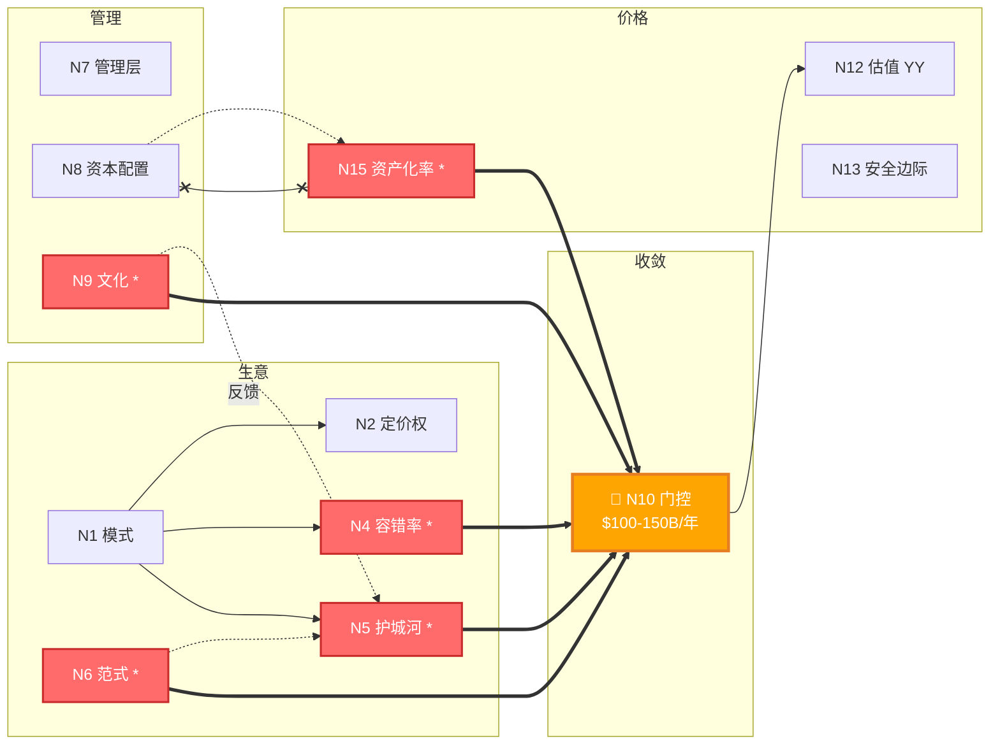

# 拓扑图格式对比演示

## 当前格式：ASCII 字符画

```
§1 生意
  + N1 模式 [Y] ──-> N2 定价权 [Y]
  │                 ──-> N3 天花板 [Y]
  │                 ──-> N4 容错率 * [Y] ──◇-> N7 权重
  │                                       ──◇-> N13 安全边际
  + N5 护城河 * [Y] ══-> N10
  + N6 范式 * [Y] ──⇒-> N5
│
§2 管理
  + N7 类型 [Y] ←──◇ N4
  + N8 资本配置 [Y] ──✓-> N15 验证
  \ N9 文化 * [Y] ──↻-> N5 飞轮
│
§3 收敛
  \ N10 门控 ** [已收敛]
       │ 门控通过后 ▼
│
§4 价格
  + N11 现金流 [Y] ──│-> N12 估值方法 [YY]
  + N13 安全边际 [Y]
  + N14 不确定性 [Y]
  + N15 资产化率 * [Y] ──⊥-> N8 矛盾仲裁
  \ N16 PVGO [YY]
```

问题：不直观，关系类型靠特殊符号区分（══ ⇒ ──◇ ⊥），在 GitHub 上等宽字体外显示更乱。

---

## 方案 A：Mermaid 流程图（GitHub 原生渲染）

```mermaid
graph TD
    subgraph "§1 生意"
        N1["N1 生意模式<br/>平台收税者 ✅Y"]
        N2["N2 定价权<br/>垄断定价 ✅Y"]
        N3["N3 天花板<br/>✅Y"]
        N4["N4 容错率 *<br/>高 ✅Y"]
        N5["N5 护城河 *<br/>CUDA生态 ✅Y"]
        N6["N6 范式转移 *<br/>ASIC侵蚀 ✅Y"]
    end

    subgraph "§2 管理"
        N7["N7 管理层<br/>先知型 ✅Y"]
        N8["N8 资本配置<br/>✅Y"]
        N9["N9 文化 *<br/>报时型 ✅Y"]
    end

    subgraph "§3 收敛"
        N10["🔴 N10 门控 **<br/>稳定利润 $100-150B/年<br/>✅Y 已收敛"]
    end

    subgraph "§4 价格"
        N11["N11 现金流<br/>成熟稳定 ✅Y"]
        N12["N12 估值方法<br/>EPV+PVGO ✅YY"]
        N13["N13 安全边际<br/>负（无安全边际）✅Y"]
        N14["N14 不确定性<br/>High ✅Y"]
        N15["N15 资产化率 *<br/>高积累 ✅Y"]
        N16["N16 PVGO<br/>62% ✅YY"]
    end

    %% 承重边（粗线）
    N5 ==>|"承重"| N10
    N6 ==>|"承重"| N10
    N4 ==>|"承重"| N10
    N15 ==>|"承重"| N10
    N9 ==>|"承重"| N10

    %% 决定关系
    N1 --> N2
    N1 --> N3
    N1 --> N4
    N1 --> N5
    N6 -.->|"传导: 缩短半衰期"| N5

    %% 权重调节
    N4 -.->|"权重调节"| N7
    N4 -.->|"权重调节"| N13

    %% 验证关系
    N8 -.->|"验证"| N15

    %% 反馈回路
    N9 -.->|"反馈: 文化支撑护城河自我修复"| N5

    %% 矛盾仲裁
    N15 x--x|"矛盾仲裁"| N8

    %% 门控通过后
    N10 -->|"门控放行"| N11
    N11 --> N12
    N14 --> N13

    %% 样式
    classDef承重 fill:#ff6b6b,stroke:#c92a2a,stroke-width:3px,color:#fff
    classDef门控 fill:#ffa502,stroke:#e67e22,stroke-width:3px,color:#fff
    classDef已确认 fill:#51cf66,stroke:#37b24d,stroke-width:2px,color:#fff
    classDef高置信 fill:#51cf66,stroke:#37b24d,stroke-width:2px,color:#fff

    class N4,N5,N6,N9,N15 承重
    class N10 门控
    class N1,N2,N3,N7,N8,N11,N13,N14 已确认
    class N12,N16 高置信
```

---

## 方案 B：Mermaid 简化版（只画核心结构，更清爽）



---

## 对比总结

| 维度 | ASCII 字符画 | Mermaid 流程图 |
|------|-------------|---------------|
| GitHub 渲染 | 纯文本，无格式 | ✅ 原生渲染为图形 |
| 可读性 | 靠特殊符号（══ ⇒ ◇ ⊥） | 颜色+箭头+子图分区 |
| 关系类型区分 | 靠记忆符号含义 | 线型+颜色直观区分 |
| 移动端 | 格式错乱 | ✅ 自适应渲染 |
| 编辑难度 | 对齐痛苦 | 语法结构化 |
| 版本 diff | 字符级 diff 不可读 | ✅ 结构化 diff |
