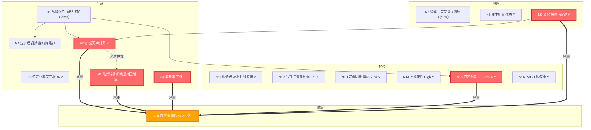

# 泡泡玛特国际集团有限公司（09992.HK）· 企业认知主页 v2.0

泡泡玛特本质是品牌溢价者与网络飞轮者，但LABUBU衰减与投机退潮已触发负飞轮，使毛利率从72%回归60-65%、稳态利润区间下修至50-200亿且护城河存在亿级有效百亿级失效的层级天花板。当前市场PE 15x已反映退潮预期，但安全边际需60-70%折扣以覆盖相变与不确定性风险。建议以正常化利润而非峰值利润估值，并跟踪库存周转与二级溢价等警戒指标验证软着陆假设。

---

灵魂版本：final_20260724 | 卡片版本：v2.0 Rebuild | 构建日期：2026-07-28
数据截止：FY2025 年报（2025-12-31）| 行情截止：2026-07-27
本文不构成投资建议。

## 1. 元信息

| | |
|---|---|
| 企业名称 | 泡泡玛特国际集团有限公司（09992.HK） |
| 行业 | 消费 / IP 经济 / 潮流玩具 |
| 创始人 / CEO | 王宁（持股 48.73%） |
| 卡片版本 | v2.0 Rebuild（注入 3 份新 autoresearch） |
| 数据截止 | FY2025 年报 |
| 行情截止 | 2026-07-27 |
| v2.0 核心变化 | N10 区间从 200-500 亿修正为 50-200 亿（退潮后稳态）；N4 容错率下修；N2 置信度降级；N15 注入经济口径资产化率（130-325%） |

## 拓扑图概览



<details>
<summary>ASCII 版本（ima KB 渲染）</summary>

```
生意区: N1品牌溢价+网络飞轮(Y) --> N2定价权(!降级)/N3天花板高(Y)/N4容错率下修(!)/N5护城河IP矩阵(Y)/N6范式转移投机退潮已发生(!)
管理区: N7先知型→造钟(Y)  N8资本配置优秀(Y)  N9文化报时→造钟(Y★承重)
收敛区: N10门控(退潮后50-200亿,!)  <=承重==>  N5 / N6 / N4 / N9 / N15
价格区: N11高增长加速期(Y)  N12正常化利润×PE(Y)  N13安全边际需60-70%(Y)  N14不确定性High(Y)  N15资产化率130-325%(Y)  N16 PVGO压缩(Y)
矛盾仲裁: N5(品牌护城河) -.-> N6(投机退潮负飞轮) 相变风险25%
正反馈: IP矩阵→会员复购→DTC渠道→海外扩张
负反馈: 投机退潮→毛利率72%→60-65%→PE中枢25x→15x→"买涨不买跌"逆转
```

</details>

## 3. 分类锚定（N1 / N7 / N11 三节点完整认知构建）

### N1 生意模式：品牌溢价者（基本盘）+ 网络飞轮者（增量）

置信度：Y（85%）

**L1-KC｜核心认知**

泡泡玛特的生意本质是"品牌溢价者"——消费者为 IP 符号承载的情感价值支付远高于制造成本的溢价，其验证在于毛利率高达 72.1%（行业平均约 32%），溢价幅度达 2.25 倍。增量层面叠加"网络飞轮者"属性：7258 万会员、93.7% 销售来自 DTC 直营渠道、55.7% 复购率，会员生态与 IP 社群共同构成增长飞轮。两个属性的关系是"品牌溢价者为基本盘（决定毛利率结构性高位），网络飞轮者为增量引擎（决定增长持续性）"。v2.0 重要修正：投机退潮研究揭示，72% 毛利率中约有 30% 成分来自投机溢价（投机者为转售而非情感付费），这一成分不可持续，真实品牌溢价的可持续毛利率基准应在 60-65% 区间。

**L1-MM｜机制图谱**

N1 作为分类锚定节点，其判断方向直接决定五个下游节点的判断逻辑：N1→N2（品牌溢价者→消费者定价权，而非平台收税者的渠道定价权）；N1→N3（品牌溢价者→反直觉型极高资产化率天花板，品牌越强营销支出占比越低）；N1→N4（品牌溢价者的 IP 生命周期约束决定容错率，而非规模效应者的产能容错率）；N1→N5（品牌心智为核心护城河来源，而非成本领先或网络效应）；N1→N15（IP 孵化引擎是资产化路径的根本来源，品牌溢价者天然具有高经济口径资产化率）。这些因果链是 v2.0 全部修正的逻辑起点。

**L2-Imp｜推论**

品牌溢价者定位→毛利率结构性高位→经营杠杆持续释放（SG&A 率从 35.3% 降至 26.6%）。但 v2.0 新增推论：如果毛利率的 72% 中包含约 30% 的不可持续投机溢价成分，那么投机退潮后毛利率可能从 72% 回归至 60-65% 区间，经营杠杆释放的幅度将收窄。一阶后果：利润率收缩 5-12 个百分点。二阶后果：估值中枢从 25-30 倍 PE 降至 15-20 倍 PE——这恰好是当前市场正在定价的状态（PE TTM 15.15x）。

**L2-QA｜质疑与仲裁**

质疑 1："泡泡玛特不是平台收税者吗？"→ 不成立。利润来自自有 IP 溢价而非抽佣，泡泡玛特自己设计、自己生产、自己卖，赚的是产品差价而非平台佣金。质疑 2："IP 符号尚未固化，LABUBU 才火 2 年且已进入衰减"→ 部分成立。品牌是 IP 孵化平台而非单一 IP（类似唱片公司而非单曲），这一结构性认知使 N1 判断仍然成立。但符号固化度确实远不如茅台（百年品牌）或爱马仕（近两百年），IP 热度均值仅 6-18 个月，这意味着品牌溢价者属性的"半衰期"显著短于传统品牌溢价者。v2.0 修正：LABUBU 衰减已确认（二级市场 -89%），使得"符号固化度"从"待验证"变为"确认不足"。

**L3-Case｜案例对标**

三丽鸥：50 年 IP 矩阵穿越多轮周期，累计推出约 500 个角色仅 10 个成功（2% 基线），Hello Kitty 靠持续内容输入延寿 50 年+。关键启示：IP 矩阵模式可行但需要克制授权（过度授权导致品牌稀释）。万代南梦宫：高达 IP + 动漫内容生态，证明内容化是延长 IP 寿命的关键路径。反例 Beats by Dre：名人营销驱动→溢价快速消退→被苹果收购后品牌独立性消失，证明缺乏内容根基的符号型溢价不可持续。

**L3-Teach｜一句话总结**

泡泡玛特像"唱片公司"——签约 IP 艺术家（73 位签约 + 200 位合作），通过 DTC 渠道直接卖给消费者，赚 72% 毛利。核心能力是发现和运营 IP 符号。但与真·唱片公司不同的是，下一个百亿级"天王巨星"（如 LABUBU）靠运气不靠流程。

---

### N7 管理层分类：创始人-先知型（向造钟者转型）

置信度：Y（80%）

**L1-KC｜核心认知**

王宁绝对控股 48.73%，拥有 7 个关键正确决策的决策记录：聚焦潮玩赛道、签约 Molly 艺术家、坚持全直营渠道、将毛绒品类独立运营、战略转向泰国市场、响应 Lisa 事件流量、巅峰期主动降温"七分饱"。这些决策体现了"先知型" CEO 的特

[generated, not original text]
