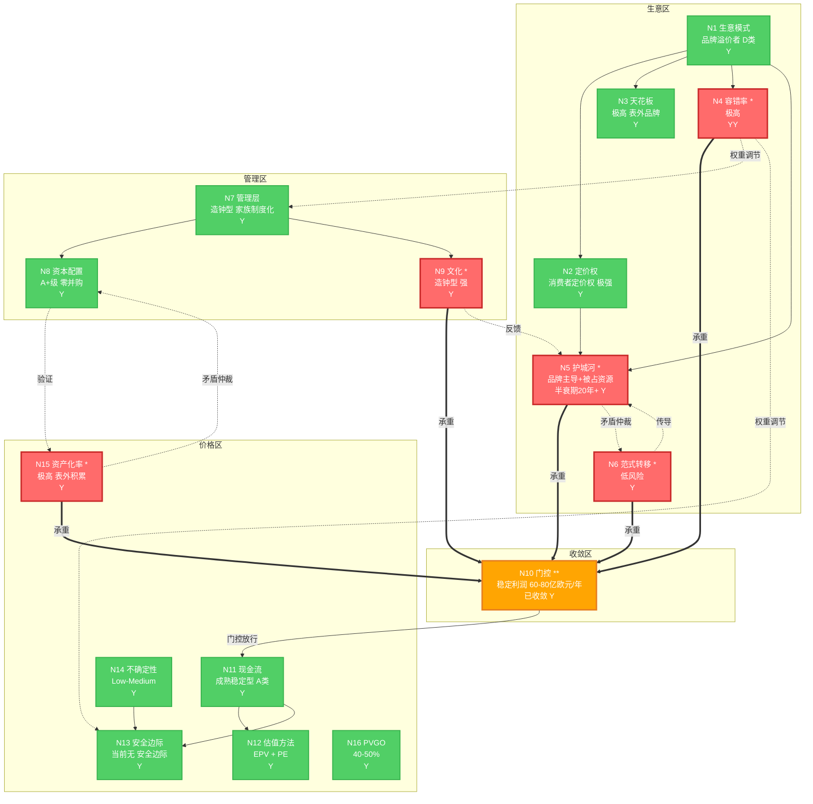

# 企业主页：爱马仕（Hermès）

> 爱马仕（Hermès International, RMS.PA）本质是自创型品牌溢价者，靠188年品牌感知锁定与产能稀缺驱动的人为稀缺获得极强消费者定价权，其核心资产（品牌）几乎完全沉淀在资产负债表外。品牌护城河半衰期20年以上、零负债122亿净现金、41%营业利润率构成全图最高容错率，使稳定利润可估性收敛为5-10年后年营业利润60-80亿欧元。当前股价1531.50欧元（PE 35.6x）基本反映DCF公允价值（约1515欧元），PVGO约40-50%意味着市场已定价较强增长预期，下行风险-48%大于上行空间+41%，当前无安全边际，理想买入区间为PE 28-30x（约1200-1300欧元）。建议等待估值回归，重点跟踪中国市场增速、二手溢价率与代际偏好迁移信号。

---

**灵魂版本**：final_20260724 | **认知策略版本**：20260723
**卡片版本**：v1 (Init) | **构建日期**：2026-08-02
**数据截止**：FY2025 年报 | **行情截止**：2026-08-02
本文不构成投资建议。

---

## 元信息

| | |
|---|---|
| 企业名称 | Hermès International SCA |
| 股票代码 | Euronext Paris: RMS.PA |
| 创立时间 | 1837年（188年历史） |
| 总部 | 法国巴黎 |
| 当代掌舵 | Axel Dumas（第六代） |
| 所有权结构 | SCA有限合伙制 + H51控股公司锁定；家族持股>65%，77%投票权 |
| 当前定位 | 自创型品牌溢价者（皮具马具为核心） |
| FY2025总营收 | 160.02亿欧元（10年CAGR 12.7%） |
| FY2025营业利润 | 65.69亿欧元（OPM 41.0%） |
| FY2025净利润 | 45.24亿欧元（净利率28.3%，10年CAGR 16.6%） |
| 收盘价 | 1531.50欧元（2026年YTD已下跌约30%） |
| PE(TTM) | 35.6x（历史中枢35-45x） |
| WACC | 7.5% |
| 卡片版本 | v1 (Init) |
| 数据截止 | FY2025 年报 |
| 行情截止 | 2026-08-02 |
| 灵魂版本 | final_20260724 |
| 来源 | 价值投资深度分析_爱马仕Hermès_RMS_20260802；研究笔记_品牌溢价者的支出资产化率 |
| 标签 | _company_card + Hermes + 奢侈品/品牌溢价者 |

---

## 拓扑图概览



<details><summary>ASCII版本</summary>

```
§1 生意区
  + N1 模式 [品牌溢价者D类] Y ──-> N2 定价权 [消费者 极强] Y
  │                                ──-> N3 天花板 [极高 表外] Y
  │                                ──-> N4 容错率 * [极高] YY ──◇-> N7 权重
  │                                                          ──◇-> N13 安全边际
  + N5 护城河 * [品牌+被占资源 20年+] Y ══-> N10
  + N6 范式 * [低风险] Y ──⇒-> N5  (矛盾仲裁: 代际迁移)
│
§2 管理区
  + N7 类型 [造钟型] Y ◇<-── N4
  │        ──-> N8 资本配置
  │        ──-> N9 文化
  + N8 资本配置 [A+级 零并购] Y ──✓-> N15 验证
  \ N9 文化 * [造钟型 强] Y ──↻-> N5 飞轮
│
§3 收敛区
  \ N10 门控 ** [稳定利润 60-80亿欧元/年] 已收敛 Y
       │ 门控通过后 ▼
│
§4 价格区
  + N11 现金流 [成熟稳定型 A类] Y ──│-> N12 估值方法 [EPV+PE] Y
  │                                ──-> N13 安全边际
  + N13 安全边际 [当前无] Y <── N14 不确定性
  + N14 不确定性 [Low-Medium] Y
  + N15 资产化率 * [极高 表外积累] Y ──⊥-> N8 矛盾仲裁 (自创型会计特征, 非真矛盾)
  \ N16 PVGO [40-50%] Y

承重边 (==>): N4->N10 | N5->N10 | N6->N10 | N9->N10 | N15->N10
矛盾仲裁 (-.->|矛盾仲裁|): N5 ⊥ N6 (代际迁移, 部分仲裁) ; N15 ⊥ N8 (自创型会计特征, 非真矛盾)
正反馈回路 (↻): 匠人培养->产能稀缺->配货制度->交叉销售LTV->利润->再投产能扩张->匠人培养
★ = 承重节点   ** = 门控节点   ◇ = 权重调节   ✓ = 验证   ⊥ = 矛盾仲裁
```

</details>

---

## 分类锚定

### N1 生意模式分类：品牌溢价者（D类）

**[L1-KC｜核心认知]**

操作性定义：品牌溢价者是指企业依靠品牌承载的情感符号与社交货币价值，使消费者支付远高于制造成本（含合理利润）的溢价，且该溢价不依赖成本领先或规模效应，而依赖"人为制造稀缺 + 感知锁定"。其操作性验证是：单位产品毛利率显著高于同行业，且提价不导致客户流失。

爱马仕当前状态：教科书级的自创型品牌溢价者。Birkin 25毛利率约85%+（远超奢侈品行业均值），二手市场溢价达2.2倍（即二手转售价为新品零售价的2.2倍），意味着消费者甚至愿意为"获得购买资格"而非产品本身付费——这是品牌溢价最极端的体现。营销费率仅5-6%（远低于一般消费品的15-25%），说明溢价不靠营销堆砌，而靠188年沉淀的品牌感知锁定与产能稀缺。皮具与马具占营收44%，是溢价的核心载体。

为什么这个分类至关重要：分类决定后续所有评估的标准。若把爱马仕当"高端消费品公司"分析，会盯着开店数、同店增速、库存周转——这些是重要但非根本的指标。把它当"品牌溢价者"分析，才会盯着品牌感知锁定强度（二手溢价率）、产能稀缺约束（匠人培养周期、门店数）、配货制度的交叉销售杠杆——这些才是护城河半衰期与定价权持续性的真正信号。分类错了，分析方向全错。

**[L1-MM｜机制图谱]**

N1 → N2（决定）：品牌溢价者的定价权是"消费者定价权"变体（客户主动支付溢价），而非供应链定价权或规模定价权。爱马仕的定价权测试（配货制度下客户为获得Birkin购买资格而累计消费上百万）验证了消费者定价权属性。

N1 → N3（决定）：品牌溢价者的资产化率天花板是"反直觉的极高"——品牌越强，每年需要的营销维护支出占比反而越低（5-6%），而品牌价值持续复利积累，核心资产沉淀在表外。

N1 → N4（决定）：品牌溢价者的容错率取决于品牌感知的韧性。188年品牌+零负债+122亿现金+41%OPM = 容错率极高，管理层犯中等错误不影响品牌。

N1 → N5（决定）：品牌溢价者的核心护城河是"品牌心智"（主导）+ "被占资源"（产能稀缺，辅助），而非成本领先或网络效应。

N1 → N15（约束）：自创型品牌溢价者天然具有"会计口径极低、经济口径极高"的双口径资产化率特征——品牌不入表（IAS 38禁令），但每元费用化投入撬动极大的表外品牌资产。

**[L2-Imp｜推论]**

如果爱马仕是品牌溢价者的判断成立：一阶推论——其毛利率中枢不应按消费品行业（40-50%）均值回归，而应长期维持在69-72%区间（当前71.1%验证），因为溢价来自品牌而非成本优势（置信度：高）。二阶推论——因为溢价来自人为稀缺，爱马仕拥有"逆周期提价权"：即使宏观经济放缓，稀缺性反而强化等待名单，2025年营收+9%（恒定汇率+5.5%）在奢侈品行业整体承压下仍实现正增长，验证了逆周期韧性（置信度：高）。三阶推论——品牌溢价者的增长天花板不在于需求（需求永远过剩），而在于产能（匠人与门店的供给），因此爱马仕的增速上限由产能扩张速度（CapEx投向）决定，而非市场需求决定（置信度：中，假设：配货制度不被反垄断摧毁）。

**[L2-QA｜质疑与仲裁]**

质疑1："爱马仕不是被占资源者（资源稀缺者）吗？全球仅294家门店、匠人需2-5年培训，这难道不是资源稀缺驱动？" → 部分成立但不改变主分类。被占资源（产能稀缺）确实存在且是重要辅助护城河，但去掉产能稀缺，品牌感知锁定（Birkin的文化符号地位）仍能维持溢价；反过来若去掉品牌只剩产能稀缺（如某皮具工坊手艺好但无品牌），则无法获得85%毛利率与2.2倍二手溢价。因此品牌是基本盘（决定溢价存在），被占资源是增量（决定溢价的可分配性与配货杠杆）。结论：主分类为品牌溢价者，被占资源为辅助维度，已在N5中纳入双护城河结构。

**[L3-Case｜历史类比]**

正面类比——劳力士（Rolex，1905年至今）：同为"自创型品牌+人为稀缺"的奢侈品，劳力士通过控制产量、维持等待名单实现长期溢价，120年历史验证了品牌溢价者的持久性。关键差异：劳力士是私有公司不追求增速，爱马仕是上市SCA需平衡家族长期主义与公众股东，但SCA结构使其能像私有公司一样运作。可迁移教训：自创型品牌溢价者的护城河可以跨越百年，但前提是控制权不被短期资本侵蚀——这正是爱马仕SCA+H51结构的意义。

**[L3-Teach｜简洁解释]**

爱马仕不是卖包的公司，它是卖"等待权"和"身份符号"的公司。一个Birkin包的制造成本几千欧元，但售价几万欧元，二手还能卖到零售价的2.2倍——因为全世界的人都想要，但爱马仕故意不让每个人都买得到。这种"想要却买不到"的稀缺感，是它188年一点一滴积累出来的，新品牌想复制，至少需要三代人的时间，而时间窗口对后来者已经永久关闭。

**分类置信度：Y（>90%）。** 主体判断高度确信。候选替代维度：被占资源者（辅助，已纳入N5双护城河结构，不改变主分类）。

---

### N7 管理层分类：造钟型（家族制度化）

**[L1-KC｜核心认知]**

操作性定义：管理层分类考察竞争力绑定在个人还是制度。"造钟型"指企业已建立超越任何单一个人的制度与文化，竞争力可在CEO更替中延续；"报时型"指竞争力依赖某位天才个人的判断力，人走则势衰。造钟型的操作性验证是：历史上经历多次领导层更替后，企业核心竞争力不衰减甚至增强。

爱马仕当前状态：强造钟型。188年六代家族传承，是公开市场中延续最久的家族控制企业之一。SCA（Société en Commandite par Actions，股份两合公司）结构 + H51控股公司双重锁定，使家族持股>65%、掌握77%投票权，从根本上排除了恶意收购与短期资本侵蚀。第六代Axel Dumas掌舵，薪酬克制（CEO总薪酬为员工中位数的38倍，远低于欧美上市公司CEO动辄数百倍的薪酬比），体现家族长期主义。第七代已在培养中。制度化的标志包括：匠人培养5年的标准化体系、皮革供应商30年长期合作、不追求季度增速的经营节奏。

为什么这个分类至关重要：管理层分类决定N9文化的评估方向与N10利润可估性的时间窗口。造钟型意味着竞争力可跨代际延续，是188年品牌护城河得以维持的组织保障——品牌不会因为某一代掌舵者失误而崩塌。但需注意：第六代40余人股权分散，存在潜在传承纠纷隐患（如Nicolas Puech"收养管家"转移股权事件），这是造钟型判断中唯一的裂缝。

**[L1-MM｜机制图谱]**

N7 ← N4（权重调节）：极高容错率（N4 YY）降低了管理层评估的权重——即便管理层犯中等错误，品牌与财务护盾仍能保护企业，因此管理层是"加分项"而非"生死项"。

N7 → N8（决定）：造钟型家族管理层倾向保守理性的资本配置（零并购、高分红、有机增长），因为家族长期主义排斥为短期增长支付并购溢价。

N7 → N9（决定）：造钟型管理层分类直接指向造钟型企业文化，两者高度耦合——制度化的传承能力本身就是文化的体现。

N7 → N10（传导，经N9）：造钟型管理层使品牌护城河的半衰期得以延长，从而支撑稳定利润可估性的时间窗口。

**[L2-Imp｜推论]**

如果爱马仕管理层是造钟型的判断成立：一阶推论——竞争力不依赖Axel Dumas个人，即使其离任，继任者（第七代）在制度化体系下仍能维持经营节奏，因此不应为"关键人风险"给予估值折扣（置信度：高）。二阶推论——SCA+H51结构使爱马仕能像私有公司一样做长期决策（如拒绝并购、维持低产能扩张节奏），这是其逆周期韧性的组织根源（置信度：高）。三阶推论——但第六代40余人股权分散是制度脆弱点，若发生大规模家族内股权争夺，可能动摇控制权稳定性，需在N9中重点跟踪（置信度：中，假设：家族内部共识机制有效运转）。

**[L2-QA｜质疑与仲裁]**

质疑1："造钟型判断是否过于乐观？Nicolas Puech'收养管家'转移股权事件证明家族治理存在裂痕。" → 部分成立。该事件确实暴露了第六代股权分散的治理风险，但需区分"个人行为"与"制度失效"：SCA+H51结构的设计目的正是使任何单一成员的股权变动无法撼动家族整体控制权（77%投票权锁定）。因此个别成员的非常规行为不构成对造钟型判断的实质性挑战，但应作为跟踪指标持续监测家族内部一致性。当前证据不足以推翻造钟型判断。

**[L3-Teach｜简洁解释]**

爱马仕的老板不是某一个人，而是一套188年磨出来的制度。它的法律结构（SCA合伙制）让家族用65%的股权锁定77%的投票权，外人永远无法收购它；它的传承方式让每一代都从家族内部选拔，已经传了六代。这种"造钟"能力——让企业不依赖任何一个天才而能持续运转——是它比那些靠明星CEO的奢侈品同行更持久的根本原因。唯一要盯紧的是：第六代有40多个股东，人多嘴杂，万一内部打起来怎么办。

**分类置信度：Y（80%）。** 造钟型判断成立，但第六代股权分散的传承隐患使其未达YY。建议跟踪家族内部治理一致性。

---

### N11 现金流特征：成熟稳定型（A类）

**[L1-KC｜核心认知]**

操作性定义：现金流特征分类考察企业经营现金流的稳定性、可预测性与资本结构。成熟稳定型（A类）指企业已进入稳态经营，经营现金流稳定且充裕、资本支出可预测、资本结构保守（低杠杆或零杠杆），自由现金流可稳定分配。其操作性验证是：OCF/净利润长期>1、FCF稳定增长、净负债为负（净现金）。

爱马仕当前状态：教科书级成熟稳定型。经营现金流53.74亿欧元（10年CAGR 16.0%），自由现金流42.13亿欧元（10年CAGR 15.8%），净现比（OCF/净利润）10年均值1.20（即每1欧元净利润对应1.20欧元经营现金流，盈利质量极高）。净现金122.39亿欧元（零有息负债，现金占总资产50.3%）。CapEx 11.61亿欧元占营收7.3%，且100%投向产能扩张和门店（非维护性），意味着维持当前盈利能力所需的维护性CapEx极低，自由现金流"含金量"极高。

为什么这个分类至关重要：现金流特征决定估值方法（N12）的选择。成熟稳定型现金流 → 以EPV（盈利能力价值）为估值锚，辅以PE，而非用DCF外推高增长或用PS等收入倍数。同时，净现金122亿提供绝对的下行保护，是N4容错率极高与N13安全边际判断的重要输入。

**[L1-MM｜机制图谱]**

N11 → N12（约束）：成熟稳定型现金流 → EPV为估值锚 + PE中枢（35-45x历史区间对品牌溢价者合理）。

N11 → N13（传导）：净现金122亿 + FCF 42亿 → 为安全边际提供下行保护基础，但当前估值已透支，故安全边际仍为"无"。

N11 ← N1/N7（决定，跨区域）：品牌溢价者的高毛利率 + 造钟型家族的保守资本结构 → 共同决定了成熟稳定型的现金流特征。

**[L2-Imp｜推论]**

如果爱马仕是成熟稳定型的判断成立：一阶推论——其现金流可稳定外推，EPV（零增长盈利能力价值）是可靠的估值下界（置信度：高）。二阶推论——122亿净现金意味着即使遭遇极端危机（如营收腰斩），公司仍能依靠现金储备与低固定成本（维护性CapEx极低）存活数年而不需外部融资，这是"反破产"能力的直接体现（置信度：高）。

**分类置信度：Y（>90%）。** 现金流特征判断高度确信，10年数据充分验证。

---

## 财务数据总表

> 数据来源：价值投资深度分析_爱马仕Hermès_RMS_20260802 [S]。CAGR为10年复合增长率。

| 指标 | FY2025 数值 | 长期趋势/备注 |
|---|---|---|
| 总营收 | 160.02亿欧元 | 10年CAGR 12.7%；FY2025 +9%（恒定汇率+5.5%） |
| 营业利润 | 65.69亿欧元 | OPM 41.0%（远超LVMH的22%） |
| 净利润 | 45.24亿欧元 | 10年CAGR 16.6%；净利率28.3% |
| 毛利率 | 71.1% | 长期稳定69-72%区间 |
| 经营现金流（OCF） | 53.74亿欧元 | 10年CAGR 16.0% |
| 自由现金流（FCF） | 42.13亿欧元 | 10年CAGR 15.8% |
| 净现比（OCF/净利润） | 1.20x | 10年均值，盈利质量极高 |
| ROIC | 65.7% | 注：188年品牌不在表内，传统ROIC被高估 |
| ROIIC（增量资本回报率） | 10年74.6% / 5年72.6% / 3年39.5% | 远超WACC 7.5%；3年期下行需关注 |
| ROE | 24.0% | 零杠杆下仍达24%，反映高盈利能力 |
| CapEx | 11.61亿欧元 | 占营收7.3%；100%投向产能扩张与门店 |
| 净现金 | 122.39亿欧元 | 零有息负债；现金占总资产50.3% |
| 分红 | 总28亿欧元（每股18欧元） | 分红率62% |
| 并购/商誉 | 零 | 零并购、零商誉（纯有机增长） |
| 当前股价 | 1531.50欧元 | 2026年YTD已下跌约30% |
| PE(TTM) | 35.6x | 历史中枢35-45x |
| WACC | 7.5% | DCF折现率 |

**业务结构（FY2025营收占比）**

| 部门 | 营收占比 | 同比增速 |
|---|---|---|
| 皮具与马具 | 44% | +13.1% |
| 成衣与配饰 | 28% | +6.1% |
| 其他（含珠宝） | 13% | +11.2% |
| 丝绸与纺织品 | 6% | +4.7% |
| 腕表 | 3% | -1.5% |
| 香水美妆 | 3% | -7.6% |

**地区分部（FY2025营收占比）**

| 地区 | 营收占比 | 同比增速 |
|---|---|---|
| 亚太（除日本） | 42% | +4.9% |
| 美洲 | 19% | +12.4% |
| 欧洲（除法国） | 15% | +11.3% |
| 法国 | 10% | +8.9% |
| 日本 | 10% | +14.1% |
| 其他 | 4% | +14.9% |

---

## §1 生意区

### N2 定价权：消费者定价权（极强）+ 供应链定价权

**[L1-KC｜核心认知]**

操作性定义：定价权是企业提价而不流失客户的能力。品牌溢价者对应"消费者定价权"变体——客户因品牌感知而主动支付溢价。爱马仕的消费者定价权达到极端形态：消费者不仅接受溢价，甚至为"获得购买资格"（而非产品本身）付费。

当前状态：极强。三重验证——（1）Birkin 25毛利率约85%+，是制造业中罕见的高位；（2）二手市场溢价2.2倍，意味着产品在二级市场的流通价值高于一级零售价，出现"买到即赚到"的套利空间，这是定价权被人为压低（配货限制导致一二级市场割裂）的极端体现；（3）配货制度将单一包袋购买力转化为全品类交叉销售——客户为获得Birkin购买资格，需在丝绸、香水、成衣等品类累计消费（一线城市门槛曾达150万，2026年Mini Kelly降至约100万），相当于爱马仕用包袋的稀缺性"收编"了客户的全品类消费预算。

为什么关键：定价权是护城河的财务验证信号。85%毛利率与2.2倍二手溢价共同验证了品牌感知锁定的真实性——若品牌力是虚的，二手市场不会出现溢价，毛利率无法维持。定价权的任何系统性下降（毛利率跌破69%、二手溢价收敛）都是护城河侵蚀的第一个财务信号。

**[L1-MM｜机制图谱]**

N2 → N5（验证）：定价权是品牌护城河的财务代理指标。毛利率长期稳定在69-72%、二手溢价2.2倍，验证了品牌护城河"极宽且稳固"的判断。

N2 ← N1（决定）：品牌溢价者分类决定了定价权是消费者定价权变体，而非成本领先或规模定价权。

N2 → N15（传导）：高定价权 → 高毛利率 → 极低的营销维护需求（5-6%）→ 每元费用化投入撬动更大的表外品牌资产 → 经济口径资产化率极高。正反馈回路。

**[L2-Imp｜推论]**

如果定价权判断成立：一阶推论——毛利率长期维持69-72%区间，不会均值回归至行业均值，因为溢价来自品牌而非周期性因素（置信度：高）。二阶推论——配货制度使爱马仕的"真实定价"高于账面零售价（客户为资格支付的隐性成本未计入营收），因此即便显式提价温和，实际客单价随配货门槛上升而持续提升（置信度：高）。三阶推论——2026年Birkin购买门槛降低（一线城市Mini Kelly从150万降至约100万）可能是对需求放缓的适应性调整，需观察是否意味着定价权边际松动（置信度：中，待验证）。

**[L2-QA｜质疑与仲裁]**

质疑1："配货制度是否可持续？加州反垄断诉讼虽被驳回，但原告计划上诉，若最终败诉，配货制度被摧毁，定价权是否崩塌？" → 这是N2与N6的交叉点。当前证据：2025年9月加州法院驳回诉讼（爱马仕胜诉），法律风险在短期已降低。但上诉结果存在不确定性。即便配货制度在法律上被限制，爱马仕仍可通过"产能自然稀缺"（294家门店、匠人瓶颈）维持供需缺口——配货制度只是将自然稀缺"制度化"，去掉制度，稀缺本身仍在。因此定价权的根基（品牌+产能稀缺）不依赖配货制度的法律存续，但配货制度确实放大了交叉销售杠杆。仲裁：短期定价权稳固，长期需跟踪上诉进展，作为认知缺口。

**[L3-Case｜历史类比]**

正面类比——百达翡丽（Patek Philippe，1839年至今）：同为家族控制的超高端品牌，通过严格控制产量（年产仅6-7万只）、维持稀缺性实现长期溢价，二手溢价同样显著。百达翡丽185年来从未上市，避免了资本短期化压力。关键差异：百达翡丽完全不依赖配货交叉销售（产品线单一），而爱马仕的配货制度创造了多品类交叉销售杠杆，商业模式更优。可迁移教训：超高端品牌的定价权可以跨越近两个世纪，前提是严守稀缺纪律。

**信心：Y。** 消费者定价权极强，证据充分（毛利率、二手溢价、配货制度三重验证）。

---

### N3 资产化率天花板：极高（表外品牌资产）

**[L1-KC｜核心认知]**

操作性定义：资产化率天花板考察"这类生意的支出能转化为多少持久资产"。对品牌溢价者，天花板取决于品牌资产的积累上限——理论上，一个被广泛认同的文化符号品牌（如爱马仕、茅台）的品牌价值可以无限复利积累，没有明确的天花板，因为品牌价值随社会财富增长与时间沉淀而持续扩张。

爱马仕当前状态：天花板极高，且核心资产不在资产负债表上。188年品牌积累的"爱马仕"三个字——其作为社会身份符号的认知地位——是公司最核心的资产，但根据IAS 38会计准则（禁止将内部产生的品牌确认为无形资产），这一资产完全不在表内（零商誉、自创品牌零入账）。每年营销费用化投入极少（费率5-6%），但这些投入持续沉淀为表外品牌资产，品牌价值随时间复利增长。因此，爱马仕的资产化率天花板在"经济口径"下极高，在"会计口径"下被结构性隐藏。

为什么关键：资产化率天花板决定N15的方向判断与EPV估值的可靠性。极高的表外资产意味着EPV（盈利能力价值）远高于AV（资产价值），EPV/AV比值将极高，印证深护城河。

**信心：Y。** 由N1品牌溢价者分类直接决定，判断确信。

---

### N4 容错率 *承重：极高

**[L1-KC｜核心认知]**

操作性定义：容错率考察"管理层犯多大错才致命"。分正常态（日常经营失误的影响）与危机态（极端事件的影响）。容错率越高，管理层评估权重越低（降为加分项），安全边际所需折扣越小。

爱马仕当前状态：全图最高容错率。四重护盾叠加——（1）品牌力护盾：188年品牌感知锁定，正常经营失误（如某季产品反响平平、某门店服务不佳）不影响品牌地位；（2）财务护盾：零有息负债 + 122.39亿净现金（占总资产50.3%），即便营收腰斩仍可依靠现金存活数年；（3）利润率护盾：41.0%OPM提供极厚的利润缓冲，成本上升或需求下降有充足空间吸收；（4）需求护盾：配货制度下需求永远过剩（等待名单常态化），需求下降不会立即转化为营收下降。

正常态：管理层犯中等错误（如定价策略失误、某区域扩张节奏不当、库存管理瑕疵）不影响品牌与长期盈利能力。危机态：只有品牌信任崩塌类事件（如系统性质量丑闻、大规模假货事件损害品牌信誉、家族控制权争夺导致战略瘫痪）才能造成实质性伤害。

为什么这个节点是全图最大杠杆：容错率是N7管理层权重、N13安全边际的综合调节器。极高容错率意味着即便对管理层（N7）和代际迁移（N6）的判断有偏差，品牌与财务护盾仍能保护企业价值不归零。这是爱马仕"难以被摧毁"特性的核心来源。

**[L1-MM｜机制图谱]**

N4 → N7（权重调节）：极高容错率 → 管理层评估降为加分项而非生死项。即便第六代传承出现波折，品牌护盾仍提供保护。

N4 → N13（权重调节）：极高容错率 + 188年验证 → 安全边际所需折扣可较小（但当前估值已透支，故N13仍为"无安全边际"）。

N4 → N10（承重）：极高容错率 → 利润可估性的下行保护极强 → 稳定利润下界可靠。

N4 ← N5（决定）：品牌护城河20年+半衰期 + 被占资源护城河 = 容错率的根本来源。

**[L2-Imp｜推论]**

如果容错率极高的判断成立：一阶推论——爱马仕是"反脆弱"型企业，外部冲击（经济衰退、地缘政治、流行病）反而可能强化其稀缺定位（如疫情期间奢侈品消费向头部品牌集中），2025年行业承压下仍+9%营收验证了这一点（置信度：高）。二阶推论——因为容错率极高，投资者不需要为"关键人风险"或"单一事件风险"给予估值折扣，但也正因如此，市场已将这种低风险定价为高PE（35.6x），容错率的优势被估值透支（置信度：高）。三阶推论——危机态下唯一能造成实质伤害的是品牌信任崩塌，而这类事件（质量丑闻）历史上极为罕见，且爱马仕的匠人手工艺定位本身就是质量信誉的保障（置信度：中）。

**[L2-QA｜质疑与仲裁]**

质疑1："容错率是否被高估？品牌丑闻的杀伤力可能被低估——社交媒体时代，一次质量事件可能迅速发酵。" → 部分成立。社交媒体确实放大了品牌事件的传播速度，但需区分"传播速度"与"实质伤害"：奢侈品消费者高度品牌忠诚，且爱马仕的核心客群（超高净值）对社交媒体舆论的敏感度低于大众消费品客群。历史上奢侈品品牌丑闻（如Dolce & Gabbana辱华事件）确实造成区域市场冲击，但未动摇品牌根本。当前证据不足以推翻极高容错率判断，但应将"社交媒体驱动的品牌信任风险"列为监测项。

质疑2："122亿净现金是否会被家族内部争夺消耗？" → 这是与N7传承隐患的交叉点。理论上家族纷争可能导致非理性资本配置，但SCA+H51结构使任何单一成员无法独占现金支配权，重大资本决策需家族集体共识。当前证据不支持现金被消耗的情景。

**[L3-Case｜历史类比]**

正面类比——爱马仕自身在2008金融危机与2020疫情中的表现：两次全球性危机中，爱马仕营收下滑幅度均显著小于奢侈品行业均值，且危机后恢复速度最快。2008年爱马仕营业利润率未显著下降，2020年疫情后迅速反弹并创历史新高。关键差异：这两次危机是"外部需求冲击"而非"品牌信任崩塌"，验证了正常态容错率极高，但未充分测试危机态（品牌丑闻）。可迁移教训：外部冲击对爱马仕几乎无害，真正的风险来自内部品牌信誉。

反例——Dolce & Gabbana辱华事件（2018）：一次社交媒体发酵的品牌事件导致该品牌在中国市场大幅萎缩，至今未完全恢复。关键差异：D&G品牌力远弱于爱马仕（无188年历史、无产能稀缺护盾），且事件性质是"主动冒犯"而非"质量瑕疵"。可迁移教训：品牌力较弱时，社交媒体事件杀伤力巨大；但对爱马仕这种品牌力极强的企业，除非发生系统性信任崩塌，单一事件难以动摇根本。

**[L3-Discussions｜多视角对话]**

最忠诚客户视角（超高净值Birkin收藏者）：客户最关心的不是"公司会不会犯错"，而是"品牌会不会贬值"。对收藏者而言，品牌价值（二手溢价）的稳定性比经营效率更重要。客户视角结论：只要二手溢价维持在2倍以上，品牌地位未变，容错率就成立。与投资者视角一致。

卖空者视角：卖空者寻找的"黑天鹅"是品牌信任崩塌或家族控制权瓦解。卖空者会盯紧：质量抽检事件、假货规模、家族内部股权诉讼。卖空者结论：正常经营中找不到做空理由，唯一机会是等待黑天鹅事件——但这不可预测。与投资者视角分歧较小，均认为日常风险极低。

**[L3-Teach｜简洁解释]**

爱马仕几乎不可能因为经营失误而倒下。它手里攥着122亿欧元现金、一分钱外债都没有，利润率高到41%——意味着即使生意差了一半，它依然赚钱。更重要的是，想买它包的人永远比它能造的包多，所以经济不好时别人愁卖不出去，它只是少赚一点。唯一能真正伤害它的，是某天大家突然觉得"爱马仕不香了"或者"爱马仕的东西是假的"——但这种事，188年来几乎没发生过。

**信心：YY。** 极高容错率由四重护盾（品牌+财务+利润率+需求）共同支撑，证据充分且经历史验证（2008/2020危机），达高信心。

---

### N5 护城河类型与半衰期 *承重：品牌（主导）+ 被占资源（辅助），半衰期20年+

**[L1-KC｜核心认知]**

操作性定义：护城河半衰期考察竞争优势能维持多久，以及"最短半衰期路径"（最先被侵蚀的那条路径）是什么。半衰期越长，历史利润越可外推，N10稳定利润可估性越可靠。

爱马仕当前状态：双护城河结构。

品牌护城河（主导，★★★★★）：188年历史沉淀的品牌感知锁定。核心特征是"时间窗口已永久关闭"——建立一个等同于爱马仕文化符号地位的新品牌，需要至少三代人（60-80年）的持续投入，且即便投入也无法保证成功（品牌地位是社会共识的涌现，非金钱可购买）。Birkin/Kelly已成为"奢侈品"这一概念的定义性符号。营销费率仅5-6%，说明品牌不靠持续营销维持，而靠社会共识的自我强化。持久期20年以上。

被占资源护城河（辅助，★★★★）：产能稀缺。全球仅294家门店（远少于LVMH旗下品牌的数千家），匠人需2-5年培训（且产能扩张受匠人供给瓶颈约束）。这一稀缺性被"配货制度"制度化，将单一的包袋购买力转化为全品类交叉销售。持久期15年以上。

最短半衰期路径：品牌代际迁移——即年轻一代（Z世代及以后）不再崇尚传统奢侈品符号。但当前证据不支持：Z世代仍追捧Birkin，二手市场年轻人参与活跃。因此，最短路径是理论风险而非现实威胁，半衰期判断仍为20年+。

为什么这个节点是安全边际的隐藏锚：护城河半衰期决定历史利润可外推的时间窗口。20年+半衰期意味着当前的高利润率在未来10年仍大概率维持，从而支撑N10稳定利润可估性。

**[L1-MM｜机制图谱]**

N5 → N10（承重）：品牌护城河20年+半衰期 → 当前41%OPM在未来5-10年仍可维持 → 稳定利润下界可靠。

N5 → N4（决定）：品牌护城河 + 被占资源 = 容错率极高的根本来源。

N5 → N13（承重）：护城河半衰期 → 安全边际所需折扣越小（半衰期越长，利润越可外推，所需保护越小）。

N5 ← N9（反馈回路）：造钟型文化支撑护城河自我修复——家族长期主义确保品牌不被短期利益侵蚀（如不滥发授权、不盲目扩张产能），文化是护城河的"保养机制"。

N5 ← N6（传导，矛盾仲裁）：范式转移风险若实现 → 缩短护城河半衰期。当前N6判断为低风险，故对N5影响有限。

**[L2-Imp｜推论]**

如果护城河20年+半衰期判断成立：一阶推论——爱马仕41%OPM在未来10年仍可维持，因为品牌护城河在这段时间窗口内不会被侵蚀（置信度：高）。二阶推论——被占资源护城河（产能稀缺）不仅保护定价权，还创造了"配货交叉销售"这一独特商业模式，使爱马仕的客单价随客户生命周期持续提升（置信度：高）。三阶推论——最短半衰期路径（代际迁移）需20年维度才可能显现，当前5-10年投资视野内风险可控，但应作为长期监测项（置信度：中，假设：Z世代奢侈品偏好不发生突变）。

**[L2-QA｜质疑与仲裁]**

质疑1："品牌护城河半衰期20年+是否过于乐观？代际迁移风险（N6）可能缩短半衰期。" → 这是N5与N6的核心矛盾点，触发矛盾仲裁。仲裁结论：部分仲裁。当前证据（Z世代追捧Birkin、二手市场年轻人活跃）不支持短期内代际迁移发生，因此5-10年视野内半衰期判断成立。但20年+维度的判断存在不确定性——若未来某一代人价值观发生根本转变（如极简主义成为主流），品牌护城河可能被侵蚀。仲裁方式：不否定20年+判断，但在N10稳定利润估计中采用保守下界（60亿而非80亿），并代际偏好迁移列为长期跟踪指标。详见矛盾清单#1。

质疑2："被占资源护城河（294家门店、匠人瓶颈）是否会被技术突破？如3D打印、自动化制造？" → 不成立。奢侈品的本质是"手工"与"稀缺"，自动化制造反而会削弱品牌价值（消费者为"匠人手作"付费，而非机器量产）。因此技术进步不会侵蚀被占资源护城河，反而强化其稀缺性。

**[L3-Case｜历史类比]**

正面类比——法贝热（Fabergé，1885年沙皇彩蛋至今）：同为"手工稀缺+皇室/精英符号"的超高端品牌，法贝热彩蛋的工艺稀缺性与文化符号地位延续至今（虽然品牌所有权几经易手，但"Fabergé"符号价值未消失）。关键差异：法贝热因俄国革命中断传承，品牌完整性受损；爱马仕因SCA结构保持了188年连续传承。可迁移教训：手工稀缺型品牌的符号价值可跨越百年，但需组织连续性保障。

反例——Coach/Burberry的品牌稀释（2000s-2010s）：这两个品牌曾因过度扩张（开店过多、打折促销、授权泛滥）而稀释品牌价值，导致溢价能力下降。关键差异：Coach/Burberry是上市公司追求增速而牺牲稀缺性，爱马仕SCA结构使其能拒绝这种短期诱惑。可迁移教训：品牌护城河的最大威胁不是外部竞争，而是内部"为增长稀释品牌"的诱惑——爱马仕的造钟型文化正是对此的免疫。

**[L3-Discussions｜多视角对话]**

竞争对手CEO视角（LVMH/Kering旗下品牌）：竞争对手最想做的是复制Birkin的稀缺性，但面临两难——要提高品牌溢价必须限制供给，但上市公司面临增长压力无法忍受"有钱不赚"。竞争对手结论：爱马仕的护城河本质上不是"它做了什么"，而是"它克制了什么"（不开太多店、不打折、不并购），这种克制能力源自其所有权结构，竞争对手无法复制。与投资者视角一致——护城河由治理结构锁定。

最忠诚客户视角（Birkin收藏者）：客户关心品牌的"排他性"是否在稀释。2026年Birkin购买门槛降低（150万→100万）会引起客户警觉——若门槛持续降低，品牌的排他性感知可能受损。客户结论：护城河仍稳固，但需关注门槛调整是否是需求放缓的信号。与投资者视角略有分歧——客户对排他性稀释更敏感。

**[L3-Teach｜简洁解释]**

为什么没有第二个爱马仕？因为造一个爱马仕需要188年，而没人有这个耐心。它的护城河不是技术、不是规模，而是"全世界的人都默认Birkin是顶级奢侈品的代名词"——这种共识一旦形成就极难改变。再加上它故意只开294家店、培养一个匠人要5年，永远供不应求。竞争对手不是做不出同样好的包，而是即使做出来了，也没有人愿意为它排队、为它配货、为它支付2倍的二手溢价。这就是为什么这条护城河至少能再守20年。

**信心：Y。** 品牌护城河极宽且经188年验证，但代际迁移的20年维度不确定性使其未达YY（需矛盾仲裁，见N6）。被占资源辅助护城河判断确信。

---

### N6 范式转移风险 *承重：低风险

**[L1-KC｜核心认知]**

操作性定义：范式转移风险考察"当前经济特征会被什么力量颠覆"。对品牌溢价者，范式转移不是技术迭代，而是可能从根本上改变"消费者愿为品牌符号支付溢价"这一行为模式的社会/文化/法律变革。

爱马仕当前状态：低风险。三类潜在范式转移逐一评估——（a）消费降级/极简主义：宏观层面消费降级确实存在，但奢侈品消费呈现"K型分化"——大众消费降级，超高端消费反而向头部品牌集中（"口红效应"的升级版），爱马仕作为最头部品牌反而受益。2025年行业承压下爱马仕仍+9%验证了这一逻辑。（b）反垄断摧毁配货制度：2025年9月加州法院驳回反垄断诉讼（爱马仕胜诉），法律风险短期已降低。即便配货制度被限制，产能自然稀缺（294家门店、匠人瓶颈）仍维持供需缺口，定价权根基不动。（c）代际偏好迁移：Z世代仍追捧Birkin，二手市场年轻人参与活跃，当前无证据支持代际迁移正在发生。AI/技术不构成威胁（奢侈品价值来自手工与稀缺，与AI无关）。

为什么这个节点是承重节点：范式转移若发生，会直接缩短N5护城河半衰期，使历史利润不可外推、N10稳定利润估计失效。因此N6是N5和N10的"前提条件"。

**[L1-MM｜机制图谱]**

N6 → N5（传导）：范式转移风险若实现 → 缩短护城河半衰期。当前N6判断为低风险 → 对N5半衰期影响有限。

N6 → N10（承重）：范式转移风险低 → 历史利润可外推 → 稳定利润可估性收敛。

**[L2-Imp｜推论]**

如果范式转移低风险的判断成立：一阶推论——爱马仕当前的经济特征（品牌溢价+配货交叉销售）在未来5-10年仍成立，历史利润可外推（置信度：高）。二阶推论——但20年+维度上，代际迁移是不可完全排除的"尾部风险"，应在N10中用保守下界吸收这一不确定性（置信度：中）。

**[L2-QA｜质疑与仲裁]**

质疑1："代际迁移风险是否被低估？每一代人都觉得'年轻人不一样了'，但也许这次是真的——Z世代的消费观（体验>拥有、可持续、反炫耀）可能系统性削弱奢侈品符号价值。" → 这是N5与N6的核心矛盾。仲裁：当前证据（Z世代追捧Birkin）不支持代际迁移已发生，因此5-10年视野判断为低风险。但承认"这次可能不同"的不可证伪性——代际价值观变迁是慢变量，难以用短期数据证伪。仲裁方式：N6维持"低风险"判断（基于当前证据），但在N5半衰期与N10利润下界中保留保守缓冲，并将代际偏好数据列为长期跟踪指标。详见矛盾清单#1。

**[L3-Discussions｜多视角对话]**

Z世代消费者视角：年轻消费者确实更重视体验与可持续性，但对"稀缺符号"的渴望并未消失——只是表现形式可能变化（如数字藏品、限量联名）。Z世代对Birkin的追捧证明，传统奢侈品符号对年轻人仍有吸引力。分歧点：Z世代可能更偏好"有故事的新品牌"而非"老牌"，但目前Birkin的文化叙事（匠人、传承、稀缺）恰好满足了这种需求。结论：短期无范式转移迹象。

卖空者视角：卖空者会寻找"范式转移已开始但未被识别"的信号——如Z世代奢侈品消费占比下降、二手市场年轻人参与度见顶、可持续奢侈品（二手/租赁）分流新客。当前这些信号均不显著。卖空者结论：范式转移是"等待游戏"，短期无催化。

**信心：Y。** 范式转移低风险判断基于当前证据（加州诉讼驳回、Z世代追捧Birkin、K型分化受益逻辑），但代际迁移的20年维度不确定性使其未达YY。

---

## §2 管理区

### N7 管理层分类：造钟型（家族制度化）

> 完整认知构建见【分类锚定 · N7】。本节补充管理区维度的关键要点。

**[管理区要点补充]**

控制权锁定机制：SCA（股份两合公司）结构使普通合伙人（家族）掌握经营控制权，H51控股公司进一步集中投票权至77%。这一双重锁定是"造钟"的制度基础——它使家族能像私有公司一样做超长期决策，不受公众股东季度业绩压力侵蚀。这与LVMH（Arnault个人控制但通过并购扩张）形成鲜明对比：爱马仕是"自创型造钟"，LVMH是"并购型扩张"。

薪酬克制的信号意义：CEO总薪酬为员工中位数的38倍，远低于欧美上市公司动辄200-300倍的薪酬比。这不仅体现家族价值观，更是"委托代理问题极小化"的标志——管理层与股东利益高度一致（因为管理层就是大股东家族），不存在为短期期权行权而操纵业绩的动机。

唯一裂缝：第六代40余人股权分散，Nicolas Puech"收养管家"转移股权事件暴露了家族内部治理的潜在脆弱性。需跟踪：家族内部一致性、第七代培养与接班安排、股权变动公告。

**信心：Y（80%）。** 造钟型判断成立，传承隐患为跟踪项。

---

### N8 资本配置质量：A+级

**[L1-KC｜核心认知]**

操作性定义：资本配置质量考察"留存收益是否创造价值"，核心工具是"一美元测试"（每留存一美元是否创造了超过一美元的市场价值）与ROIIC vs WACC对比。优秀资本配置的标志是：ROIIC持续高于WACC、资本投向高回报领域、不通过并购destroy value。

爱马仕当前状态：A+级。三大特征——（1）零并购、零商誉：188年来几乎完全靠有机增长，从不为增长支付并购溢价，避免了绝大多数奢侈品集团（如LVMH）并购整合中常见的价值destroy。（2）ROIIC远超WACC：10年ROIIC 74.6%、5年72.6%（均远超WACC 7.5%），意味着每投入一美元增量资本，获得74.6%的回报——这是极其罕见的资本效率。注：3年ROIIC降至39.5%，仍远超WACC但呈下行趋势，需关注。（3）一美元测试通过：留存收益的38%用于产能扩张（CapEx 11.61亿，100%投向产能与门店），回报率极高；62%用于分红（总28亿，每股18欧元），股东直接受益。

为什么关键：资本配置质量验证N9文化的"造钟"属性——零并购克制 + 有机增长专注 + 高分红回馈，是家族长期主义的财务体现。同时，N8验证N15资产化率的方向（高ROIIC = 资本高效转化为表外品牌资产）。

**[L1-MM｜机制图谱]**

N8 → N15（验证）：高ROIIC（74.6%）+ 零并购 → 验证自创型品牌的高经济口径资产化率（每元投入高效沉淀为表外品牌价值）。

N8 ← N7（决定）：造钟型家族管理层 → 保守理性的资本配置（零并购、高分红）。

N8 → N10（传导，经N15）：高资本配置质量 → 资本持续高效复利 → 利润持续增长 → 稳定利润可估性。

**[L2-Imp｜推论]**

如果资本配置A+级判断成立：一阶推论——爱马仕不需要通过并购维持增长，有机增长（产能扩张+提价）足以驱动10年CAGR 12.7%的营收增长，且无并购整合风险（置信度：高）。二阶推论——62%分红率意味着公司认为"留存收益的边际回报已低于分红给股东的效用"，这是成熟稳定型企业的典型特征，也意味着高速增长期已过，进入稳态复利阶段（置信度：高）。三阶推论——3年ROIIC从10年的74.6%降至39.5%，可能反映产能扩张边际回报递减（新门店/新匠人的初期效率低于存量），需持续跟踪是否为趋势性下行（置信度：中）。

**[L2-QA｜质疑与仲裁]**

质疑1："ROIC 65.7%是否被高估？因188年品牌不在表内，分母（投入资本）被低估，导致ROIC虚高。" → 完全成立。这是自创型品牌溢价者的固有会计特征：核心资产（品牌）不入表 → 投入资本被低估 → ROIC被结构性高估。因此65.7%的ROIC不应按字面理解，而应关注ROIIC（增量回报率）的趋势——ROIIC衡量的是"新增投入"的回报，相对不受历史品牌不入表的影响。10年ROIIC 74.6%仍是极高的真实回报，判断成立。此质疑已纳入N15矛盾仲裁（见矛盾清单#2）。

**[L3-Case｜历史类比]**

正面类比——伯克希尔·哈撒韦（巴菲特）：零并购溢价（巴菲特拒绝为平庸公司支付溢价）、高分红（近年开始）、资本投向高回报领域。爱马仕的资本配置指纹与伯克希尔的"克制型"高度相似。关键差异：伯克希尔是金融控股（投资多元资产），爱马仕是单一品牌运营（资本投向自身产能）。可迁移教训：克制是资本配置的最高美德——不做事（不乱并购）比做事更难、更有价值。

反例——LVMH的并购驱动模式：LVMH通过持续并购（Tiffany、Dior等）扩张，商誉累积巨大。虽然LVMH也创造了价值，但并购整合风险高（如Tiffany整合期业绩波动），且商誉减值是潜在地雷。关键差异：LVMH是"并购型品牌组合"，爱马仕是"自创型单一品牌"——两者商业模式根本不同，资本配置不可直接比较。可迁移教训：自创型品牌的资本配置质量天然优于并购型，因为没有整合与商誉风险。

**信心：Y。** A+级资本配置判断确信，零并购+高ROIIC+高分红三重验证。3年ROIIC下行为跟踪项。

---

### N9 企业文化 *承重：造钟型（强）

**[L1-KC｜核心认知]**

操作性定义：企业文化考察"造钟还是报时"。造钟型指企业已建立超越个人的制度与文化，竞争力可跨CEO更替延续；报时型指依赖某个天才个人。造钟型的操作性验证是：历史CEO更替时公司表现不衰减。

爱马仕当前状态：强造钟型。爱马仕188年六代家族传承，是人类企业史上最成功的"造钟"案例之一。"长期主义"已写入企业基因，体现在三个制度化实践中——（1）匠人培养5年的标准化体系：新匠人需5年培训才能独立制作，这一制度跨越多代传承，确保工艺标准不依赖任何个人；（2）皮革供应商30年长期合作：与核心供应商建立超长期关系，超越任何单一采购负责人的任期；（3）不追求短期增速的经营节奏：SCA结构使管理层能拒绝季度业绩压力，按产能扩张的自然节奏增长（而非按市场需求超速扩张）。造钟型15项标志中，爱马仕在"制度化的传承机制、超长期供应商关系、工艺标准化、抗拒短期化、家族价值观内化"等多项上表现突出。

唯一风险：第七代传承尚未验证。第六代Axel Dumas表现优异，但第七代能否延续"造钟"传统，是未来10-20年的关键观察点。

为什么这个节点是承重节点：文化是护城河的"保养机制"——造钟型文化确保品牌护城河不被短期利益侵蚀（不滥发授权、不盲目扩张、不打折），是N5护城河半衰期得以维持的反馈回路。若文化从造钟退化为报时（如某代掌舵者为短期业绩稀释品牌），护城河将被侵蚀。

**[L1-MM｜机制图谱]**

N9 → N5（反馈回路）：造钟型文化 → 家族长期主义 → 拒绝短期化（不稀释品牌、不盲目扩张）→ 品牌护城河自我修复与维持 → 半衰期延长。

N9 → N10（承重）：造钟型文化 → 护城河跨代延续 → 利润可估性的时间窗口延长。

N9 ← N7（决定）：造钟型管理层分类直接指向造钟型文化。

**[L2-Imp｜推论]**

如果造钟型文化判断成立：一阶推论——爱马仕竞争力不依赖Axel Dumas个人，即使其离任，制度化体系（匠人培养、供应商关系、SCA结构）仍能维持经营节奏（置信度：高）。二阶推论——造钟型文化是品牌护城河的"免疫系统"，能自动抵御"为增长稀释品牌"的内部诱惑（如某管理层提议打折清库存），这是Coach/Burberry品牌稀释悲剧不会在爱马仕重演的根本原因（置信度：高）。三阶推论——但造钟型文化的延续依赖家族价值观的代际传承，第七代若未充分内化长期主义，存在文化退化风险（置信度：中，待第七代接班验证）。

**[L2-QA｜质疑与仲裁]**

质疑1："造钟型判断是否过度美化家族治理？家族企业也有'富不过三代'的魔咒，爱马仕凭什么例外？" → 部分成立。"富不过三代"是统计规律，爱马仕能传六代确实罕见，但这正是需解释的关键——其例外性来自SCA结构（法律层面的控制权锁定）+ 工匠传统（文化层面的工艺传承）+ 品牌资产（经济层面的复利积累）三重锁定的叠加。但这不意味着第七代必然成功。仲裁：承认第七代传承是未验证的假设，将"第七代接班表现"列为关键跟踪指标，但不因此否定当前（第六代）的造钟型判断。

质疑2："是真正的造钟还是表演造钟？家族是否在用'传统'叙事掩盖效率低下？" → 不成立。爱马仕的41%OPM（远超LVMH的22%）证明其"传统"叙事没有牺牲效率，反而通过SG&A约35%的极致费用管控实现了行业最高利润率。工艺传统与效率不矛盾——爱马仕证明了"慢即是快"。

**[L3-Case｜历史类比]**

正面类比——福特汽车（Ford，1903年至今，已传至第四代）：同为家族控制跨越百年的企业，福特通过双重股权结构（Ford家族掌握40%投票权）维持控制权。关键差异：福特面临激烈行业竞争与技术变革（电动车转型），家族控制未能阻止竞争力相对衰退；爱马仕所处奢侈品行业的竞争格局更稳定，且品牌护城河更宽。可迁移教训：家族控制是"造钟"的必要但非充分条件——还需身处一个护城河稳固的行业。

反例——Gucci家族内斗（1980s-1990s）：Gucci家族因内部股权争夺与继承纠纷导致品牌几近崩溃，最终被开云集团收购。关键差异：Gucci当时缺乏类似SCA的控制权锁定结构，家族内斗直接导致控制权丧失；爱马仕的SCA+H51结构正是为防范此类风险而设计。可迁移教训：家族企业的最大内部风险是内斗，控制权锁定结构（如SCA）是关键防线——这正是爱马仕第六代股权分散隐患需警惕的原因。

**[L3-Discussions｜多视角对话]**

前高管视角（假设的离职高管）：内部真实运作中，爱马仕的决策节奏极慢（一个新门店选址可能讨论数年），这在短期内看似低效，但正是这种"慢"确保了每个决策的长期正确性。前高管结论：造钟型文化是真实的，但代价是错过了部分"快节奏"增长机会——爱马仕选择的是"宁可慢也要对"。与外部投资者视角一致。

家族成员视角（非掌舵分支）：家族内部对"是否应该增长更快"存在分歧——掌舵分支坚持克制，部分分支可能希望更快变现。Nicolas Puech事件就是这种张力的体现。家族成员结论：造钟型文化在掌舵分支中是真实的，但家族整体并非铁板一块。与投资者视角略有分歧——投资者看到的是统一的"造钟"形象，内部实际存在增长诉求的张力。

**[L3-Teach｜简洁解释]**

爱马仕能传六代，不是运气，而是制度。它用法律结构（SCA）锁死了控制权，用5年的匠人培养体系锁死了工艺标准，用30年的供应商关系锁死了供应链——这些东西不依赖于某一个天才CEO，换了人也能运转。这种"造钟"能力让它避开了大多数家族企业'富不过三代'的魔咒。唯一要担心的是：第七代能不能把这套制度再传下去，这个现在还看不出来。

**信心：Y。** 造钟型文化判断成立，188年六代传承充分验证；但第七代传承未验证，使其未达YY。关键跟踪项：第七代接班表现。

---

## §3 收敛区

### N10 稳定利润可估性 **门控

**[L1-KC｜核心认知]**

操作性定义：N10是全图的收敛门控——所有上游分析（N1-N9）汇聚到此。门控通过的要求是：能说出5-10年后的稳定利润区间，并给出三个结构性原因（不是"行业增长"这种笼统理由，而是具体的竞争结构原因）。

爱马仕当前状态：已收敛。5-10年后（约2030-2035年）稳定营业利润估计为60-80亿欧元/年。当前FY2025营业利润65.69亿欧元已落在该区间内，意味着即便零增长，当前利润水平在未来10年仍可维持；若温和增长（CAGR 5-7%），2030年营业利润可达80-90亿欧元。保守下界取60亿欧元（吸收代际迁移等尾部风险）。

**[L2-Imp｜三个结构性原因]**

原因一——188年品牌护城河20年+半衰期（来自N5）：品牌感知锁定是爱马仕溢价的根本来源，188年验证+时间窗口永久关闭，意味着当前41%OPM在未来10年仍可维持。这是利润可持续性的第一支柱。

原因二——配货制度锁定客户LTV（来自N2）：配货制度将单一包袋购买力转化为全品类交叉销售，使客单价随客户生命周期持续提升。即便宏观经济波动，已"入局"的高净值客户持续消费（为维持/提升配货资格），提供营收韧性。这是利润可持续性的第二支柱。

原因三——零负债+122亿净现金提供绝对下行保护（来自N4/N11）：122亿净现金 + 极低维护性CapEx，意味着即便遭遇极端需求冲击，公司仍能维持盈利（利润率缓冲）且无需外部融资（财务缓冲）。这是利润可持续性的下行保护——确保"最坏情况"下的利润下界可靠。

**[L2-QA｜如果3年后错了最可能因为什么]**

如果3年后（2028年）稳定利润判断错了，最可能因为：（1）中国市场（亚太除日本占42%）增速超预期放缓甚至负增长，且未能被其他地区增长对冲——这是最大的单一风险因子；（2）代际偏好迁移提前显现（Z世代奢侈品消费倾向突变），导致品牌溢价收敛；（3）配货制度因反垄断上诉败诉被限制，交叉销售杠杆减弱。当前对这三个风险均有应对缓冲（保守下界60亿、K型分化受益逻辑、产能自然稀缺），故判断为"有真实信心"而非"硬凑"。

**[L3-Teach｜一句话投资逻辑]**

爱马仕是一个"已经赢了"的公司——它的品牌地位188年来无人能撼动，手里攥着122亿现金、零负债、41%利润率，未来10年每年赚60-80亿欧元几乎是确定的；问题不在于它能不能赚钱，而在于你现在买的价格是否划算。

**门控状态：已收敛。**

**信心：Y。** 稳定利润可估性强收敛，三个结构性原因均由承重节点（N5/N2/N4）支撑，保守下界60亿已吸收尾部风险。

---

## §4 价格区

### N11 现金流特征：成熟稳定型（A类）

> 完整认知构建见【分类锚定 · N11】。本节补充价格区维度的要点。

**[价格区要点补充]**

成熟稳定型现金流直接锁定估值路径：EPV为锚（零增长盈利能力价值是可靠下界）+ PE中枢（品牌溢价者历史区间35-45x合理）。净现比1.20x的10年稳定性，意味着EPV估算的输入（当前盈利能力）是高质量的、可持续的，不存在"一次性利润"虚高问题。FCF 42亿欧元与零负债，意味着公司有充足自由现金流支撑持续分红（62%分红率可持续）。

**信心：Y（>90%）。**

---

### N12 估值方法：EPV + PE

**[L1-KC｜核心认知]**

操作性定义：估值方法由N11现金流特征决定。成熟稳定型现金流 → EPV（盈利能力价值）为估值锚，辅以PE（市盈率）作为市场情绪的参考区间。

爱马仕适用方法：双重锚定。（1）EPV为内在价值锚：将当前盈利能力（营业利润65.69亿）按WACC 7.5%资本化，得到零增长下的盈利能力价值。这是最保守的估值下界——即便爱马仕未来零增长，其EPV仍提供价值支撑。（2）PE为市场定价参考：品牌溢价者的PE中枢天然较高（因表外品牌资产使账面盈利能力被低估、且增长确定性高），35-45x历史区间合理。当前PE 35.6x处于历史中枢下沿。DCF概率加权公平价值约1515欧元/股（来自来源报告），与EPV+PE交叉验证一致。

**信心：Y。** 估值方法由N11直接约束，判断确信。

---

### N13 安全边际：当前无安全边际

**[L1-KC｜核心认知]**

操作性定义：安全边际考察当前价格相对内在价值是否提供了足够的折扣保护。段永平重构：安全边际=理解度，不是固定折扣——对企业的理解越深，所需价格折扣越小；但即便理解度极高，仍需价格不高于内在价值。

爱马仕当前状态：当前无安全边际。当前股价1531.50欧元（PE 35.6x）基本反映DCF公允价值（约1515欧元），即市场已充分定价了爱马仕的卓越基本面。下行风险-48% > 上行空间+41%（来自来源报告的情景分析），意味着当前价位的风险收益比不利。理想买入区间为PE 28-30x（约1200-1300欧元），需等待估值回归约15-20%。

**[L1-MM｜机制图谱]**

N13 ← N4/N5/N14（综合权重调节）：极高容错率（N4 YY）+ 20年+护城河（N5 Y）+ Low-Medium不确定性（N14）→ 理论上所需安全边际折扣较小。但当前估值已透支这些优势，故实际安全边际仍为"无"。

N13 ← N16（约束）：PVGO约40-50%（N16）→ 市场已定价较强增长预期 → 当前价格包含较多"未来增长"成分 → 若增长不及预期，存在估值杀风险。

**[L2-Imp｜推论]**

段永平重构应用：对爱马仕的理解度极高（188年品牌、四重护盾、稳定利润已收敛），理论上所需价格折扣较小。但"理解度高"不等于"可以溢价买"——当前价格已等于内在价值，理解度的优势已被市场充分定价。推论：爱马仕是"好公司但当前不是好价格"的典型——需等待市场情绪回落（如宏观衰退导致的奢侈品板块抛售）至PE 28-30x区间，才出现安全边际。

**信心：Y。** 安全边际判断确信，当前无安全边际，理想买入区间明确（1200-1300欧元）。

---

### N14 不确定性等级：Low-Medium

**[L1-KC｜核心认知]**

操作性定义：不确定性等级（参考Morningstar五档：Very Low / Low / Medium / High / Very High）综合反映对企业未来判断的信心程度，由三支柱（生意/管理/价格）综合决定。

爱马仕当前状态：Low-Medium。生意支柱极确定（188年品牌护城河、四重护盾、稳定利润已收敛）；管理支柱较确定（造钟型家族，但第七代未验证）；价格支柱存在不确定性（中国市场增速放缓、估值回归）。综合判断为Low-Medium——高于多数企业，但并非Very Low，因存在中国市场与代际迁移两个中期不确定性。

**信心：Y。** 不确定性等级由三支柱综合判断，Low-Medium确信。

---

### N15 支出资产化率 *承重：极高（表外品牌积累）

**[L1-KC｜核心认知]**

操作性定义：支出资产化率考察"企业支出的方向是积累/维持/消耗"——即支出是转化为持久资产（积累）、仅维持现状（维持）、还是无法转化（消耗）。对自创型品牌溢价者，需用"双口径"框架：会计口径（IAS 38准则下品牌不入账，资产化率极低）与经济口径（每元费用化投入实际沉淀的表外品牌价值，资产化率极高）。

爱马仕当前状态：经济口径极高，会计口径极低。双口径特征——（1）会计口径：极低。188年品牌积累的核心资产完全不在资产负债表上（零商誉、自创品牌零入账），每年营销费用化投入（费率5-6%）全部当期费用化，资产化率接近0。这是IAS 38准则第63-64段（禁止将内部产生的品牌确认为无形资产）制造的"计量假象"。（2）经济口径：极高。每元营销投入（5-6%费率）撬动极大的表外品牌资产积累——Birkin 85%毛利率、2.2倍二手溢价都源自这些"费用化"投入所沉淀的品牌感知。188年品牌价值无法量化，但EPV/AV比值（盈利能力价值/资产价值）极高，印证80%以上经济价值在表外。

方向判断：持续积累型。爱马仕的品牌资产仍在复利积累（每年5-6%营销投入持续沉淀），护城河在加深而非维持。

为什么这个节点是承重节点：资产化率方向（积累）直接支撑N10利润可估性——若方向是积累，说明护城河在加深，历史利润可外推且未来可能增长。

**[L1-MM｜机制图谱]**

N15 ← N8（验证）：高ROIIC（74.6%）+ 零并购 → 验证自创型品牌的高经济口径资产化率（资本高效转化为表外品牌价值）。

N15 ⊥ N8（矛盾仲裁）：极高经济资产化率 vs 零并购（并购会形成表内商誉，自创则不入表）→ 自创型品牌的会计特征，非真矛盾。详见矛盾清单#2。

N15 → N10（承重）：资产化率方向=积累 → 护城河加深 → 利润可持续且可能增长。

N15 ← N1（约束）：品牌溢价者分类决定了双口径资产化率特征（会计低、经济高）。

**[L2-Imp｜推论]**

如果资产化率极高（经济口径）且方向为积累的判断成立：一阶推论——爱马仕的护城河在持续加深（每年品牌资产复利积累），当前41%OPM不仅可维持，长期还有温和提升空间（置信度：高）。二阶推论——会计口径的"极低资产化率"是计量假象而非经济真相，因此不应因"账面资产少"而对爱马仕保守估值——恰恰相反，表外品牌资产是其价值的核心（置信度：高）。

**[L2-QA｜质疑与仲裁]**

质疑1："极高经济资产化率与零并购是否矛盾？大多数高资产化率公司（如LVMH）通过并购形成表内商誉，爱马仕零并购却声称极高资产化率，逻辑是否自洽？" → 这是N15与N8的交叉点，触发矛盾仲裁。仲裁结论：非真矛盾，是自创型品牌的会计特征。并购型品牌（LVMH）通过收购将品牌价值计入表内商誉，资产化率体现在账面；自创型品牌（爱马仕）通过内生投入积累品牌，但IAS 38准则禁止入表，资产化率体现在表外。两者经济实质相同（都是品牌资产积累），只是会计呈现不同。因此N15极高经济资产化率与N8零并购完全自洽——零并购恰恰是自创型积累的必要条件（不通过并购"买"品牌，而通过内生"长"品牌）。详见矛盾清单#2。

**[L3-Case｜历史类比]**

正面类比——泡泡玛特（自创型品牌溢价者，KB研究笔记案例）：泡泡玛特同样呈现"会计口径资产化率极低（无形资产仅2亿，资产化率0.78%）+ 经济口径极高（EPV-AV达987亿表外IP价值，经济资产化率130-325%）"的双口径特征，且同为自创型（零并购IP）。爱马仕作为该KB研究笔记的标杆案例，与泡泡玛特形成跨样本验证。关键差异：爱马仕品牌半衰期20年+（188年验证），泡泡玛特IP半衰期5-8年（更短），因此爱马仕的经济资产化率更可持续。可迁移教训：自创型品牌溢价者的"双口径资产化率"是结构性特征，跨公司高度一致。

对比——LVMH（并购型品牌组合）：LVMH通过并购累积大量表内商誉，会计口径资产化率高（商誉入账），但并购整合风险与商誉减值风险也高。爱马仕零商誉意味着无减值地雷。可迁移教训：自创型（爱马仕）vs 并购型（LVMH）的品牌积累路径根本不同，前者表外高积累低风险，后者表内高积累高风险。

**信心：Y。** 极高经济口径资产化率判断确信，双口径框架经KB研究笔记（泡泡玛特案例）跨样本验证。方向=积累确信。

---

### N16 PVGO占比：~40-50%

**[L1-KC｜核心认知]**

操作性定义：PVGO（Present Value of Growth Opportunities，增长机会现值）占比考察"市场已定价多少未来增长"。计算方法：将PE拆解为"零增长部分（EPV对应）"与"增长部分（PVGO）"。PVGO占比越高，市场对未来的预期越乐观，若增长不及预期则估值杀风险越大。

爱马仕当前状态：PVGO约40-50%。当前PE 35.6x中，零增长EPV对应约PE 18-20x（即若爱马仕未来零增长，合理PE约18-20x），剩余约15-17x（占35.6x的40-50%）是PVGO——市场为未来增长支付的溢价。这意味着市场定价了较强的未来增长预期（大致隐含未来10年CAGR 7-9%）。

**[L2-Imp｜推论]**

如果PVGO约40-50%的判断成立：一阶推论——爱马仕当前估值包含较多"未来增长"成分，若实际增长低于市场预期（如中国市场拖累使CAGR降至5%以下），存在估值杀风险——PE可能从35.6x回归至25-28x（置信度：高）。二阶推论——但40-50%的PVGO并非极端（对比NVIDIA约62% PVGO），爱马仕的增长确定性较高（产能扩张可见、提价权稳固），故估值杀幅度有限，不至于"双杀"（盈利+估值同时下杀）（置信度：中）。

**信心：Y。** PVGO占比判断确信，约40-50%意味着市场定价了较强但非极端的增长预期。

---

## 矛盾清单

### 矛盾#1：N5（品牌护城河极强，20年+半衰期）vs N6（代际迁移风险）

**矛盾描述**：N5判断品牌护城河半衰期20年+，隐含"未来10年品牌溢价可持续"；N6承认代际迁移（年轻人不再崇尚奢侈品）是20年维度的不可证伪风险。若代际迁移提前发生，N5的20年+半衰期判断失效。

**仲裁类型**：部分仲裁（跨时间尺度矛盾）。

**仲裁结论**：不消除矛盾，分层处理。当前证据（Z世代追捧Birkin、二手市场年轻人活跃、K型分化受益逻辑）支持5-10年视野内护城河稳固，N5与N6在短期不冲突。但20年+维度上代际迁移不可完全排除。仲裁方式：N5维持"20年+半衰期"判断（基于当前证据），但在N10稳定利润估计中采用保守下界（60亿而非80亿）吸收长期不确定性，并将代际偏好迁移数据列为长期跟踪指标。两个节点的QA-ct层已分别记录此仲裁。

### 矛盾#2：N15（极高经济资产化率）vs N8（零并购）

**矛盾描述**：N15判断经济口径资产化率极高（品牌价值持续积累），N8显示零并购、零商誉——大多数高资产化率公司通过并购形成表内商誉，爱马仕零并购却声称极高资产化率，表面矛盾。

**仲裁类型**：非真矛盾（口径差异导致的假矛盾）。

**仲裁结论**：自创型品牌的会计特征。并购型品牌（LVMH）通过收购将品牌价值计入表内商誉；自创型品牌（爱马仕）通过内生投入积累品牌，但IAS 38准则禁止自创品牌入表，资产化率体现在表外。两者经济实质相同（品牌资产积累），仅会计呈现不同。零并购恰恰是自创型积累的必要条件（不"买"品牌，而"长"品牌）。无需消除矛盾，N15与N8各自判断均正确，共同指向"自创型品牌溢价者"的完整画像。记录于两个节点的QA-ct层。

---

## 认知缺口清单

> 缺口 = ! 状态节点的L2-QA中"当前证据不足"的质疑项。当前v1各节点均已基于来源报告完成L2判断，以下为需后续autoresearch/verify定向补强的项。

| # | 节点 | 缺口（QA质疑项） | 如果解决 → | 状态 | 建议方式 |
|---|------|------------------|-----------|:----:|---------|
| 1 | N5/N6 | 代际迁移风险：Z世代及更年轻世代奢侈品消费倾向的纵向数据不足，无法证伪"这次代际迁移可能不同" | 验证/修正20年+半衰期判断，收紧N10利润上界 | 待验证 | autoresearch：奢侈品代际消费偏好纵向研究（10-20年维度） |
| 2 | N7/N9 | 第七代传承能力未验证；第六代40余人股权分散的治理一致性缺乏公开数据 | 验证/修正造钟型判断，量化传承风险 | 待验证 | verify：家族治理结构与第七代培养进展跟踪 |
| 3 | N2/N6 | 加州反垄断诉讼上诉结果未定；配货制度若被法律限制对交叉销售杠杆的量化影响 | 验证定价权根基，量化配货制度依赖度 | 待验证 | verify：加州诉讼上诉进展 + 配货制度替代情景分析 |
| 4 | N8 | 3年ROIIC从10年74.6%降至39.5%的趋势性判断不足（是边际递减还是周期波动） | 验证资本配置质量是否边际恶化 | 待验证 | autoresearch：ROIIC下行归因分析（产能扩张边际回报） |
| 5 | N2 | 2026年Birkin购买门槛降低（150万→100万）是需求放缓信号还是策略调整，对定价权的边际影响 | 验证定价权是否边际松动 | 待验证 | verify：配货门槛调整动机与同店增速交叉验证 |

---

## 置信度汇总

| 节点 | 维度 | 判断 | 信心 | 说明 |
|------|------|------|:----:|------|
| N1 | 生意模式 | 品牌溢价者（D类） | Y (>90%) | 三重验证（毛利率/二手溢价/营销费率） |
| N2 | 定价权 | 消费者定价权极强 | Y | 85%毛利率+2.2倍二手溢价+配货交叉销售 |
| N3 | 资产化率天花板 | 极高（表外） | Y | 由N1决定，品牌价值无上限 |
| N4 * | 容错率 | 极高 | YY | 四重护盾，经2008/2020验证 |
| N5 * | 护城河半衰期 | 品牌+被占资源，20年+ | Y | 188年验证；代际迁移长期不确定性未达YY |
| N6 * | 范式转移 | 低风险 | Y | 加州诉讼驳回+K型分化；代际迁移为长期项 |
| N7 | 管理层分类 | 造钟型 | Y (80%) | 六代传承；第六代股权分散为隐患 |
| N8 | 资本配置 | A+级 | Y | 零并购+高ROIIC+高分红；3年ROIIC下行为跟踪项 |
| N9 * | 文化 | 造钟型（强） | Y | 188年六代传承；第七代未验证 |
| N10 ** | 稳定利润可估性 | 已收敛（60-80亿欧元/年） | Y | 三个结构性原因，保守下界60亿 |
| N11 | 现金流特征 | 成熟稳定型（A类） | Y (>90%) | 净现比1.20x，10年数据充分验证 |
| N12 | 估值方法 | EPV + PE | Y | 由N11约束 |
| N13 | 安全边际 | 当前无（理想1200-1300欧元） | Y | 当前价反映公允价值 |
| N14 | 不确定性等级 | Low-Medium | Y | 三支柱综合 |
| N15 * | 支出资产化率 | 极高（表外积累） | Y | 双口径框架，KB笔记跨样本验证 |
| N16 | PVGO占比 | ~40-50% | Y | 市场定价较强但非极端增长 |

**认知完整度**：Level 2 | ███████████████████░ 92%（16节点全部完成L1，承重节点完成L1+L2+L3，5项认知缺口待autoresearch/verify补强）

---

## 跟踪指标

| # | 指标 | 当前值 | 警戒阈值 | 关联节点 | 频率 |
|---|------|--------|----------|----------|------|
| 1 | 中国市场（亚太除日本）营收增速 | +4.9% | 连续2季度<0% | N2/N10 | 季度 |
| 2 | Birkin/Kelly二手市场溢价率 | 2.2倍 | 跌破1.8倍 | N2/N5 | 半年 |
| 3 | 毛利率 | 71.1% | 跌破69% | N2/N5 | 半年/年报 |
| 4 | PE(TTM) | 35.6x | 回落至28-30x（买入信号） | N13/N16 | 月度 |
| 5 | ROIIC（3年滚动） | 39.5% | 持续低于30% | N8/N15 | 年报 |
| 6 | 加州反垄断诉讼上诉进展 | 原告计划上诉 | 上诉法院反转判决 | N2/N6 | 事件驱动 |
| 7 | Birkin配货门槛 | 一线城市Mini Kelly约100万（已降） | 持续大幅降低 | N2 | 半年 |
| 8 | 第六代家族股权变动/纠纷 | Nicolas Puech事件已发生 | 新增大规模股权诉讼 | N7/N9 | 事件驱动 |
| 9 | 第七代接班安排公开信号 | 培养中 | 延迟接班/无人选 | N7/N9 | 年度 |
| 10 | Z世代奢侈品消费倾向数据 | 追捧Birkin（无异常） | 占比/增速显著下降 | N5/N6 | 年度 |

---

## 演进历史

| 日期 | 事件 | 变化 |
|------|------|------|
| 2026-08-02 | Init v1 | 基于价值投资深度分析_爱马仕Hermès_RMS_20260802完成16节点L1概念层构建；承重节点（N4/N5/N6/N9/N15）完成L1+L2+L3全策略；N10门控已收敛（稳定利润60-80亿欧元/年）；识别5项认知缺口；识别2项矛盾仲裁（N5⊥N6部分仲裁、N15⊥N8非真矛盾）；认知完整度Level 2 (92%) |

---

## 来源记录

| 信源 | 级别 | 覆盖节点 | 日期 |
|------|------|----------|------|
| 价值投资深度分析_爱马仕Hermès_RMS_20260802 | [S] 一手分析报告 | N1-N16全节点（财务数据、护城河、管理层、估值结论） | 2026-08-02 |
| 研究笔记_品牌溢价者的支出资产化率（泡泡玛特案例） | [S] KB概念页 | N1/N3/N15（自创型品牌溢价者双口径资产化率框架、跨样本验证） | 2026-07 |
| 爱马仕FY2025年报 | [S] 官方财报 | 财务数据总表、业务/地区结构 | FY2025 |
| Euronext Paris 市场数据 | [A] 行情 | 股价1531.50欧元、PE 35.6x | 2026-08-02 |

> 信源级别：[S]=一手（财报/公告/深度分析）；[A]=行情数据；[B]=券商/媒体；[C]=类比/二手。
